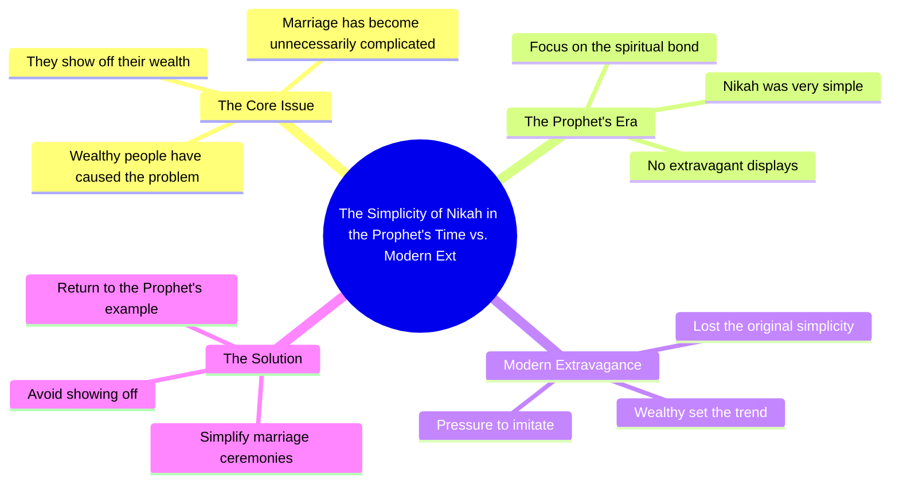

# Nikkah Was Very Simple In Our Prophet’s Time

> 🌐 **Read this in:** [English](../../en/2026-07/tiktok-transcript-2-8m-views-218k-reactions-warna-nikkah-bohot-aasan-tha-hamar-de02.md) · **中文**

> **Creator:** [@Ahmed Khan](https://www.tiktok.com/@Ahmed Khan) · **Views:** 1.3M · **Posted:** 2026-07-13 · **Niche:** other
>
> **TL;DR:** Opens with a provocative blame on the rich, then contrasts with a simpler past to hook viewers.

[Watch original video →](https://www.facebook.com/share/r/1BwZzm7hFs/)

## Why This Went Viral

## 钩子（前3秒）
- **逐字内容：** "富人炫耀财富才点燃了这把火"
- **钩子模式：** 大胆指控 + 谴责
- **为何能吸引眼球：** 它将富人定位为社会问题的根源，瞬间引发情感反应——要么是认同（对那些对物质主义感到沮丧的人），要么是好奇（想听听论点）。"火"这个词增添了隐喻的强度。

## 情感节奏
1. **好奇 + 愤怒（0–3秒）：** 对富人的大胆指控制造紧张感。
2. **对比（3–6秒）：** "否则婚姻本很简单"——转向怀旧、简单的理想。
3. **共鸣（6–9秒）：** "在我们先知的时代"——援引宗教权威和集体认同，加深情感吸引力。
4. **高潮（9–12秒）：** 过去简单与当下复杂的隐含对比点明主题——观众既感到正义的愤怒，又充满向往。
5. **收尾：** 陈述以开放式结尾，让观众反思或分享。

## 关键词密度
| 关键词/短语 | 频率（约） | 驱动因素 |
|-------------|-----------|----------|
| 富人 | 1（位置突出） | 情感吸引力——针对群体，制造"我们 vs. 他们" |
| 点燃火 | 1（隐喻） | 算法传播力——戏剧化、易分享的语言 |
| 婚姻 | 1 | 情感吸引力——普遍人生事件，易共鸣 |
| 简单 | 1 | 情感吸引力——怀旧，对轻松的渴望 |
| 先知 | 1 | 算法传播力 + 情感——宗教关键词，目标受众中参与度高 |

- **算法传播力：** "先知"和"火"在乌尔都语宗教/社交媒体空间中是高参与度触发词。
- **情感吸引力：** "富人"和"简单"触及阶级怨恨和对简单的渴望。

## 为何能传播
1. **我们 vs. 他们的框架：** "富人点燃了火"将富人定位为反派，瞬间团结观众对抗共同目标。这推动分享，因为观众在表明自己的价值观。
2. **宗教权威作为情感锚点：** "在我们先知的时代"援引神圣的过去，使批评在道德上显得合理，更难被驳斥。
3. **简短有力的结构：** 整个论点在10秒内完成——完美适合留存和循环观看。没有废话。
4. **有争议但安全：** 指控针对"富人"（一个模糊、安全的目标），而非特定个人，因此避免反弹，同时仍显得大胆。
5. **普遍痛点：** 婚姻成本是南亚/穆斯林社区中普遍的挫败感——视频解决了真实的情感需求（对愤怒的认可）。

## 你可以借鉴什么
1. **以反派开场，而非问题本身。** 不要说"婚姻太贵"，而是指责特定群体（"富人点燃了火"）。这能瞬间建立情感投入。
2. **将批评锚定在普遍受尊敬的理想上。** 使用宗教、历史或文化参考（例如"在先知的时代"），让你的论点显得永恒且道德上有根基。
3. **控制在10秒内。** 一口气完成一个完整的情感弧线（指控 → 对比 → 收尾）。不要解释，不要过渡——只留冲击力。

## Mind Map

## Full Transcript (Generated by [免费 TikTok 文稿生成器](https://toktranscript.com/?utm_source=github&utm_medium=breakdown&utm_campaign=tool_attribution))

> 📝 Transcripts on this page are auto-generated and show the first 60%. Want to transcribe any TikTok in 30 seconds and get the full version? [Try TokTranscript free →](https://toktranscript.com/?utm_source=github&utm_medium=breakdown&utm_campaign=transcript_cta)

امیروں نے ہی آگ لگائی ہے امیری دکھانے میں ورنہ نکاح 

*[Read the full transcript on TokTranscript →](https://toktranscript.com/plaza/tiktok-transcript-2-8m-views-218k-reactions-warna-nikkah-bohot-aasan-tha-hamar-de02?utm_source=github&utm_medium=breakdown&utm_campaign=transcript_full)*

## Browse More

- All [other](../../by-niche/zh-CN/other.md) breakdowns
- All [Bold accusation + contrast](../../by-pattern/zh-CN/hook-bold-accusation-contrast.md) examples

## Video Info

| | |
|---|---|
| Creator | [@Ahmed Khan](https://www.tiktok.com/@Ahmed Khan) |
| Original video | [https://www.facebook.com/share/r/1BwZzm7hFs/](https://www.facebook.com/share/r/1BwZzm7hFs/) |
| Original title | 2.8M views · 218K reactions | Warna Nikkah Bohot Aasan Tha Hamare Nabi Ke Zamane Mein🥺🖤🙏 #shortsvideos #facebookreel #Ahmedkhantv #reelsinstagram #kalabandar #sadreels #shayari #RemyMa #shorts #reel #BarkatUzmi | Ahmed Khan |
| Views | 1.3M (1338229) |
| Posted | 2026-07-13 |
| Duration | 0s |
| Niche | `other` |
| Hook pattern | `Bold accusation + contrast` |
| Original language | `en` (this page translated by AI) |
| Available languages | en, zh-CN |
| Generated | 2026-07-16 by [TokTranscript](https://toktranscript.com/) |

---

*This breakdown is for educational analysis under fair use. Original video © [@Ahmed Khan](https://www.tiktok.com/@Ahmed Khan). All transcripts are auto-generated and may contain errors.*

*Want to analyze your own TikToks like this? [我们用的转录工具 →](https://toktranscript.com/viral-breakdown?utm_source=github&utm_medium=breakdown&utm_campaign=footer_cta)*