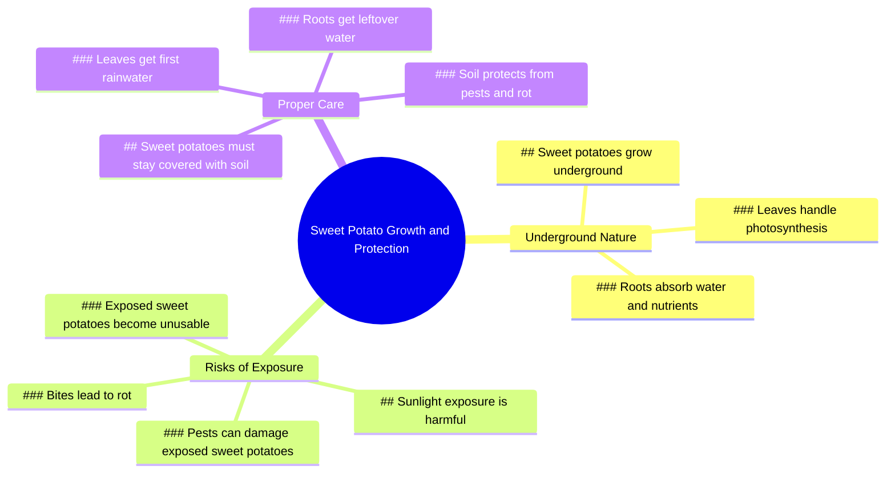

# Sweet Potatoes Argue Over Sunlight Exposure

> 🌐 **Read this in:** [English](../../en/2026-07/tiktok-transcript-2-9m-views-24k-reactions-never-let-sweet-potatoes-stick-out-260c.md) · **中文**

> **Creator:** [@Dr.Bota](https://www.tiktok.com/@Dr.Bota) · **Views:** 1.5M · **Posted:** 2026-07-16 · **Niche:** other
>
> **TL;DR:** The hook uses a dramatic confrontation between anthropomorphized sweet potatoes, instantly creating curiosity and humor.

[Watch original video →](https://www.facebook.com/share/r/19LjiFDT65/)

## Why This Went Viral

## 钩子（前3秒）
- **逐字开场白：**“哥们，快回来！你曝光了！”
- **钩子模式：** 场景冲突加拟人化对话（预期行为与反抗之间的反差）
- **为何能阻止滑动：** 两个红薯之间突然出现的戏剧性对峙，立即制造了认知失调——观众期待的是烹饪或园艺视频，而不是一个蔬菜对阳光产生存在主义危机。这种荒诞感迫使人们产生“什么鬼？”的停顿。

## 情感节奏
1. **好奇/震惊**（0:00–0:02）——“哥们，快回来！”瞬间制造紧张和困惑
2. **趣味**（0:03–0:06）——“曝光？我只是想要点阳光！”用冷面幽默反转预期
3. **紧张升级**（0:07–0:12）——光合作用争论制造了伪严肃辩论，构建虚假冲突
4. **惊喜/转折**（0:13–0:15）——“哎哟！离我的红薯远点！”引入了物理风险
5. **高潮+教育**（0:16–0:20）——叙述者放下玩笑，传递真实的园艺知识：“害虫会损害它们……导致腐烂”
6. **满足/收尾**（0:21）——“这个已经不行了”用实际后果解决了冲突

**高潮时刻：** 从荒诞喜剧转向真正的园艺建议，在“一旦暴露，害虫就会损害它们”这里——这是视频体现价值的地方。

## 关键词密度
| 词/短语 | 次数 | 功能 |
|---------|------|------|
| “红薯” | 4 | **算法覆盖**——园艺/美食内容搜索量高 |
| “曝光” | 3 | **情感吸引**——制造紧张和风险叙事 |
| “阳光” | 2 | **双重目的**——算法（园艺）+情感（自由vs安全） |
| “害虫” | 1 | **教育锚点**——触发“如何做”的搜索意图 |
| “腐烂” | 1 | **情感后果**——制造紧迫感和损失恐惧 |
| “待着” | 2 | **情感吸引**——强化“应该vs想要”的冲突 |
| “地下” | 1 | **视觉锚点**——强化园艺背景 |

**算法驱动因素：** “红薯”（细分话题）、“阳光”（一般园艺）、“害虫”（问题解决搜索）
**情感驱动因素：** “曝光”（脆弱性）、“腐烂”（损失厌恶）、“待着”（服从vs反抗）

## 为何能传播
1. **意外的拟人化创造分享性**——“哥们，快回来！”让蔬菜变得有共鸣。人们分享是因为荒诞，而不是因为他们关心红薯。“叶子为我们进行光合作用！”这种冷面幽默会被剪辑和转发。

2. **教育转折防止跳过**——从喜剧过渡到“一旦暴露，害虫就会损害它们”，奖励了为笑话而停留的观众。这种“惊喜学习”模式增加了观看时长和完成率——两者都是算法信号。

3. **冲突驱动的微叙事**——视频有明确的主角（叛逆的红薯）、反派（谨慎的红薯）和结局（腐烂的后果）。这种20秒内的三幕结构使其感觉完整，推动分享和重播。

4. **“应该”与“想要”之间的共鸣紧张感**——“我只是想要点阳光！”vs“我们应该待在地下”反映了每个人在安全与自由之间的冲突。观众将自己的欲望投射到红薯上，创造了情感投入。

5. **视觉新颖性**——会说话的红薯配上不同的声音（谨慎的听起来惊慌，叛逆的听起来无忧无虑）创造了令人难忘的角色组合。这种“奇怪搭档”的动态已被证明能增加记忆度和引用转发。

## 你可以借鉴什么
1. **“虚假冲突→真实教育”结构**——以两个无生命物体或角色之间的荒诞争论开场，然后转向真实知识。观众为笑话而停留，但带着知识离开。适用于任何领域：“别吵了，你们两个！实际上，这就是为什么……”

2. **拟人化你的主题**——给你的产品、植物或过程赋予声音。一个想要阳光的红薯很有趣。一辆想开快的车很有趣。一份想早点申报的税表很有趣。关键在于让“叛逆”角色有共鸣，让“谨慎”角色听起来像唠叨。

3. **以具体后果结尾**——不要只教育；展示忽视建议的代价。“这个已经不行了”比“所以要把红薯盖好”更有力。失败的可视化证据（腐烂的红薯）创造了情感收尾并强化了教训。

## Mind Map

## Full Transcript (Generated by [拆解你自己的 TikTok](https://toktranscript.com/?utm_source=github&utm_medium=breakdown&utm_campaign=tool_attribution))

> 📝 Transcripts on this page are auto-generated and show the first 60%. Want to transcribe any TikTok in 30 seconds and get the full version? [Try TokTranscript free →](https://toktranscript.com/?utm_source=github&utm_medium=breakdown&utm_campaign=transcript_cta)

Dude, get back here! You're exposing yourself! Exposing myself? I just want some sunlight! But we're sweet potatoes! We're supposed to stay underground! The leaves do the photosynthesis for us! Not only that, I get the first sip of rainwater while you stay down there getting the leftove

*[Read the full transcript on TokTranscript →](https://toktranscript.com/plaza/tiktok-transcript-2-9m-views-24k-reactions-never-let-sweet-potatoes-stick-out-260c?utm_source=github&utm_medium=breakdown&utm_campaign=transcript_full)*

## Browse More

- All [other](../../by-niche/zh-CN/other.md) breakdowns
- All [Unexpected Personification](../../by-pattern/zh-CN/hook-unexpected-personification.md) examples

## Video Info

| | |
|---|---|
| Creator | [@Dr.Bota](https://www.tiktok.com/@Dr.Bota) |
| Original video | [https://www.facebook.com/share/r/19LjiFDT65/](https://www.facebook.com/share/r/19LjiFDT65/) |
| Original title | 2.9M views · 24K reactions | Never Let Sweet Potatoes Stick Out | Dr.Bota |
| Views | 1.5M (1464721) |
| Posted | 2026-07-16 |
| Duration | 0s |
| Niche | `other` |
| Hook pattern | `Unexpected Personification` |
| Original language | `en` (this page translated by AI) |
| Available languages | en, zh-CN |
| Generated | 2026-07-17 by [TokTranscript](https://toktranscript.com/) |

---

*This breakdown is for educational analysis under fair use. Original video © [@Dr.Bota](https://www.tiktok.com/@Dr.Bota). All transcripts are auto-generated and may contain errors.*

*Want to analyze your own TikToks like this? [TikTok 转录工具 →](https://toktranscript.com/viral-breakdown?utm_source=github&utm_medium=breakdown&utm_campaign=footer_cta)*