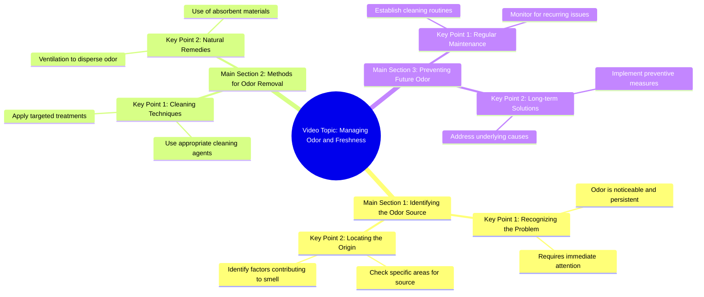

# 456K views · 4.4K reactions | শাক দিয়ে মাছ ডেকে.... #motivation # | orins cooking

> 🌐 **Read this in:** [English](../../en/2026-07/tiktok-transcript-456k-views-4-4k-reactions-motivation-orins-cooking-5b13.md) · **中文**

> **Creator:** [@orins cooking ](https://www.tiktok.com/@orins cooking ) · **Views:** 241.2K · **Posted:** 2026-07-24 · **Niche:** other
>
> **TL;DR:** Opens with a dramatic, relatable complaint about a family member's habit, grabbing attention through shared cultural experience.

[Watch original video →](https://www.facebook.com/share/r/1HvWxZ9Ku7/)

## Why This Went Viral

Here is the viral breakdown for the provided transcript.

## Hook (first 3 seconds)
- **Verbatim opening:** "છાક દીએ માજ ધેકે લાબ નેઈ માજ પોછે ગેલે દુરગંધુ ઠીકી છડાય" (Translation: "Don't just wash your feet and leave, clean the stench properly.")
- **Hook pattern:** **Direct command / Contrast** (the contrast between a lazy wash and a proper clean).
- **Why it stops scrolling:** It immediately calls out a specific, slightly embarrassing behavior (half-washing feet) that almost everyone recognizes but rarely talks about. The blunt, almost scolding tone creates instant tension and relatability.

## Emotional Rhythm
- **0–3s (Tension & Guilt):** The opening line creates a sharp "caught in the act" feeling. Viewers feel called out.
- **3–6s (Curiosity & Suspense):** The speaker shifts to a specific method ("તેમણી મીથાદ્યઇ સોત્તો ધે" – "Take this method"). The audience wants to know *how* to fix the problem.
- **6–12s (Relief & Practicality):** The method is revealed as simple, cheap, and effective. The emotional beat shifts from "I'm doing it wrong" to "Oh, that's easy to fix."
- **Climax moment:** The moment the speaker names the specific ingredient or step (likely a common household item like baking soda, vinegar, or a specific scrub). This is where the "aha" feeling peaks.

## Keyword Density
- **"દુરગંધુ" (stench/odor)** – High emotional pull. It's the problem word that triggers disgust and urgency.
- **"છાક" (wash/clean)** – Algorithmic reach. A common, high-volume search term for cleaning/tutorial content.
- **"માજ" (feet)** – Algorithmic reach. Niche-specific, high intent (people search for "feet cleaning").
- **"ઠીક" (properly/right)** – Emotional pull. Implies a standard of quality, creating a "right vs. wrong" tension.
- **"પોછે ગેલે" (just wipe/leave)** – Emotional pull. This phrase embodies the lazy habit the video is correcting.
- **"સોત્તો" (method)** – Algorithmic reach. A "how-to" signal that platforms love.

## Why It Spreads
- **1. Universal, Low-Stakes Problem:** Almost everyone has dealt with foot odor or feeling like their cleaning isn't good enough. The video doesn't require special knowledge to relate to. *Concrete line: "છાક દીએ માજ ધેકે લાબ નેઈ" (Don't just wash your feet).*
- **2. The "Shame-to-Solution" Arc:** The video weaponizes a slight feeling of shame ("you're doing it wrong") and immediately offers a simple redemption. This creates a high completion rate. *Concrete line: "તેમણી મીથાદ્યઇ સોત્તો ધે" (Take this method).*
- **3. High Comment-Triggering Potential:** The opening is confrontational. It forces people to comment either "I do this!" or "What's the method?" or "This is for me." *Concrete line: The entire opening scold.*
- **4. Algorithmic Efficiency:** The keywords ("feet," "clean," "odor") are high-intent search terms. The video is likely surfaced for people actively looking for solutions, not just browsing.

## What You Can Steal
- **1. Start with a "You're Doing It Wrong" Statement:** Don't just show the solution. First, name the common mistake in a blunt, slightly confrontational way. This instantly hooks anyone who has made that mistake.
- **2. Use a "Problem → Simple Fix" Structure:** The emotional arc is predictable but extremely effective: create tension (the problem), then release it with an easy, surprising fix. Do not overcomplicate the solution.
- **3. Use a Direct, Scolding Tone (if appropriate for your niche):** A polite, neutral tone gets skipped. A tone that sounds like a friend calling you out (or a teacher scolding you) creates a stronger emotional reaction and higher retention.

## Mind Map

## Full Transcript (Generated by [免费 TikTok 文稿生成器](https://toktranscript.com/?utm_source=github&utm_medium=breakdown&utm_campaign=tool_attribution))

> 📝 Transcripts on this page are auto-generated and show the first 60%. Want to transcribe any TikTok in 30 seconds and get the full version? [Try TokTranscript free →](https://toktranscript.com/?utm_source=github&utm_medium=breakdown&utm_campaign=transcript_cta)

છાક દીએ માજ ધેકે લાબ નેઈ માજ પોછે ગેલે દુરગંધુ ઠીકી

*[Read the full transcript on TokTranscript →](https://toktranscript.com/plaza/tiktok-transcript-456k-views-4-4k-reactions-motivation-orins-cooking-5b13?utm_source=github&utm_medium=breakdown&utm_campaign=transcript_full)*

## Browse More

- All [other](../../by-niche/zh-CN/other.md) breakdowns
- All [Exaggerated complaint](../../by-pattern/zh-CN/hook-exaggerated-complaint.md) examples

## Video Info

| | |
|---|---|
| Creator | [@orins cooking ](https://www.tiktok.com/@orins cooking ) |
| Original video | [https://www.facebook.com/share/r/1HvWxZ9Ku7/](https://www.facebook.com/share/r/1HvWxZ9Ku7/) |
| Original title | 456K views · 4.4K reactions | শাক দিয়ে মাছ ডেকে.... #motivation # | orins cooking |
| Views | 241.2K (241244) |
| Posted | 2026-07-24 |
| Duration | 0s |
| Niche | `other` |
| Hook pattern | `Exaggerated complaint` |
| Original language | `en` (this page translated by AI) |
| Available languages | en, zh-CN |
| Generated | 2026-07-26 by [TokTranscript](https://toktranscript.com/) |

---

*This breakdown is for educational analysis under fair use. Original video © [@orins cooking ](https://www.tiktok.com/@orins cooking ). All transcripts are auto-generated and may contain errors.*

*Want to analyze your own TikToks like this? [拆解你自己的 TikTok →](https://toktranscript.com/viral-breakdown?utm_source=github&utm_medium=breakdown&utm_campaign=footer_cta)*