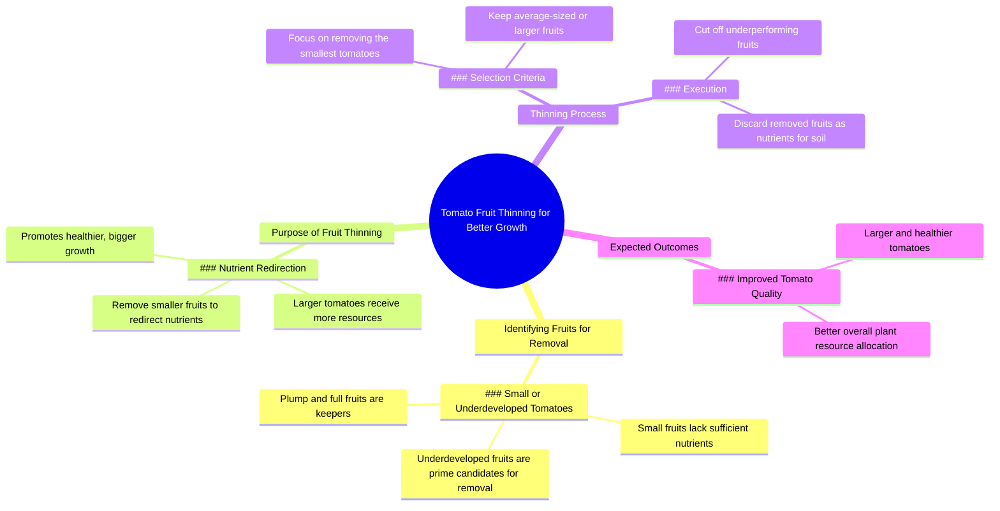

# Why Gardeners Remove Small Tomatoes

> 🌐 **Read this in:** [English](../../en/2026-07/tiktok-transcript-8-3m-views-120k-reactions-why-gardeners-remove-small-tomatoe-fdbc.md) · **中文**

> **Creator:** [@Dr.Bota](https://www.tiktok.com/@Dr.Bota) · **Views:** 4.0M · **Posted:** 2026-07-12 · **Niche:** other
>
> **TL;DR:** The hook uses tactile and visual appreciation to create curiosity about the subject.

[Watch original video →](https://www.facebook.com/share/r/1EPKJ9LuBZ/?mibextid=wwXIfr)

## Why This Went Viral

## 钩子（前3秒）
- **逐字开场白：**“嗯，这个看起来不错，饱满又充实。这个也不赖。大小还算正常。嘿，你怎么回事？为什么这么小？”
- **钩子模式：** **对比 + 拟人** — 将“饱满又充实”与直接质问小番茄（“为什么这么小？”）并列
- **为何能阻止滑动：** 从欣赏番茄突然转向“欺负”一个番茄，制造了认知失调。观众停下来是因为他们感觉一场迷你戏剧正在展开——他们想看看小番茄会遭受怎样的“惩罚”。

## 情绪节奏
1. **好奇**（0–3秒）——“嗯，这个看起来不错”营造出积极、满意的审视氛围
2. **紧张**（3–5秒）——“嘿，你怎么回事？为什么这么小？”引入了冲突和羞耻感
3. **悬念**（5–7秒）——“请别剪掉我”——番茄（拟人化）求饶，提高了赌注
4. **反转/解脱**（7–9秒）——“既然你吸收不到养分，那你就来当养分吧”——黑色幽默的高潮
5. **收尾**（9–12秒）——教育性回报：“番茄在适当疏果后长得最好……”——合理的解释为之前的“残忍”正名
- **高潮：**“你来当养分吧”——笑话落地、园艺逻辑被理解的瞬间

## 关键词密度
| 词语/短语 | 次数 | 功能 |
|-------------|-------|----------|
| “养分” | 3 | **算法覆盖**（园艺领域关键词）+ **情感吸引**（制造讽刺——“你就是养分”） |
| “小” | 2 | **情感吸引**（羞耻/对比）+ **算法覆盖**（园艺技巧常见搜索词） |
| “饱满又充实” | 1 | **情感吸引**（吸引力、对比） |
| “剪掉我” | 1 | **情感吸引**（拟人化、戏剧性） |
| “疏果” | 1 | **算法覆盖**（特定园艺技巧，高意图搜索） |
| “更大的番茄” | 1 | **算法 + 情感**（期望结果，可搜索） |

## 为何能传播
1. **拟人化创造可分享的戏剧性** — 番茄“恳求”（“请别剪掉我”）将平凡的园艺任务变成了一个 relatable 的角色弧线。观众会@朋友说：“这就是我跳过练腿日的下场。”
2. **黑色幽默 + 教育组合** — 反转（“你来当养分吧”）既有趣又有信息量。观众因为理解了笑话而觉得自己聪明，随后又被真实的科学知识所验证。这种双重回报推动了收藏和分享。
3. **高对比度视觉 + 音频** — 一只手拿着小番茄 vs. 大番茄的画面，配合面无表情的声音，创造了一个 meme 模板。“欺负”的语气足够荒谬，以至于其他创作者会模仿。
4. **普遍的园艺挫败感** — “为什么你这么小？”触及了每个园丁对生长不均的烦恼。解决方案（疏果）是一个常见的知识盲点——因此视频会被搜索、收藏和引用。

## 你可以借鉴什么
1. **将你的主题拟人化** — 给无生命的物体赋予声音和问题。“为什么你这么小？”适用于番茄，也适用于枯萎的植物、生长缓慢的多肉，甚至一个小辣椒。它将指导变成了故事。
2. **使用“反派起源故事”结构** — 从赞美开始（“这个看起来不错”），然后引入一个“有缺陷”的角色，接着给出一个黑暗的反转，为“惩罚”正名。这种钩子模式适用于任何关于“淘汰”或“修剪”的建议。
3. **以3秒的教育性回报结尾** — 在笑话之后，立即用通俗语言解释科学原理。这同时满足了“娱乐型”观众和“我需要修复我的花园”型观众——将收藏的可能性翻倍。

## Mind Map

## Full Transcript (Generated by [免费 TikTok 文稿生成器](https://toktranscript.com/?utm_source=github&utm_medium=breakdown&utm_campaign=tool_attribution))

> 📝 Transcripts on this page are auto-generated and show the first 60%. Want to transcribe any TikTok in 30 seconds and get the full version? [Try TokTranscript free →](https://toktranscript.com/?utm_source=github&utm_medium=breakdown&utm_campaign=transcript_cta)

Mmm, this one looks good, plump and full. This one's not bad either. Still about average size. Hey, what's going on with you? Why are you so small? It's not that I wanted to. I'm just not getting enough nutrients. Please don't cut me off. Since you're not getting enough nutrients, you

*[Read the full transcript on TokTranscript →](https://toktranscript.com/plaza/tiktok-transcript-8-3m-views-120k-reactions-why-gardeners-remove-small-tomatoe-fdbc?utm_source=github&utm_medium=breakdown&utm_campaign=transcript_full)*

## Browse More

- All [other](../../by-niche/zh-CN/other.md) breakdowns
- All [Sensory Appreciation](../../by-pattern/zh-CN/hook-sensory-appreciation.md) examples

## Video Info

| | |
|---|---|
| Creator | [@Dr.Bota](https://www.tiktok.com/@Dr.Bota) |
| Original video | [https://www.facebook.com/share/r/1EPKJ9LuBZ/?mibextid=wwXIfr](https://www.facebook.com/share/r/1EPKJ9LuBZ/?mibextid=wwXIfr) |
| Original title | 8.3M views · 120K reactions | Why Gardeners Remove Small Tomatoes | Dr.Bota |
| Views | 4.0M (4013304) |
| Posted | 2026-07-12 |
| Duration | 0s |
| Niche | `other` |
| Hook pattern | `Sensory Appreciation` |
| Original language | `en` (this page translated by AI) |
| Available languages | en, zh-CN |
| Generated | 2026-07-13 by [TokTranscript](https://toktranscript.com/) |

---

*This breakdown is for educational analysis under fair use. Original video © [@Dr.Bota](https://www.tiktok.com/@Dr.Bota). All transcripts are auto-generated and may contain errors.*

*Want to analyze your own TikToks like this? [TikTok 转录工具 →](https://toktranscript.com/viral-breakdown?utm_source=github&utm_medium=breakdown&utm_campaign=footer_cta)*