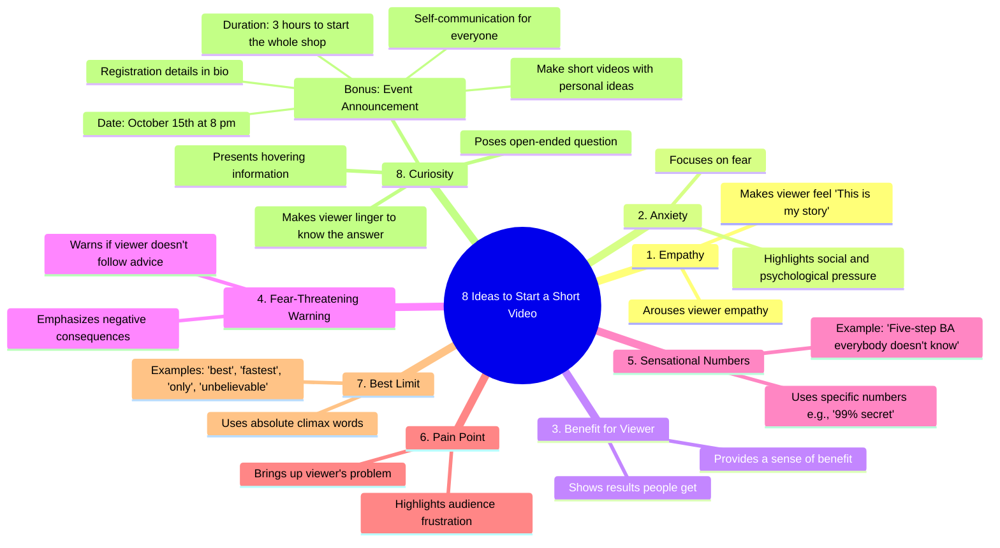

# 8 Short Video Opening Ideas to Hook Viewers

> 🌐 **Read this in:** [English](../../en/2026-07/tiktok-transcript-8-t-ng-b-t-u-video-ng-n-dcgr-tutruyenthong-nguoimoixayken-95c1.md) · **中文**

> **Creator:** [@duymuoi](https://www.tiktok.com/@duymuoi) · **Views:** 1.1M · **Posted:** 2026-07-30 · **Niche:** marketing
>
> **TL;DR:** Promises a specific number of actionable ideas, creating immediate curiosity and perceived value.

[Watch original video →](https://www.tiktok.com/@duymuoi/video/7559107509257129234)

## Why This Went Viral

## 钩子（前3秒）
- **原文：**“给你8个做短视频的起步思路，先记住这8句话。”
- **钩子模式：**数字 + 大胆断言（明确承诺列出“8个思路”，并暗示记忆捷径）
- **为何能让人停下滑动：**数字“8”具体且可操作，“给你”营造直接的个人价值感，“记住”暗示内行知识——这些都触发稀缺驱动的求知欲。

## 情绪节奏
- **好奇**（0–3秒）：“8个思路”——是什么？→ **期待**（3–10秒）：列表以共情、焦虑、利益开始 → **紧张**（10–20秒）：焦虑、恐惧威胁、痛点击中——观众感到压力 → **释然/共鸣**（20–30秒）：“原来这也是我的故事”——共情落地 → **高潮**（30–35秒）：“第8个好奇”——开放式问题制造未解悬念 → **紧迫感**（35–40秒）：“10月15日晚8点”——限时行动号召引发错失恐惧。
- **转折：**最后的“好奇”钩子类型被呈现为最强，颠覆了列表之前的模式。
- **高潮时刻：**“最后第8个好奇提出一个开放式问题……让观众停留。”

## 关键词密度
| 关键词/短语 | 频率（约） | 驱动因素 |
|---|---|---|
| “8个思路”/“8句话” | 3 | 算法覆盖（数字具体性） |
| “共情”/“我的故事” | 2 | 情感拉动（共鸣） |
| “焦虑”/“恐惧”/“威胁” | 3 | 情感拉动（紧张） |
| “利益”/“结果” | 2 | 情感拉动（价值） |
| “痛苦”/“挫败” | 2 | 情感拉动（痛点） |
| “10月15日晚8点” | 1 | 算法覆盖（限时事件） |
| “简介” | 1 | 算法覆盖（行动号召） |

- **算法驱动因素：**数字（“8”、“99%”）、限时（“10月15日”）、行动提示（“简介”）提升点击率和留存率。
- **情感驱动因素：**“共情”、“我的故事”、“焦虑”、“挫败”触发镜像神经元，让观众持续观看。

## 为何能传播
1. **模式中断列表格式**——“8个思路”是经典的列表式钩子，承诺快速、易消化的价值。观众分享是因为他们觉得自己得到了一个“作弊指南”来获得病毒式传播。  
   *文案证据：*“给你8个做短视频的起步思路。”

2. **情绪过山车**——序列（共情→焦虑→利益→威胁→痛苦→好奇）模仿了迷你剧。观众为了每个情绪节点的解决而停留，然后因为视频“懂”他们的心理而分享。  
   *文案证据：*“这种共情会引发共鸣……第二个是焦虑……第三个是有益的。”

3. **悬念式好奇缺口**——最后的钩子类型（“好奇”）故意保持开放式，迫使观众要么重看，要么点击简介来填补缺口。这推动留存率和简介点击。  
   *文案证据：*“最后第8个好奇提出一个开放式问题……让观众停留。”

4. **稀缺+错失恐惧行动号召**——具体日期/时间（“10月15日晚8点”）制造截止日期。观众为了避免错过而分享，“简介”链接推动平台外转化。  
   *文案证据：*“10月15日晚8点，我们会有三个小时来启动整个店铺。”

5. **自我指涉的病毒性**——视频在教授如何走红的同时，本身就在使用这些技巧（共情、焦虑、数字）。这种元层次使其作为内容策略的“大师课”而具有分享性。  
   *文案证据：*“我们有这个思路……大家都可以在这里自我交流，为自己做短视频。”

## 你可以借鉴什么
1. **“8件套”列表式钩子**——以一个具体、奇数的数字（如8、7、5）开头，并承诺一个可记忆的序列。它让大脑准备好轻松消费和分享。  
   *应用：*“5句让你的评论翻倍的话——现在就记住它们。”

2. **情绪序列地图**——将你的脚本写成4拍情绪弧：共情→焦虑→利益→好奇。测试哪个拍子在你的领域中最有效。  
   *应用：*以“你感到卡住了”开头（共情），然后“这是让你夜不能寐的事”（焦虑），然后“这是解决办法”（利益），然后“但有一件事你忽略了……”（好奇）。

3. **“简介诱饵”悬念**——以一个未解决的问题或限时事件结尾，迫使观众点击你的简介。不要在视频中给出完整答案。  
   *应用：*“第8个思路？那是99%的创作者忽略的一个。我在简介里解释了——但只在接下来的24小时内。”

## Mind Map

## Full Transcript (Generated by [免费 TikTok 文稿生成器](https://toktranscript.com/?utm_source=github&utm_medium=breakdown&utm_campaign=tool_attribution))

> 📝 Transcripts on this page are auto-generated and show the first 60%. Want to transcribe any TikTok in 30 seconds and get the full version? [Try TokTranscript free →](https://toktranscript.com/?utm_source=github&utm_medium=breakdown&utm_campaign=transcript_cta)

Sending you 8 ideas to start with a short video, remember to memorize 8 sentences like this first, this type of empathy will arouse empathy that makes the viewer feel ah It turns out that this is also my story, the second is anxiety, focusing on fear, social and psychological pressure, the third is beneficial for the viewer. There's a sense of benefit -- the results that people get right in the fourth video -- the same kind of fear-threatening warning that emphasizes the negative consequences if the viewer doesn't follow their advice. Fifth Give numbers using sensational specific numbers such as the 99% secret five-step BA, for example. Everybody doesn't know this. Friday is about hitting the pain, bringing up the problem or the frustration that people in the audience are having. Seventh gives a best limit using words that 

*[Read the full transcript on TokTranscript →](https://toktranscript.com/plaza/tiktok-transcript-8-t-ng-b-t-u-video-ng-n-dcgr-tutruyenthong-nguoimoixayken-95c1?utm_source=github&utm_medium=breakdown&utm_campaign=transcript_full)*

## Browse More

- All [marketing](../../by-niche/zh-CN/marketing.md) breakdowns
- All [List-based promise](../../by-pattern/zh-CN/hook-list-based-promise.md) examples

## Video Info

| | |
|---|---|
| Creator | [@duymuoi](https://www.tiktok.com/@duymuoi) |
| Original video | [https://www.tiktok.com/@duymuoi/video/7559107509257129234](https://www.tiktok.com/@duymuoi/video/7559107509257129234) |
| Original title | 8 ý tưởng để bắt đầu video ngắn. #dcgr #tutruyenthong #nguoimoixayken... |
| Views | 1.1M (1100000) |
| Posted | 2026-07-30 |
| Duration | 0s |
| Niche | `marketing` |
| Hook pattern | `List-based promise` |
| Original language | `en` (this page translated by AI) |
| Available languages | en, zh-CN |
| Generated | 2026-07-30 by [TokTranscript](https://toktranscript.com/) |

---

*This breakdown is for educational analysis under fair use. Original video © [@duymuoi](https://www.tiktok.com/@duymuoi). All transcripts are auto-generated and may contain errors.*

*Want to analyze your own TikToks like this? [TokTranscript →](https://toktranscript.com/viral-breakdown?utm_source=github&utm_medium=breakdown&utm_campaign=footer_cta)*