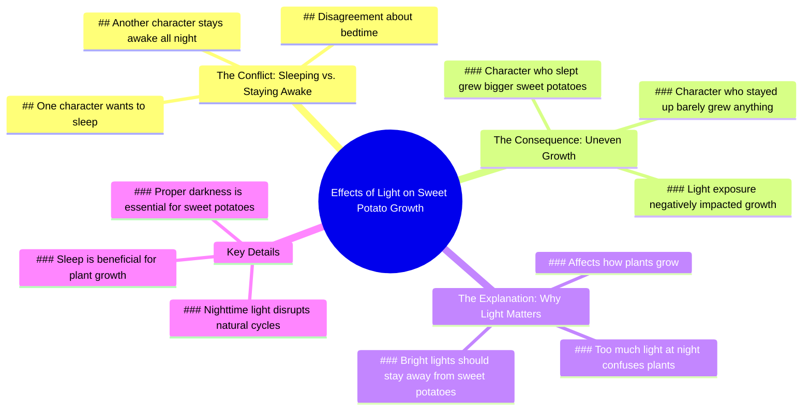

# How Street Lights Affect Plant Growth

> 🌐 **Read this in:** [English](../../en/2026-07/tiktok-transcript-9-3m-views-99k-reactions-how-street-lights-can-affect-plant-db19.md) · **中文**

> **Creator:** [@Dr.Bota](https://www.tiktok.com/@Dr.Bota) · **Views:** 3.7M · **Posted:** 2026-07-19 · **Niche:** other
>
> **TL;DR:** The hook creates immediate curiosity by contrasting the expectation of bedtime with the reality of daylight.

[Watch original video →](https://www.facebook.com/reel/1006843358938373)

## Why This Went Viral

## 钩子（前3秒）
- **逐字台词：** "啊，终于！睡觉时间！不是吧？睡觉时间？对我来说现在还是白天呢。随你便吧。我要睡了。"
- **钩子模式：** 对比 / 场景式对话（两个角色对睡觉时间持相反观点）
- **为何能留住观众：** 即时的冲突（"终于到睡觉时间" vs. "现在还是白天"）营造出亲切又幽默的紧张感。那些有睡眠困扰或认识有睡眠问题的人会立刻被吸引。

## 情绪节奏
1. **好奇** – 开篇关于睡觉时间与白天的争论。
2. **紧张** – 轻蔑的"随你便吧"和"我要睡了"形成对峙。
3. **轻松（喜剧效果）** – "兄弟，你整晚没睡吗？你看上去累坏了。" 自嘲式幽默。
4. **悬念** – "看看你这样能种出多少红薯。" 预示后续结果。
5. **反转** – "咦？为什么你种的红薯更大，而我几乎没收获？" 出乎意料的结果。
6. **解决 + 教训** – "夜间光线太强会干扰某些植物。" 高潮是红薯大小差异的揭示。

**高潮时刻：** 红薯生长情况的并排对比，观众看到之前争论的后果。

## 关键词密度
| 词语/短语 | 出现次数 | 作用 |
|-----------|----------|------|
| 睡觉 / 睡眠 | 5 | 情感共鸣（ relatable struggle） |
| 夜晚 | 4 | 算法覆盖（时间相关内容） |
| 红薯 | 4 | 算法覆盖（小众园艺） |
| 光线 / 强光 | 3 | 情感共鸣（因果关系） |
| 熬夜 / 不睡 | 2 | 情感共鸣（坏习惯） |
| 生长 / 种出 | 3 | 算法覆盖（园艺） |

**驱动因素：** "睡眠"和"红薯"是双重钩子——一个引发人类共鸣，一个激发小众园艺好奇心。"光线"将两者连接起来。

## 为何能传播
1. **普遍共鸣 + 小众反转** – 每个人都理解"该睡还是该熬"的困境，但红薯的结局出人意料。"夜间光线太强会干扰某些植物"这句话把日常争论变成了科学课。
2. **对话驱动的悬念** – 一来一回的对话模仿真实交谈，让观众感觉像在偷听。"看看你这样能种出多少红薯"这句话埋下了一个需要解答的问号。
3. **视觉回报** – 大小差异的揭示（"为什么你种的红薯更大？"）正是观众分享视频的瞬间。这是一个清晰、令人满意的前后对比。
4. **教育性惊喜** – 视频巧妙植入了一个园艺技巧（光线影响红薯生长），却不显得说教。观众在笑声中学到知识。
5. **短小精悍的格式** – 整个叙事（争论 → 后果 → 教训）在60秒内完成。没有一句废话。

## 你可以借鉴的
1. **"友好争论"结构** – 从一个常见话题的两种对立观点开始（睡 vs. 熬，工作 vs. 休息）。让冲突驱动前10秒。例如："终于下雨了！" vs. "下雨？最讨厌了。"
2. **"隐藏后果"钩子** – 早期埋下悬念（"看看你能种出多少红薯"），让观众知道必须看到结果。通过承诺揭示来留住观众。
3. **"意外导师"反转** – 用一个简单、有科学依据的解释收尾，重新定义整个争论。用"这就是为什么强光应该远离红薯"这句话作为任何小众知识的模板。

## Mind Map

## Full Transcript (Generated by [TokTranscript 转录工具](https://toktranscript.com/?utm_source=github&utm_medium=breakdown&utm_campaign=tool_attribution))

> 📝 Transcripts on this page are auto-generated and show the first 60%. Want to transcribe any TikTok in 30 seconds and get the full version? [Try TokTranscript free →](https://toktranscript.com/?utm_source=github&utm_medium=breakdown&utm_campaign=transcript_cta)

Ah, finally! Bedtime! Seriously? Bedtime? It still looks like daytime to me. Whatever suits you. I'm going to sleep. Bro, were you up all night? You look exhausted. It never got dark anyway. You just love sleeping. Let's see how much sweet potato you grow doing that. It's getting late. Go to sleep already. Staying up all night might mess up your sweet potatoes. Dude, if you want to sleep all night, that's your business. Go

*[Read the full transcript on TokTranscript →](https://toktranscript.com/plaza/tiktok-transcript-9-3m-views-99k-reactions-how-street-lights-can-affect-plant-db19?utm_source=github&utm_medium=breakdown&utm_campaign=transcript_full)*

## Browse More

- All [other](../../by-niche/zh-CN/other.md) breakdowns
- All [Contrasting perspective](../../by-pattern/zh-CN/hook-contrasting-perspective.md) examples

## Video Info

| | |
|---|---|
| Creator | [@Dr.Bota](https://www.tiktok.com/@Dr.Bota) |
| Original video | [https://www.facebook.com/reel/1006843358938373](https://www.facebook.com/reel/1006843358938373) |
| Original title | 9.3M views · 99K reactions | How Street Lights Can Affect Plant Growth | Dr.Bota |
| Views | 3.7M (3729279) |
| Posted | 2026-07-19 |
| Duration | 0s |
| Niche | `other` |
| Hook pattern | `Contrasting perspective` |
| Original language | `en` (this page translated by AI) |
| Available languages | en, zh-CN |
| Generated | 2026-07-20 by [TokTranscript](https://toktranscript.com/) |

---

*This breakdown is for educational analysis under fair use. Original video © [@Dr.Bota](https://www.tiktok.com/@Dr.Bota). All transcripts are auto-generated and may contain errors.*

*Want to analyze your own TikToks like this? [TokTranscript →](https://toktranscript.com/viral-breakdown?utm_source=github&utm_medium=breakdown&utm_campaign=footer_cta)*