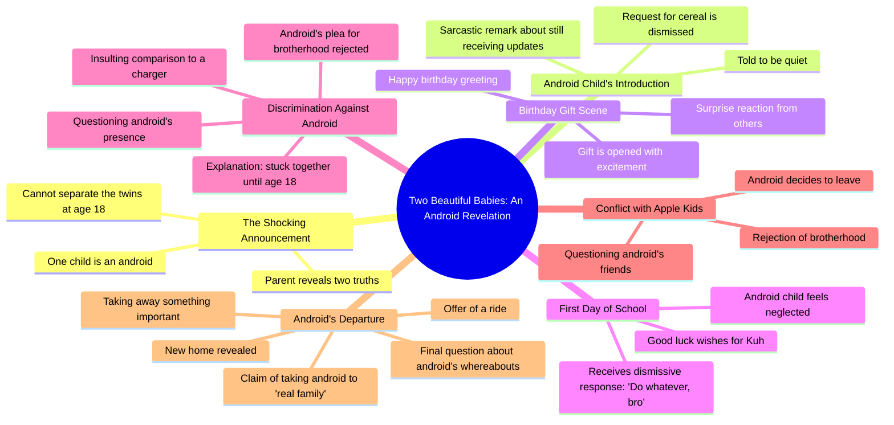

# Android Babies Cannot Be Separated at 18

> 🌐 **Read this in:** [English](../../en/2026-07/tiktok-transcript-ai-aifruits-brainrot-aistory-fruitdrama-872f.md) · **中文**

> **Creator:** [@aistorys957](https://www.tiktok.com/@aistorys957) · **Views:** 3.4M · **Posted:** 2026-07-14 · **Niche:** entertainment
>
> **TL;DR:** The hook subverts expectations by revealing one baby is an android, instantly creating curiosity and conflict.

[Watch original video →](https://www.tiktok.com/t/ZP8GWePH8/)

## Why This Went Viral

## 钩子（前3秒）
- **逐字开场白：**“恭喜。你有两个漂亮的宝宝。不过，有两件事你得知道。第一，他们18岁时其实分不开。第二件事是。是个机器人。”
- **钩子模式：** **反差**（喜悦的宣告立刻被惊人的转折削弱）+ **悬念**（“有两件事你得知道”制造期待）
- **为何能让人停下滑动：** 第一句话营造了一个温馨、亲切的育儿场景，然后“机器人”这个词打破了现实。观众被迫重新理解刚才听到的内容——这种认知失调瞬间产生，令人欲罢不能。

## 情感节奏
- **节拍1（好奇）：**“恭喜……两个漂亮的宝宝”——温暖、熟悉的设定。
- **节拍2（紧张）：**“第一，他们其实分不开”——不祥之兆，提升风险。
- **节拍3（震惊）：**“是个机器人”——转折落地，观众必须重新评估。
- **节拍4（喜剧缓解/困惑）：**“爸爸，我能吃点麦片吗？闭嘴。”——荒诞带来的幽默，释放紧张。
- **节拍5（悬念）：**“搞什么鬼，老兄？”——兄弟竞争升级，机器人被欺负。
- **节拍6（共鸣/心碎）：**“你不再需要这个了……这是你的新家，小老弟。”——情感高潮：机器人被抛弃，但随后被救。
- **节拍7（解脱/转折）：**“那个破烂机器人在哪？”——未解决，让观众意犹未尽。

**高潮时刻：** 台词“你不再需要这个了”——情感转折点，机器人的脆弱暴露无遗，让观众为他加油。

## 关键词密度
| 关键词/短语 | 频率（约） | 驱动因素 |
|---|---|---|
| “老兄”/“小老弟” | 6次以上 | **算法覆盖**——随意、俚语密集的对话提升互动（评论、混剪） |
| “机器人” | 4次 | **情感吸引力**——核心科幻设定，引发好奇与共情 |
| “兄弟” | 3次 | **情感吸引力**——家庭与科技的张力 |
| “破烂” | 2次 | **情感吸引力**——侮辱制造弱者动态 |
| “真正的家人” | 2次 | **情感吸引力**——身份危机，触动心弦 |
| “闭嘴”/“绝对不” | 2次以上 | **算法覆盖**——高能量对话，易于剪辑和制作表情包 |
| “苹果小孩” | 1次 | **算法覆盖**——品牌提及（苹果）通过搜索增加可发现性 |

## 为何能传播
1. **高概念、低成本科幻：**“家庭中的机器人”设定瞬间可理解，视觉上执行成本低。观众分享因为它感觉像一部几秒钟就能看完的微电影。*具体台词：“是个机器人。”*
2. **60秒内的情感过山车：** 视频在幽默、紧张和心碎之间循环。这能保持高留存率，并触发“重看”冲动。*具体台词：“你不再需要这个了” → “这是你的新家。”*
3. **熟悉的家庭动态 + 荒诞转折：** 兄弟竞争是普遍现象；加入机器人使其新颖。观众评论“我兄弟也这样”——连接虚构与现实。*具体台词：“你为什么对我这么刻薄，老兄？我们是兄弟。”*
4. **开放式悬念结尾：**“那个破烂机器人在哪？”引发猜测，要求出第二部。这推动评论、分享和算法青睐。*具体台词：最后一句未回答。*
5. **俚语驱动的对话：** 频繁使用“老兄”和“破烂”让对话感觉真实，符合Z世代/街头文化，使视频像真实对话而非剧本。这提升了在朋友间的分享性。*具体台词：“绝对不，哥们。我才不和什么破烂机器人做兄弟。”*

## 你可以借鉴的点
1. **“平凡 + 不可能”的钩子：** 从正常场景（育儿、家庭晚餐）开始，注入一个不可能的元素（机器人、仿生人、时间旅行者）。这能零成本瞬间制造好奇。
2. **60秒内的情感过山车：** 规划你的剧本：10秒幽默 → 10秒紧张 → 10秒心碎 → 10秒悬念。用对话切换语气，而非旁白。
3. **留下未解决的结尾：** 以一个问题或角色的反应结束，暗示“未完待续”。这迫使观众评论“第二部？”——算法会奖励这种互动。

## Mind Map

## Full Transcript (Generated by [拆解你自己的 TikTok](https://toktranscript.com/?utm_source=github&utm_medium=breakdown&utm_campaign=tool_attribution))

> 📝 Transcripts on this page are auto-generated and show the first 60%. Want to transcribe any TikTok in 30 seconds and get the full version? [Try TokTranscript free →](https://toktranscript.com/?utm_source=github&utm_medium=breakdown&utm_campaign=transcript_cta)

Congratulations. You have two beautiful babies. However, there are two things you should know. First, can't actually separate when they turn 18. The second thing is. Is an android. An android? Daddy, can I get some cereal? Shut up. Huh? You lucky you still getting updates. Happy birthday, babe. Yeah, little bro, go ahead and open it. No way. Yes, sir. What the hell, kuh? Good luck on your first school day, Kuh? Thanks, dad. What about me, daddy? Do whatever, bro. Who let an android in here? He's stuck with me till I'm 18, cuh. Why you so mean to me, CUH? We brothers. Hell, nah, fam. I 

*[Read the full transcript on TokTranscript →](https://toktranscript.com/plaza/tiktok-transcript-ai-aifruits-brainrot-aistory-fruitdrama-872f?utm_source=github&utm_medium=breakdown&utm_campaign=transcript_full)*

## Browse More

- All [entertainment](../../by-niche/zh-CN/entertainment.md) breakdowns
- All [Unexpected reveal](../../by-pattern/zh-CN/hook-unexpected-reveal.md) examples

## Video Info

| | |
|---|---|
| Creator | [@aistorys957](https://www.tiktok.com/@aistorys957) |
| Original video | [https://www.tiktok.com/t/ZP8GWePH8/](https://www.tiktok.com/t/ZP8GWePH8/) |
| Original title | #ai #aifruits #brainrot #aistory #fruitdrama  |
| Views | 3.4M (3400000) |
| Posted | 2026-07-14 |
| Duration | 0s |
| Niche | `entertainment` |
| Hook pattern | `Unexpected reveal` |
| Original language | `en` (this page translated by AI) |
| Available languages | en, zh-CN |
| Generated | 2026-07-15 by [TokTranscript](https://toktranscript.com/) |

---

*This breakdown is for educational analysis under fair use. Original video © [@aistorys957](https://www.tiktok.com/@aistorys957). All transcripts are auto-generated and may contain errors.*

*Want to analyze your own TikToks like this? [免费 TikTok 文稿生成器 →](https://toktranscript.com/viral-breakdown?utm_source=github&utm_medium=breakdown&utm_campaign=footer_cta)*