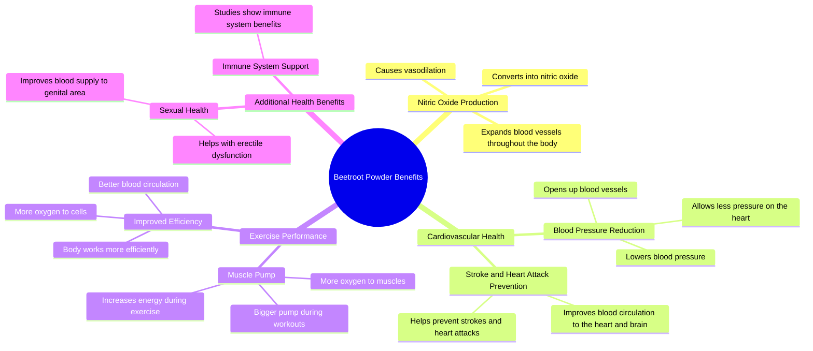

# Beetroot Powder Benefits: Nitric Oxide, Pumps & Blood Pre...

> 🌐 **Read this in:** [English](../../en/2026-07/tiktok-transcript-all-the-benefits-of-beet-root-fyp-beetroot-beetrootpowder-me-8fd2.md) · **中文**

> **Creator:** [@trainwithjk](https://www.tiktok.com/@trainwithjk) · **Views:** 544.3K · **Posted:** 2026-07-30 · **Niche:** fitness
>
> **TL;DR:** Starts with a scientific mechanism that promises a tangible fitness result, hooking gym enthusiasts immediately.

[Watch original video →](https://www.tiktok.com/@trainwithjk/video/7167214449760193835?is_from_webapp=1&sender_device=pc&web_id=7652559874152564254)

## Why This Went Viral

## 钩子（前3秒）
- **逐字开场白：** “甜菜根粉转化为一氧化氮，引起血管扩张，你输送到肌肉的氧气越多，泵感就越大，而氧气就是生命。”
- **钩子模式类型：** 大胆断言 + 科学触发 + 即时收益（“更大泵感”）
- **为何能让人停下滚动：** 它前置了一个听起来很权威的生理机制（一氧化氮→血管扩张），然后立刻将其与健身圈的实际收益（“更大泵感”）挂钩——一口气同时吸引了对科学好奇的观众和痴迷健身的人群。

## 情绪节奏
- **节拍1 — 好奇（0–3秒）：** “甜菜根粉转化为一氧化氮……”——听起来像是一个秘密科学窍门。
- **节拍2 — 紧张（3–8秒）：** “它实际上可以降低血压……对于那些有勃起功能障碍困扰的男性来说”——转向一个脆弱且高风险的敏感话题。
- **节拍3 — 释然/共鸣（8–14秒）：** “更多的血液循环意味着更好的健康……打开那些血管，减轻心脏的压力”——用简单的方式解释机制，让人感觉找到了解决方案。
- **节拍4 — 升级（14–20秒）：** “这是帮助你预防中风或心脏病发作的方法之一”——将利害关系提升到生死攸关的层面。
- **节拍5 — 转折/高潮（20–24秒）：** “我现在才意识到我从来没有深入讲过甜菜根粉”——一个元时刻，让创作者显得更有人情味，同时暗示内容价值。
- **高潮时刻：** 提到勃起功能障碍——这是一个禁忌话题，容易引发共鸣，瞬间将受众从健身爱好者扩展到更广泛的人群。

## 关键词密度
| 词语/短语 | 次数（约） | 触达 vs. 吸引 |
|-------------|-----------------|----------------|
| “氧气” | 5 | **算法触达** — 高搜索量的健康关键词 |
| “血液循环 / 血管” | 4 | **情感吸引** — 暗示活力、年轻、预防 |
| “甜菜根粉” | 3 | **垂直关键词** — 精准定位补剂购买者 |
| “一氧化氮” | 2 | **算法触达** — 热门生物黑客术语 |
| “心脏病发作 / 中风” | 2 | **情感吸引** — 基于恐惧的紧迫感 |
| “肌肉 / 泵感” | 2 | **算法触达** — 健身受众 |
| “勃起功能障碍” | 1 | **情感吸引** — 高互动率的禁忌话题 |

## 为何能广泛传播
1. **禁忌桥梁：** “勃起功能障碍”在健身短视频中很少被提及——它打破了算法的内容边界，推动那些感到被看见的男性发表评论和分享。
2. **层层叠加的收益阶梯：** 视频从泵感→能量→血压→预防心脏病发作→免疫系统→勃起功能障碍——每一步都在扩大受众范围（健身、健康、老龄化、男性健康）。
3. **元层面的自我暴露：** “我现在才意识到我从来没有深入讲过”——这句带有自我觉察的话听起来像是一种坦白，增加了信任感，促使观众收藏视频以备后用。
4. **科学即权威：** “一氧化氮引起血管扩张”听起来像医生的解释，让视频显得足够可信，观众无需查证就愿意分享。
5. **评论诱饵结构：** 提到勃起功能障碍 + “关注获取更多健康建议” + 开放式收益，自然形成了评论钩子（“真的有效吗？”“你用的什么牌子？”）。

## 你可以借鉴什么
1. **用机制开头，而不是用断言。** 以“X转化为Y，进而引起Z”开头——听起来像内行知识，能迅速建立权威感。
2. **尽早桥接到禁忌话题。** 在第一个收益之后，转向一个脆弱受众群体（勃起功能障碍、脑雾、衰老）——这会大幅提升互动率，并将触达范围扩展到核心领域之外。
3. **以元层面的自我觉察收尾。** 说“我刚意识到我从来没有解释过这个”会让视频感觉像是一份礼物，而不是推销——观众会将其保存为参考资料。

## Mind Map

## Full Transcript (Generated by [TokTranscript](https://toktranscript.com/?utm_source=github&utm_medium=breakdown&utm_campaign=tool_attribution))

> 📝 Transcripts on this page are auto-generated and show the first 60%. Want to transcribe any TikTok in 30 seconds and get the full version? [Try TokTranscript free →](https://toktranscript.com/?utm_source=github&utm_medium=breakdown&utm_campaign=transcript_cta)

beetroot powder converts into nitric oxide which causes vasodilation the more oxygen you get to your muscles the bigger pump and oxygen is life it can actually lower blood pressure follow for more health tips the more efficiently your body is going to be able to work and for the men that struggle with things like erectile dysfunction as the more oxygen your cells get for all my gym bros and muscle mommies and more blood circulation means better health or the expansion of blood vessels throughout the entire body by opening up those blood vessels allowing less pressure on your heart it's also gonna help create your

*[Read the full transcript on TokTranscript →](https://toktranscript.com/plaza/tiktok-transcript-all-the-benefits-of-beet-root-fyp-beetroot-beetrootpowder-me-8fd2?utm_source=github&utm_medium=breakdown&utm_campaign=transcript_full)*

## Browse More

- All [fitness](../../by-niche/zh-CN/fitness.md) breakdowns
- All [Science-Backed Benefit Tease](../../by-pattern/zh-CN/hook-science-backed-benefit-tease.md) examples

## Video Info

| | |
|---|---|
| Creator | [@trainwithjk](https://www.tiktok.com/@trainwithjk) |
| Original video | [https://www.tiktok.com/@trainwithjk/video/7167214449760193835?is_from_webapp=1&sender_device=pc&web_id=7652559874152564254](https://www.tiktok.com/@trainwithjk/video/7167214449760193835?is_from_webapp=1&sender_device=pc&web_id=7652559874152564254) |
| Original title | All the benefits of beet root  #fyp #beetroot #beetrootpowder #menshe... |
| Views | 544.3K (544300) |
| Posted | 2026-07-30 |
| Duration | 0s |
| Niche | `fitness` |
| Hook pattern | `Science-Backed Benefit Tease` |
| Original language | `en` (this page translated by AI) |
| Available languages | en, zh-CN |
| Generated | 2026-07-31 by [TokTranscript](https://toktranscript.com/) |

---

*This breakdown is for educational analysis under fair use. Original video © [@trainwithjk](https://www.tiktok.com/@trainwithjk). All transcripts are auto-generated and may contain errors.*

*Want to analyze your own TikToks like this? [TikTok 转录工具 →](https://toktranscript.com/viral-breakdown?utm_source=github&utm_medium=breakdown&utm_campaign=footer_cta)*