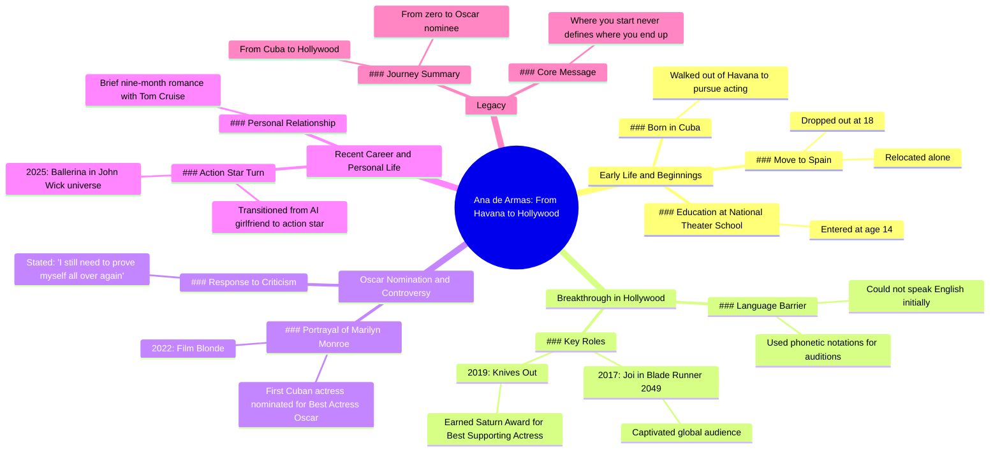

# Ana de Armas Through the Years

> 🌐 **Read this in:** [English](../../en/2026-07/tiktok-transcript-ana-de-armas-through-the-years-anadearmas-fyp-foryou-through-c66a.md) · **中文**

> **Creator:** [@chronos085](https://www.tiktok.com/@chronos085) · **Views:** 2.7M · **Posted:** 2026-07-14 · **Niche:** entertainment
>
> **TL;DR:** Immediately establishes a relatable, aspirational figure with a clear underdog narrative.

[Watch original video →](https://vt.tiktok.com/ZSXhcD681/)

## Why This Went Viral

## 钩子（前3秒）
- **逐字开场白：**"她是安娜·德·阿玛斯，那个走出哈瓦那的古巴女孩，如今成为好莱坞最令人着迷的新生代银幕女神之一。"
- **钩子模式：**大胆断言 + 身份反差（"古巴女孩" vs. "好莱坞银幕女神"）
- **为何能阻止滑动：**立即构建了一个戏剧性的逆袭叙事，包含具体且陌生的起点（哈瓦那）和高地位结局（好莱坞女神）。这种反差瞬间引发好奇——她是怎么从那里走到这里的？

## 情感节奏
- **节拍1 – 好奇：**"走出哈瓦那的古巴女孩……"——铺垫一段旅程
- **节拍2 – 张力：**"一句英语都不会说……用音标标注"——障碍 + 坚韧
- **节拍3 – 回报：**"《银翼杀手2049》让全世界为那双眼睛倾倒"——首次成功
- **节拍4 – 升级：**"《利刃出鞘》……土星奖"——认可
- **节拍5 – 巅峰高潮：**"首位获得奥斯卡最佳女主角提名的古巴女演员"——历史性成就
- **节拍6 – 脆弱低谷：**"我仍然需要重新证明自己"——人性化，引发共鸣
- **节拍7 – 回归：**"凭借《芭蕾女杀手》强势回归……动作明星"——救赎弧线
- **节拍8 – 最终决心：**"起点从不定义终点"——情感收束
- **高潮时刻：**奥斯卡提名揭晓——这是风险最高、最具历史意义的里程碑

## 关键词密度
| 词语/短语 | 频率 | 驱动因素 |
|---|---|---|
| "古巴" | 3次 | 算法覆盖（身份+地理标签） |
| "好莱坞" | 3次 | 算法覆盖（行业权威） |
| "奥斯卡"/"提名" | 2次 | 算法覆盖（声望信号） |
| "证明" | 2次 | 情感吸引（逆袭叙事） |
| "首位" | 2次 | 情感吸引（独特性、历史性） |
| "零" | 1次 | 情感吸引（与"奥斯卡提名者"形成反差） |
| "独自" | 1次 | 情感吸引（脆弱性、共鸣感） |
| "强势回归" | 1次 | 情感吸引（回归戏剧性） |

## 为何能传播
1. **逆袭成偶像的弧线具有普遍分享性**——"她一句英语都不会说"→"奥斯卡提名者"。这种结构跨文化有效，因为它激发励志情感。观众会@需要动力的朋友。
2. **具体且令人惊讶的里程碑创造"哇"时刻**——"首位获得奥斯卡最佳女主角提名的古巴女演员"是一个让人感觉像发现新大陆的事实。人们分享以表明自己知道酷事。
3. **脆弱+回归=情感留存**——奥斯卡提名后那句"我仍然需要重新证明自己"让故事人性化。防止视频显得像吹捧之作。观众会评论自己的挣扎。
4. **提及高认知度IP**——"《银翼杀手2049》"、"《利刃出鞘》"、"《疾速追杀》"、"汤姆·克鲁斯"——每个都触发观众的微记忆，让视频感觉内容丰富。人们因识别多个接触点而分享。
5. **结尾是可引用的金句**——"起点从不定义终点"是可分享、适合文字叠加的句子。可作为Instagram、TikTok或Twitter转发的独立标题。

## 你可以借鉴什么
1. **前三个词用身份反差开场**——"她是[名字]，那个[卑微出身]成为[高地位结局]的[身份]。"这个模式适用于任何人物或品牌故事。它立即暗示一个转变弧线。
2. **在最大胜利后立即插入一句脆弱台词**——奥斯卡提名揭晓后，添加一句像"我仍然需要证明自己"的引用。这防止视频感觉像高光集锦，并引发更深层的情感投入。
3. **以一句普适的单句格言结尾**——用一句可独立作为图形引用的句子收尾。增加二次创作、收藏和分享的机会。测试："起点从不定义终点"是9个字——目标控制在12字以内。

## Mind Map

## Full Transcript (Generated by [TokTranscript](https://toktranscript.com/?utm_source=github&utm_medium=breakdown&utm_campaign=tool_attribution))

> 📝 Transcripts on this page are auto-generated and show the first 60%. Want to transcribe any TikTok in 30 seconds and get the full version? [Try TokTranscript free →](https://toktranscript.com/?utm_source=github&utm_medium=breakdown&utm_campaign=transcript_cta)

She is Ana de Armas, the Cuban girl who walked out of Havana and became one of Hollywood's most mesmerizing new generation screen goddesses. At 14, she entered Cuba's National Theater School. At 18, she dropped out and moved to Spain alone. When she set her sights on Hollywood, she couldn't speak a word of English, but she marked every single line of dialogue with phonetic notations before every audition. In 2017, her role is joy in Blade Runner 2049 made the whole world fall for those eyes. In 2019, knives out put her on the map and earned her a Saturn Award for best supporting actress. In 2022, as a Cuban born actress, she brought Marilyn Monroe back to life on the big screen. Blonde

*[Read the full transcript on TokTranscript →](https://toktranscript.com/plaza/tiktok-transcript-ana-de-armas-through-the-years-anadearmas-fyp-foryou-through-c66a?utm_source=github&utm_medium=breakdown&utm_campaign=transcript_full)*

## Browse More

- All [entertainment](../../by-niche/zh-CN/entertainment.md) breakdowns
- All [Identity Reveal + Underdog Origin](../../by-pattern/zh-CN/hook-identity-reveal-underdog-origin.md) examples

## Video Info

| | |
|---|---|
| Creator | [@chronos085](https://www.tiktok.com/@chronos085) |
| Original video | [https://vt.tiktok.com/ZSXhcD681/](https://vt.tiktok.com/ZSXhcD681/) |
| Original title | Ana de Armas through the years #anadearmas #fyp #foryou #throughtheye... |
| Views | 2.7M (2700000) |
| Posted | 2026-07-14 |
| Duration | 0s |
| Niche | `entertainment` |
| Hook pattern | `Identity Reveal + Underdog Origin` |
| Original language | `en` (this page translated by AI) |
| Available languages | en, zh-CN |
| Generated | 2026-07-15 by [TokTranscript](https://toktranscript.com/) |

---

*This breakdown is for educational analysis under fair use. Original video © [@chronos085](https://www.tiktok.com/@chronos085). All transcripts are auto-generated and may contain errors.*

*Want to analyze your own TikToks like this? [TokTranscript 转录工具 →](https://toktranscript.com/viral-breakdown?utm_source=github&utm_medium=breakdown&utm_campaign=footer_cta)*