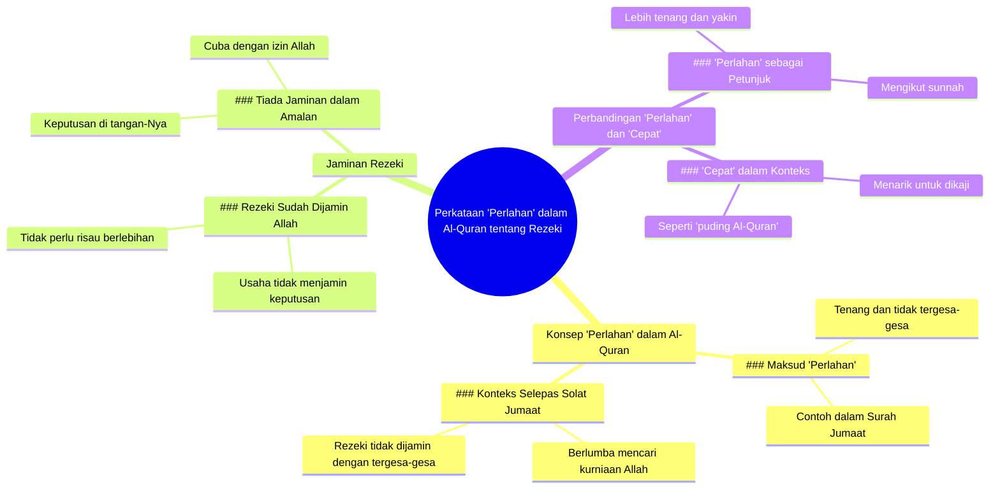

# Bagaimana wording dalam Quran menggambarkan ketika mengejar dunia dan...

> 🌐 **Read this in:** [English](../../en/2026-07/tiktok-transcript-bagaimana-wording-dalam-quran-menggambarkan-ketika-mengejar-3229.md) · **中文**

> **Creator:** [@apaciter.podcast](https://www.tiktok.com/@apaciter.podcast) · **Views:** 347.4K · **Posted:** 2026-07-24 · **Niche:** other
>
> **TL;DR:** Opens with a cryptic divine hint to spark curiosity about a lesser-known Quranic concept.

[Watch original video →](https://vt.tiktok.com/ZSX7rrEmM/)

## Why This Went Viral

## Hook (3 saat pertama)
- **Apa yang berlaku secara verbatim:** "Dalam Quran, ada kata tentang mencari rezeki. Allah hint dengan kata pelan."
- **Jenis corak hook:** *Contrast* (perbandingan antara konsep "pelan" dengan kebiasaan "cepat" dalam mencari rezeki)
- **Kenapa ia buat penonton berhenti skrol:** Ayat pertama langsung menyentuh isu universal (rezeki) dengan pendekatan yang tidak biasa—menggunakan perkataan "pelan" yang bertentangan dengan budaya kerja keras dan kejar-masa. Ini menimbulkan rasa ingin tahu segera.

## Emotional Rhythm
- **Detik emosi mengikut urutan:**
  1. **Curiosity** (0-3s) – "Allah hint dengan kata pelan" → menimbulkan tanda tanya
  2. **Resonance** (3-10s) – "Seperti Surah Jumaat... selepas solat Jumaat, berlumba-lumba" → penonton kenal dengan konteks solat Jumaat
  3. **Tension** (10-15s) – "Rezeki Allah dah jamin... tak ada jaminan dalam usaha" → kontradiksi yang membuat penonton fokus
  4. **Relief + Insight** (15-20s) – "Walaupun kena cepat pun, macam Quran puding" → twist lucu yang melegakan
- **Klimaks:** "Tak ada jaminan dalam usaha" – detik paling kuat dari segi emosi kerana ia membalikkan logik biasa (usaha = jaminan)
- **Twist:** Akhir dengan "Quran puding" – jenaka ringan yang membuat mesej lebih mudah diingat

## Keyword Density
| Kata/Frasa | Kekerapan | Fungsi |
|------------|-----------|--------|
| **Rezeki** | 4x | **Algoritma** – kata kunci utama untuk capaian (rezeki = topik trending dalam komuniti Muslim) |
| **Pelan** | 3x | **Emosi** – kontras dengan budaya cepat, menimbulkan rasa tenang |
| **Jamin** | 2x | **Algoritma + Emosi** – kata kunci yang kuat untuk kepercayaan dan ketenangan |
| **Cepat** | 2x | **Emosi** – mewakili tekanan sosial yang ingin dilepaskan |
| **Allah** | 2x | **Algoritma** – kata kunci agama untuk capaian organik |
| **Quran** | 2x | **Algoritma** – autoriti dan kredibiliti |
| **Usaha** | 1x | **Emosi** – titik perbandingan dengan jaminan rezeki |

## Why It Spreads
1. **Kontras yang tidak biasa** – "Allah hint dengan kata pelan" vs "berlumba-lumba" → penonton terkejut kerana biasanya dengar "rezeki kena usaha keras". Ini menimbulkan rasa ingin tahu dan perdebatan dalam komen.
2. **Resolusi yang menenangkan** – "Rezeki Allah dah jamin... tak ada jaminan dalam usaha" → ayat ini melegakan tekanan kerja/kejar-masa yang dialami ramai. Penonton rasa "finally, someone said it".
3. **Twist humor yang mudah diingat** – "Quran puding" → frasa unik dan kelakar yang mudah di-share. Penonton akan ingat dan ulang dalam perbualan.
4. **Topik sejagat** – Rezeki adalah isu yang semua orang (terutama Muslim) hadapi. Tiada batasan demografi.
5. **Struktur pendek dan padat** – Video hanya ~20 saat, sesuai untuk TikTok/Reels. Setiap ayat ada fungsi—tiada filler.

## What You Can Steal
1. **Gunakan kontras dalam ayat pertama** – Mulakan dengan perkataan yang bertentangan dengan kepercayaan umum. Contoh: "Kita selalu dengar rezeki kena kejar, tapi Quran kata pelan."
2. **Letakkan resolusi emosi di tengah** – Jangan simpan mesej utama di akhir. Letakkan ayat paling powerful (seperti "rezeki dah jamin") di pertengahan untuk buat penonton terus fokus.
3. **Akhir dengan twist ringan** – Tambah humor atau metafora kelakar (macam "Quran puding") untuk buat video lebih mudah diingat dan di-share. Pastikan twist itu relevan dengan topik.

## Mind Map

## Full Transcript (Generated by [TokTranscript](https://toktranscript.com/?utm_source=github&utm_medium=breakdown&utm_campaign=tool_attribution))

> 📝 Transcripts on this page are auto-generated and show the first 60%. Want to transcribe any TikTok in 30 seconds and get the full version? [Try TokTranscript free →](https://toktranscript.com/?utm_source=github&utm_medium=breakdown&utm_campaign=transcript_cta)

In the Quran, there are words about seeking sustenance. God hinted with the word slow. It's like being calm. calm, for example, like Surah Jumaat. After Friday prayers. racing to find God's forgiveness because that thing is not guaranteed. God's sustenance has guaranteed it. 

*[Read the full transcript on TokTranscript →](https://toktranscript.com/plaza/tiktok-transcript-bagaimana-wording-dalam-quran-menggambarkan-ketika-mengejar-3229?utm_source=github&utm_medium=breakdown&utm_campaign=transcript_full)*

## Browse More

- All [other](../../by-niche/zh-CN/other.md) breakdowns
- All [Mystery Reveal](../../by-pattern/zh-CN/hook-mystery-reveal.md) examples

## Video Info

| | |
|---|---|
| Creator | [@apaciter.podcast](https://www.tiktok.com/@apaciter.podcast) |
| Original video | [https://vt.tiktok.com/ZSX7rrEmM/](https://vt.tiktok.com/ZSX7rrEmM/) |
| Original title | Bagaimana wording dalam Quran menggambarkan ketika mengejar dunia dan... |
| Views | 347.4K (347400) |
| Posted | 2026-07-24 |
| Duration | 0s |
| Niche | `other` |
| Hook pattern | `Mystery Reveal` |
| Original language | `ms` (this page translated by AI) |
| Available languages | en, zh-CN |
| Generated | 2026-07-25 by [TokTranscript](https://toktranscript.com/) |

---

*This breakdown is for educational analysis under fair use. Original video © [@apaciter.podcast](https://www.tiktok.com/@apaciter.podcast). All transcripts are auto-generated and may contain errors.*

*Want to analyze your own TikToks like this? [TokTranscript →](https://toktranscript.com/viral-breakdown?utm_source=github&utm_medium=breakdown&utm_campaign=footer_cta)*