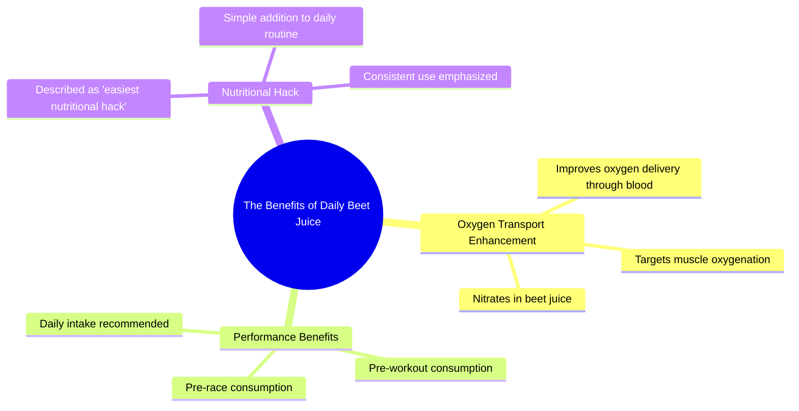

# Beet Juice: The Easiest Performance Boost Before Workouts

> 🌐 **Read this in:** [English](../../en/2026-07/tiktok-transcript-beet-juice-is-the-simplest-performance-boost-you-can-add-bef-85f1.md) · **中文**

> **Creator:** [@postrunhigh](https://www.tiktok.com/@postrunhigh) · **Views:** 969.1K · **Posted:** 2026-07-30 · **Niche:** fitness
>
> **TL;DR:** Starts with a surprising personal habit then poses a question to hook curiosity.

[Watch original video →](https://www.tiktok.com/@postrunhigh/video/7579356281593433358?is_from_webapp=1&sender_device=pc&web_id=7652559874152564254)

## Why This Went Viral

## 钩子（前3秒）
- **逐字开场白：**“我确实每天都喝甜菜根汁。”
- **钩子模式：**大胆主张 / 个人自白
- **为何能阻止滑动：**演讲者以一个明确、不加修饰的个人习惯（“我确实每天都喝甜菜根汁”）开场，听起来像是一个秘密或自白。这立刻引发好奇：*为什么会有人这么做？有什么好处？* 直白而自信的表达让你感觉即将得知一个隐藏的捷径。

## 情绪节奏
1. **好奇**——“甜菜根汁有什么作用？”（反问句，为揭示做铺垫）
2. **张力**——“甜菜根汁里含有硝酸盐，能帮助你携带氧气……”（技术性解释制造悬念）
3. **释然 / 回报**——“百分之百，这真的是，最简单的营养窍门。”（高潮：回报简单、强大且经过验证）
4. **紧迫感**——“比赛和训练前喝甜菜根汁。每天都喝。”（行动号召，营造必须去做的感觉）
5. **共鸣**——“百分之百。”（最终肯定，让建议显得坚不可摧）
- **高潮时刻：**“最简单的营养窍门”这句话——将复杂的生理过程重新定义为一句生活窍门。

## 关键词密度
- **甜菜根汁**（3次）——核心产品；提升可搜索性和细分兴趣（健身、健康）
- **百分之百**（2次）——情感锚点；传达确定性和权威感
- **窍门**（1次）——高算法触达关键词（病毒式“生活窍门”模式）
- **硝酸盐**（1次）——科学可信度；吸引“健康/表现”相关搜索的算法
- **氧气 / 血液 / 肌肉**（3次）——生理学术语；吸引健身/耐力受众的自然搜索
- **每天**（1次）——频率触发词；让建议听起来像一种习惯，而非一次性行为

**算法触达驱动词：**“窍门”“甜菜根汁”“硝酸盐”“氧气”。  
**情感拉动驱动词：**“百分之百”“最简单”“每天”。

## 为何能传播
1. **“秘密捷径”模式**——演讲者将一个简单、反直觉的习惯呈现为“窍门”。人们喜欢感觉自己发现了优势。*“最简单的营养窍门”*这句话是病毒式传播的钩子，常被用在标题和评论中分享。
2. **高权威、低门槛**——演讲者使用科学语言（“硝酸盐”“通过血液携带氧气”）来显得可信，但在15秒的短视频中呈现。没有术语，没有废话。这让建议既值得信赖又立即可执行。
3. **确定性的重复**——“百分之百”出现两次。在短视频中，重复的肯定句充当记忆锚点。观众离开时感觉得到了一个明确的答案，从而推动分享（“我看到有人说甜菜根汁有效——100%是真的”）。
4. **“每天都喝”的行动号召**——最后一句*“每天都喝”*将建议转化为习惯。这创造了一个观众可以立即采纳的心理脚本，从而激发用户生成内容（UGC），比如“我试了一周甜菜根汁”的后续视频。
5. **低投入、高回报**——视频只有15秒。建议本身零成本（甜菜根汁很便宜）。承诺却很大（更好的表现）。这种风险/回报比非常适合病毒式传播——观众觉得试试没有任何损失。

## 你可以借鉴什么
1. **以个人习惯开场，而非事实。**不要说“研究表明X”，而是说“我每天都做X”。这能立刻引发好奇，并将你定位为可信的内部人士。
2. **使用“百分之百”双重肯定。**在钩子的开头和结尾重复一个简短、绝对的肯定句。这传达出不可动摇的信心，让你的建议显得确定无疑。
3. **前置“窍门”标签。**在前10秒内将你的建议称为“窍门”。这个词本身就能触发算法触达和观众对快速、有价值捷径的期待。然后用一句简单的科学解释来支撑它。

## Mind Map

## Full Transcript (Generated by [TokTranscript 转录工具](https://toktranscript.com/?utm_source=github&utm_medium=breakdown&utm_campaign=tool_attribution))

> 📝 Transcripts on this page are auto-generated and show the first 60%. Want to transcribe any TikTok in 30 seconds and get the full version? [Try TokTranscript free →](https://toktranscript.com/?utm_source=github&utm_medium=breakdown&utm_campaign=transcript_cta)

I do drink beet juice every day. What does beet juice do? So beet juice, uh, has nitrates in it that help you carry oxygen through the blood, so to the muscles. Hundred percent like, tha

*[Read the full transcript on TokTranscript →](https://toktranscript.com/plaza/tiktok-transcript-beet-juice-is-the-simplest-performance-boost-you-can-add-bef-85f1?utm_source=github&utm_medium=breakdown&utm_campaign=transcript_full)*

## Browse More

- All [fitness](../../by-niche/zh-CN/fitness.md) breakdowns
- All [Personal confession + curiosity gap](../../by-pattern/zh-CN/hook-personal-confession-curiosity-gap.md) examples

## Video Info

| | |
|---|---|
| Creator | [@postrunhigh](https://www.tiktok.com/@postrunhigh) |
| Original video | [https://www.tiktok.com/@postrunhigh/video/7579356281593433358?is_from_webapp=1&sender_device=pc&web_id=7652559874152564254](https://www.tiktok.com/@postrunhigh/video/7579356281593433358?is_from_webapp=1&sender_device=pc&web_id=7652559874152564254) |
| Original title | Beet juice is the simplest performance boost you can add before worko... |
| Views | 969.1K (969100) |
| Posted | 2026-07-30 |
| Duration | 0s |
| Niche | `fitness` |
| Hook pattern | `Personal confession + curiosity gap` |
| Original language | `en` (this page translated by AI) |
| Available languages | en, zh-CN |
| Generated | 2026-07-31 by [TokTranscript](https://toktranscript.com/) |

---

*This breakdown is for educational analysis under fair use. Original video © [@postrunhigh](https://www.tiktok.com/@postrunhigh). All transcripts are auto-generated and may contain errors.*

*Want to analyze your own TikToks like this? [拆解你自己的 TikTok →](https://toktranscript.com/viral-breakdown?utm_source=github&utm_medium=breakdown&utm_campaign=footer_cta)*