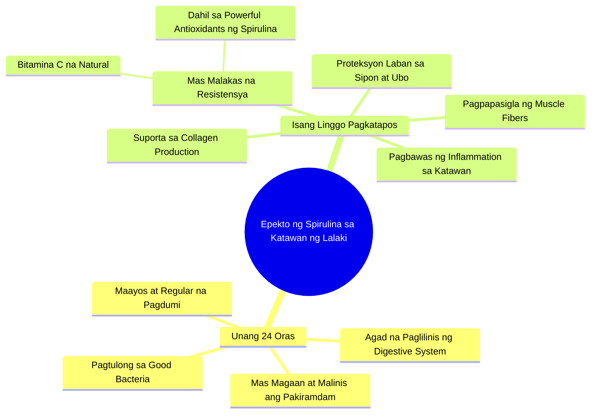

# Spirulina Benefits for Men and Digestion

> 🌐 **Read this in:** [English](../../en/2026-07/tiktok-transcript-benefits-ng-spirulina-sa-lalaki-at-bakit-maganda-ito-sa-dige-86bc.md) · **中文**

> **Creator:** [@healthyph](https://www.tiktok.com/@healthyph) · **Views:** 442.5K · **Posted:** 2026-07-29 · **Niche:** fitness
>
> **TL;DR:** It creates immediate curiosity about a specific bodily transformation within a short timeframe.

[Watch original video →](https://www.tiktok.com/@healthyph/video/7585086871026273556?shop_region=PH&shop_id=7495310222761495027)

## Why This Went Viral

## 钩子（前3秒）
- **原句：** "当男人喝下螺旋藻时，他身体可能会有这样的感受"
- **模式：** 场景 + 好奇心（尚未说明会发生什么，但已勾起你对效果的想象）
- **为何你会停下：** 使用了"你"的视角和"这就是……的方式"——仿佛是一场个人实验。不是泛泛的"螺旋藻的好处"，而是"你的身体会有这样的感受"。瞬间产生关联感。

## 情绪节奏
- **好奇心（0–3秒）：** 我的身体会有什么感觉？
- **期待感（3–5秒）：** "仅仅24小时内"——有时间线，有承诺
- **微小释然（5–10秒）：** "更轻盈、更洁净"——积极结果，让你放心并非负面体验
- **建立信任（10–15秒）：** "有益菌、消化、规律观察"——看似科学却简单易懂
- **惊喜 + 紧张（15–20秒）：** "简单的咳嗽总也好不了"——突然出现威胁，有了问题
- **解决（20–25秒）：** "胶原蛋白、修复肌纤维、减少炎症"——问题的解决方案
- **高潮：** "关注获取更多"——带有社交证明的行动号召（如果你喜欢这个，还有后续）

## 关键词密度
| 关键词 | 出现次数 | 目的 |
|---------|-------|---------|
| **螺旋藻** | 3次 | 算法驱动（产品名称，可搜索） |
| **身体** | 4次 | 情感驱动（个人化，易共鸣） |
| **洁净 / 轻盈** | 2次 | 情感驱动（向往的，积极的） |
| **能量** | 2次 | 算法 + 情感驱动（搜索量高） |
| **胶原蛋白** | 1次 | 算法驱动（热门关键词） |
| **炎症** | 1次 | 算法驱动（健康细分领域） |
| **24小时 / 一周** | 2次 | 情感驱动（紧迫感，进展感） |
| **有益菌** | 1次 | 情感驱动（信任感，科学感） |

**算法驱动词：** 螺旋藻、胶原蛋白、炎症、能量——这些在健康领域都有很高的搜索量。
**情感吸引力：** 身体、洁净、轻盈、能量——全是积极的转变词汇。

## 为何能传播
1. **快速见效的承诺** —— "仅仅24小时内" + "一周后" = 效果有明确时间线。不模糊。易于分享，因为听起来像"试试这个，一天就能看到效果。"
2. **问题 → 解决方案模式** —— "简单的咳嗽总也好不了" → "螺旋藻能解决。"利用对疾病的恐惧来包装产品作为解决方案。经典的痛点营销。
3. **个性化语言** —— "这就是*他*可能有的感受"，但感觉像是在说你。使用"他的身体"来避免过于推销，但仍保持关联性。
4. **社交证明式行动号召** —— "如果你喜欢这类内容，关注获取更多"——不是"立即购买"，而是"关注"。门槛更低，互动率更高。
5. **微教育风格** —— 不只是罗列好处，还有解释（有益菌、抗氧化剂、维生素C）。像是在教学，而不是在推销。更值得信赖。

## 你可以借鉴的点
1. **使用"仅仅X小时/天"的公式** —— 给结果加上具体时间线。不是"有效"，而是"24小时"。更可信，更易分享。
2. **问题先行，解决方案在后** —— 在介绍产品之前，先从一个常见问题开始（咳嗽、精力不足、炎症）。更易引起共鸣。
3. **使用"关注获取更多"而非"立即购买"** —— 阻力更小，互动机会更大。如果你想走红，初期互动 > 销售。

## Mind Map

## Full Transcript (Generated by [TokTranscript 转录工具](https://toktranscript.com/?utm_source=github&utm_medium=breakdown&utm_campaign=tool_attribution))

> 📝 Transcripts on this page are auto-generated and show the first 60%. Want to transcribe any TikTok in 30 seconds and get the full version? [Try TokTranscript free →](https://toktranscript.com/?utm_source=github&utm_medium=breakdown&utm_campaign=transcript_cta)

When the man drinks spirulina This is how he might feel in his body In just twenty Four hours will notice that the lighter and cleaner Because it helps to clean immediately The digestion and trick The good Bacteria for Smooth and help with Regular observations and for Natural Energy After a week More male resistance is stronger thanks to Powerful Antioxidants of Spir

*[Read the full transcript on TokTranscript →](https://toktranscript.com/plaza/tiktok-transcript-benefits-ng-spirulina-sa-lalaki-at-bakit-maganda-ito-sa-dige-86bc?utm_source=github&utm_medium=breakdown&utm_campaign=transcript_full)*

## Browse More

- All [fitness](../../by-niche/zh-CN/fitness.md) breakdowns
- All [Curiosity gap + time promise](../../by-pattern/zh-CN/hook-curiosity-gap-time-promise.md) examples

## Video Info

| | |
|---|---|
| Creator | [@healthyph](https://www.tiktok.com/@healthyph) |
| Original video | [https://www.tiktok.com/@healthyph/video/7585086871026273556?shop_region=PH&shop_id=7495310222761495027](https://www.tiktok.com/@healthyph/video/7585086871026273556?shop_region=PH&shop_id=7495310222761495027) |
| Original title | benefits ng spirulina sa lalaki at bakit maganda ito sa digestion. #n... |
| Views | 442.5K (442500) |
| Posted | 2026-07-29 |
| Duration | 0s |
| Niche | `fitness` |
| Hook pattern | `Curiosity gap + time promise` |
| Original language | `tl` (this page translated by AI) |
| Available languages | en, zh-CN |
| Generated | 2026-07-30 by [TokTranscript](https://toktranscript.com/) |

---

*This breakdown is for educational analysis under fair use. Original video © [@healthyph](https://www.tiktok.com/@healthyph). All transcripts are auto-generated and may contain errors.*

*Want to analyze your own TikToks like this? [免费 TikTok 文稿生成器 →](https://toktranscript.com/viral-breakdown?utm_source=github&utm_medium=breakdown&utm_campaign=footer_cta)*