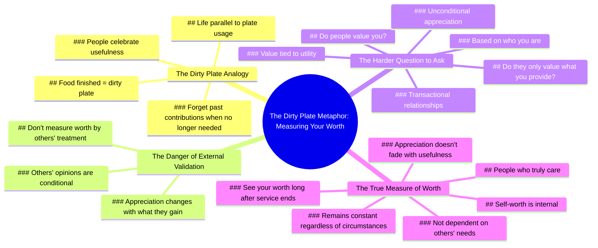

# Best Motivational Speech: Life Lesson on Self-Worth

> 🌐 **Read this in:** [English](../../en/2026-07/tiktok-transcript-best-motivational-speech-life-lesson-must-watch-foryou-foryo-2145.md) · **中文**

> **Creator:** [@relationmotivation786](https://www.tiktok.com/@relationmotivation786) · **Views:** 1.5M · **Posted:** 2026-07-04 · **Niche:** other
>
> **TL;DR:** Uses a relatable, vivid metaphor to immediately draw viewers into a deeper reflection on worth.

[Watch original video →](https://vm.tiktok.com/ZNRKM29Ny/)

## Why This Went Viral

## 钩子（前3秒）
- **逐字内容：** "当食物被吃完，他们管那叫脏盘子。"
- **钩子模式：** 对比/隐喻（脏盘子 vs. 人的价值）
- **为何能让人停下滑动：** 这个隐喻瞬间让人产生共鸣，略带刺耳，并揭示了一个关于交易型关系的普遍真相。它让观众停下来解读这个类比。

## 情绪节奏
1. **好奇**（0–3秒）——"脏盘子"的隐喻触发"这是什么意思？"的反射性思考。
2. **认同**（4–8秒）——"你有用时，人们为你欢呼"直击一个痛苦而熟悉的真相。
3. **紧张**（9–12秒）——"他们的感激往往随着能从你身上得到什么而改变"加剧了刺痛感。
4. **反思**（13–16秒）——"问自己一个更难的问题"将焦点从外部指责转向内部自省。
5. **高潮**（17–19秒）——"人们是看重你这个人，还是只看重你能提供什么？"——核心情感冲击。
6. **释然/解脱**（20–24秒）——"真正在乎你的人……在很久之后依然能看到你的价值"提供了一个温柔的落脚点和希望。

## 关键词密度
- **"价值/有价值的"**（4次）——算法覆盖（高互动自我提升关键词）+ 情感吸引力（身份威胁）。
- **"值得"**（2次）——情感吸引力（自尊触发）；中等算法权重。
- **"有用/提供/服务"**（3次）——情感吸引力（害怕被利用）；低算法权重。
- **"人们"**（3次）——算法覆盖（广泛、高流量词汇）。
- **"你/你的"**（6次）——算法覆盖（个性化提升观看时长）+ 情感吸引力（直接对话）。
- **"在乎/真正在乎"**（2次）——情感吸引力（与交易型爱的对比）；低算法权重但高留存率。

## 为何能传播
1. **普遍痛苦真相 + 隐喻**——"脏盘子"是一个粘性十足、视觉化的类比，能立即引起任何曾感到被利用的人的共鸣。它易于分享，因为它点明了一种禁忌感受，却不说教。
2. **直接的第二人称对话**——"你"和"你的"出现6次，让每个观众都感觉被单独对话。这增加了观看时长和评论互动（"这说的是我的前任/老板/朋友"）。
3. **情绪过山车与温柔落地**——脚本从不舒服的真相 → 紧张 → 尖锐问题 → 解脱。这种模式最大化留存率（观众会为了结局而留下），并增加分享（人们想把"希望"的结尾送给朋友）。
4. **呼吁内部行动，而非外部指责**——"问自己一个更难的问题"避免了受害者心态，将创作者定位为智慧而非苦涩。这让视频感觉像心理治疗而非抱怨，扩大了跨人群的分享性。
5. **节奏与停顿**——第17秒的口头磕绊（"呃"）增加了真实感。完美的朗读会显得刻意；轻微的犹豫让尖锐问题显得真诚脆弱，增加了信任和情感连接。

## 你可以借鉴什么
1. **用粘性隐喻开头，而非论点陈述。** 以一个具体、日常的画面（脏盘子、空椅子、关上的门）开场，让观众去解读。认知差距创造好奇心，为你赢得3–5秒的额外注意力。
2. **每个情绪节拍以问题而非陈述结尾。** "人们是看重你这个人，还是只看重你能提供什么？"迫使观众内心参与。默默回答的观众更可能评论或分享。
3. **在30秒内构建"真相→紧张→解脱"的弧线。** 从痛苦的观察开始，升级到尖锐问题，然后以充满希望的框架结束。这种模式模仿了成功的心理治疗内容，让观众看到最后（提升算法信号）。

## Mind Map

## Full Transcript (Generated by [免费 TikTok 文稿生成器](https://toktranscript.com/?utm_source=github&utm_medium=breakdown&utm_campaign=tool_attribution))

> 📝 Transcripts on this page are auto-generated and show the first 60%. Want to transcribe any TikTok in 30 seconds and get the full version? [Try TokTranscript free →](https://toktranscript.com/?utm_source=github&utm_medium=breakdown&utm_campaign=transcript_cta)

When the food is finished, they call it a dirty plate. That's life. People celebrate you when you're useful and forget everything you gave once they no longer need you. That's why you should never measure your worth by how others treat you. Their appreciation often changes with what they can get from you. Instea

*[Read the full transcript on TokTranscript →](https://toktranscript.com/plaza/tiktok-transcript-best-motivational-speech-life-lesson-must-watch-foryou-foryo-2145?utm_source=github&utm_medium=breakdown&utm_campaign=transcript_full)*

## Browse More

- All [other](../../by-niche/zh-CN/other.md) breakdowns
- All [Metaphorical hook](../../by-pattern/zh-CN/hook-metaphorical-hook.md) examples

## Video Info

| | |
|---|---|
| Creator | [@relationmotivation786](https://www.tiktok.com/@relationmotivation786) |
| Original video | [https://vm.tiktok.com/ZNRKM29Ny/](https://vm.tiktok.com/ZNRKM29Ny/) |
| Original title | Best Motivational Speech. Life Lesson, Must Watch. #foryou #foryoupag... |
| Views | 1.5M (1500000) |
| Posted | 2026-07-04 |
| Duration | 0s |
| Niche | `other` |
| Hook pattern | `Metaphorical hook` |
| Original language | `en` (this page translated by AI) |
| Available languages | en, zh-CN |
| Generated | 2026-07-07 by [TokTranscript](https://toktranscript.com/) |

---

*This breakdown is for educational analysis under fair use. Original video © [@relationmotivation786](https://www.tiktok.com/@relationmotivation786). All transcripts are auto-generated and may contain errors.*

*Want to analyze your own TikToks like this? [TokTranscript 转录工具 →](https://toktranscript.com/viral-breakdown?utm_source=github&utm_medium=breakdown&utm_campaign=footer_cta)*