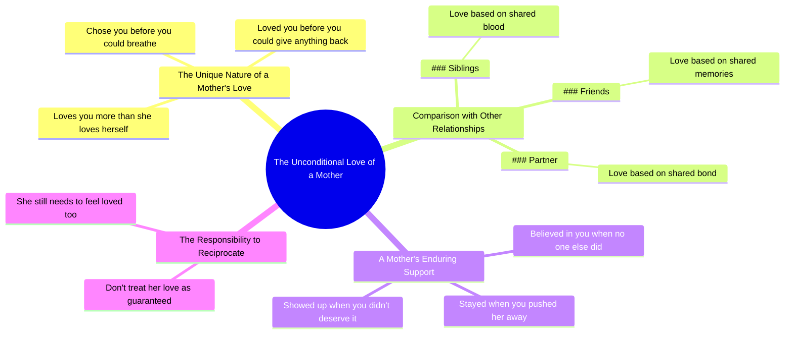

# Your Mom Loves You More Than Herself

> 🌐 **Read this in:** [English](../../en/2026-07/tiktok-transcript-best-motivational-speech-life-lesson-must-watch-foryou-foryo-b176.md) · **中文**

> **Creator:** [@successmotivation454](https://www.tiktok.com/@successmotivation454) · **Views:** 1.9M · **Posted:** 2026-07-16 · **Niche:** other
>
> **TL;DR:** Contrasts unconditional maternal love with other relationships, creating immediate emotional resonance.

[Watch original video →](https://www.tiktok.com/t/ZTS3rU21u/)

## Why This Went Viral

## 钩子（前3秒）
- **逐字内容：** "你妈妈是你生命中唯一一个爱你胜过爱自己的人。"
- **钩子模式：** 大胆断言 + 对比（妈妈 vs. 其他人）
- **为何能阻止滑动：** 它以普遍且充满情感冲击的真相开场，立即挑战观众的固有认知。"唯一"一词制造了稀缺效应，让观众觉得必须看下去才能确认或反驳这一说法。"爱你胜过爱自己"与其他关系中隐含的自私形成鲜明对比，既令人震惊又引人共鸣。

## 情感节奏
- **节拍：** 好奇（钩子）→ 认同（兄弟姐妹/朋友/伴侣部分）→ 紧张升级（"但是"——"是啊，但你妈妈"）→ 情感回报（选择、爱、留下、出现）→ 内疚/羞愧（"别把这份爱当成理所当然"）→ 行动号召（"也需要被爱"）
- **悬念/共鸣：** "是啊，但是"的转折制造了一个微小的反转。观众以为他们看懂了模式（列举关系），然后脚本转向更深层、更脆弱的真相。
- **高潮：** "当没人相信你时，她相信了你。"这是情感冲击的巅峰——它将整个叙事从"她给了你东西"重新定义为"在孤立无援时，她是你唯一的盟友。"

## 关键词密度
- **妈妈/母亲**（7次）——情感锚点，驱动传播和共鸣。
- **爱/被爱/爱**（6次）——核心情感动词，高算法情感信号。
- **你/你的**（14次）——直接称呼，营造亲密感和个性化。
- **她/她的**（10次）——强化主题，聚焦于母亲。
- **选择/选择**（2次）——高影响力动词，暗示主动性和牺牲。
- **值得/应得**（2次）——触发内疚/羞愧，强大的情感驱动力。
- **理所当然**（1次）——稀缺性词汇，触发失去的恐惧。
- **算法传播：** "妈妈"、"爱"、"你"——高流量、高互动关键词。
- **情感吸引力：** "选择"、"应得"、"理所当然"——触发深层的内疚和感恩。

## 为何能传播
1. **普遍、低门槛的情感触发器。** "你妈妈"几乎是普遍经历。脚本不需要特定背景故事——它对任何有母亲角色的人都有效。*具体台词："你妈妈是你生命中唯一一个爱你胜过爱自己的人。"*
2. **内疚作为传播引擎。** 视频让观众觉得自己对妈妈做得不够。内疚是一种高强度情感，驱动分享（证明自己是好孩子）和评论（辩护或忏悔）。*具体台词："所以别把这份爱当成理所当然。"*
3. **模式中断 + 情感升级。** "是啊，但是"的转折打破了预期的列表格式，制造了一个小惊喜，保持高留存率。从"爱你"到"选择你"再到"当没人相信你时，她相信了你"的升级构建了情感高潮。*具体台词："当没人相信你时，她相信了你。"*
4. **行动号召嵌入情感中。** 最后一句（"也需要被爱"）不是直接的"点赞分享"，而是微妙的推动（给妈妈打电话、发短信）。这驱动现实行为，观众往往会随后发帖，形成第二波内容。*具体台词："那个如此爱你的女人，仍然需要感受到被爱。"*

## 你可以借鉴的
1. **以一个大胆、普遍的断言开场，制造"我 vs. 他们"的对比。** 使用"唯一"或"没人"来制造稀缺感，立即钩住观众。*示例："你最好的朋友是唯一一个在所有人都撒谎时对你说真话的人。"*
2. **使用"是啊，但是"的转折打破可预测的模式。** 列举2-3件事，然后用"但是"或"是啊，但是"翻转脚本，传达更深层、更脆弱的真相。这能保持高留存率并制造微反转。*示例："你的老板给你反馈。你的教练给你训练。是啊，但是你的导师给你失败的权利。"*
3. **以一个看似善意的内疚式行动号召结尾。** 不要用"点赞订阅"，而是将CTA框定为提醒去做一些好事（打电话、发短信、表达感激）。这驱动现实行动和有机分享。*示例："所以别等特殊的日子才告诉他们。他们今天就需要听到。"*

## Mind Map

## Full Transcript (Generated by [免费 TikTok 文稿生成器](https://toktranscript.com/?utm_source=github&utm_medium=breakdown&utm_campaign=tool_attribution))

> 📝 Transcripts on this page are auto-generated and show the first 60%. Want to transcribe any TikTok in 30 seconds and get the full version? [Try TokTranscript free →](https://toktranscript.com/?utm_source=github&utm_medium=breakdown&utm_campaign=transcript_cta)

Your mom is the only person in your life who loves you more than she loves herself. Your siblings love you because you share blood. Your friends because you share memories. Your partner because you share a bond. Yeah, but your mom. She chose you before you could breathe. She loved you before you could give anything back. She stayed wh

*[Read the full transcript on TokTranscript →](https://toktranscript.com/plaza/tiktok-transcript-best-motivational-speech-life-lesson-must-watch-foryou-foryo-b176?utm_source=github&utm_medium=breakdown&utm_campaign=transcript_full)*

## Browse More

- All [other](../../by-niche/zh-CN/other.md) breakdowns
- All [Contrast/Comparison](../../by-pattern/zh-CN/hook-contrast-comparison.md) examples

## Video Info

| | |
|---|---|
| Creator | [@successmotivation454](https://www.tiktok.com/@successmotivation454) |
| Original video | [https://www.tiktok.com/t/ZTS3rU21u/](https://www.tiktok.com/t/ZTS3rU21u/) |
| Original title | Best Motivational Speech. Life Lesson, Must Watch. #foryou #foryoupag... |
| Views | 1.9M (1900000) |
| Posted | 2026-07-16 |
| Duration | 0s |
| Niche | `other` |
| Hook pattern | `Contrast/Comparison` |
| Original language | `en` (this page translated by AI) |
| Available languages | en, zh-CN |
| Generated | 2026-07-17 by [TokTranscript](https://toktranscript.com/) |

---

*This breakdown is for educational analysis under fair use. Original video © [@successmotivation454](https://www.tiktok.com/@successmotivation454). All transcripts are auto-generated and may contain errors.*

*Want to analyze your own TikToks like this? [免费 TikTok 文稿生成器 →](https://toktranscript.com/viral-breakdown?utm_source=github&utm_medium=breakdown&utm_campaign=footer_cta)*