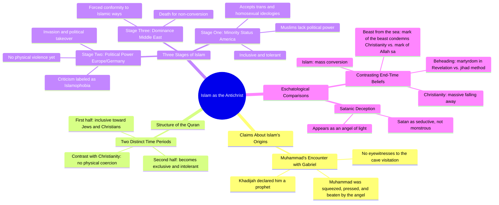

# Christian Evangelist Claims Islam Is the Antichrist

> 🌐 **Read this in:** [English](../../en/2026-07/tiktok-transcript-christian-evangelist-believes-islam-is-the-antichrist-christ-c875.md) · **中文**

> **Creator:** [@mindknowledgepower](https://www.tiktok.com/@mindknowledgepower) · **Views:** 1.6M · **Posted:** 2026-07-13 · **Niche:** other
>
> **TL;DR:** Opens with a provocative, absolute statement that immediately grabs attention and sparks debate.

[Watch original video →](https://www.tiktok.com/t/ZTSnh12oS/)

## Why This Went Viral

## 钩子（前3秒）
- **逐字开场白：** "我相信伊斯兰教就是敌基督。"
- **钩子模式：** 大胆断言 + 宗教争议
- **为何能阻止滑动：** 这是一个高风险、禁忌性的指控，以个人信仰的形式呈现。"敌基督"一词会立即引发基督徒和穆斯林观众的情绪反应（愤怒、好奇或认同）。没有人会滑过直接挑战世界主要宗教的言论。

## 情绪节奏
- **节拍1 – 震惊/愤怒（0–5秒）：** "伊斯兰教就是敌基督"——观众警惕性提高。
- **节拍2 – 好奇（5–15秒）：** "根据圣训……没有目击者"——提供伪历史"证据"，营造内幕知识的感觉。
- **节拍3 – 紧张/风险（15–30秒）：** "伊斯兰教的三个阶段……美国处于第一阶段"——构建一个风险不断升级的阴谋框架。
- **节拍4 – 共鸣/认同（30–45秒）：** "如果我作为一个同性恋者去加沙地带……我会被扔到大街上"——用具体、生动的例子给予情感重击。
- **节拍5 – 高潮（45秒至结束）：** "圣战中杀人的首要方式就是斩首……撒旦可以伪装成光明的天使"——将所有内容归结为一个黑暗、末日般的结论。"斩首"的类比是高潮。
- **节拍6 – 挥之不去的不安：** 没有解决方案就结束，让观众感到不安，更有可能评论或重看。

## 关键词密度
| 关键词/短语 | 数量（约） | 功能 |
|---|---|---|
| 伊斯兰教 / 穆斯林 / 古兰经 / 圣训 | 10+ | 算法覆盖（高搜索量的宗教术语） |
| 敌基督 / 撒旦 / 光明的天使 | 4 | 情绪拉动（恐惧、宗教身份） |
| 第一阶段 / 第二阶段 / 第三阶段 | 5 | 结构框架（营造一个看似可信的"体系"） |
| 杀害 / 斩首 / 身体伤害 | 4 | 情绪拉动（暴力、威胁） |
| 美国 / 德国 / 欧洲 / 中东 | 4 | 算法覆盖（地缘政治关键词） |
| 包容 / 排外 / 容忍 | 3 | 情绪拉动（我们vs他们、文化焦虑） |

**为何能推动传播：** "伊斯兰教"、"穆斯林"、"美国"和"古兰经"是高搜索量的术语。**为何能激发情绪：** "敌基督"、"斩首"和"撒旦"触发恐惧和愤怒，从而推动评论和分享。

## 为何能传播
1. **争议为饵：** 开场白是一枚手榴弹。"我相信伊斯兰教就是敌基督"保证了来自辩护者和攻击者的参与。每条评论（正面或负面）都会提升算法权重。
2. **虚假对等 + 模式识别：** 演讲者将伊斯兰教和基督教的末世论（海兽、兽的印记、斩首）进行类比。对于已经怀疑伊斯兰教的观众来说，这感觉像是一个"隐藏的真相"，让他们因为"发现"了模式而觉得自己很聪明。
3. **风险升级（三阶段框架）：** "第一阶段 → 第二阶段 → 第三阶段"将一个复杂的话题变成了一个简单、可怕的路线图。它制造了紧迫感：*"美国处于第一阶段，如果你不采取行动，你就会像欧洲或中东一样。"* 这是经典的基于恐惧的病毒式传播结构。
4. **具体、暴力的意象：** "当街斩首"和"如果你不改教就杀了你"是直观的。它们绕过了理性分析，直接作用于观众的杏仁核。这使得视频令人难忘且易于分享。
5. **宗教身份触发：** 视频明确地将"基督徒"与"穆斯林"对立起来。认同为基督徒的观众感到被肯定；认同为穆斯林的观众感到被攻击。两者都将其分享给各自的群体，作为号召或警告。

## 你可以借鉴什么
1. **以禁忌的个人主张开场。** 不要说"有些人认为X"。要说"我相信X"。个人化的主张使其更难被忽视，并引发辩论。（例如："我相信主流媒体是一个邪教。"）
2. **使用编号的升级结构。** "第一阶段、第二阶段、第三阶段"或"A阶段、B阶段、C阶段"营造出一种不可避免和紧迫的感觉。这是一个简单的思维模型，观众可以转述给他人。
3. **以黑暗、未解决的类比结束。** 不要整齐地收尾。让观众留下一个令人不寒而栗的比较（例如："撒旦伪装成光明的天使"），迫使他们处于不适之中。这种不适会驱使他们评论、分享或重看，以"理解"它。

## Mind Map

## Full Transcript (Generated by [我们用的转录工具](https://toktranscript.com/?utm_source=github&utm_medium=breakdown&utm_campaign=tool_attribution))

> 📝 Transcripts on this page are auto-generated and show the first 60%. Want to transcribe any TikTok in 30 seconds and get the full version? [Try TokTranscript free →](https://toktranscript.com/?utm_source=github&utm_medium=breakdown&utm_campaign=transcript_cta)

I believe Islam is the Antichrist. According to the Hadiths, Muhammad was visited by the angel Gabriel, and he is squeezed and he is pressed and beaten by this angel. And it's laughable to think that they're claiming an angel visited him in a cave. No eyewitnesses to this. He goes back home to his wife, Khadijah. She's like, oh, you're a prophet sent from God. And so there we have the birth of Islam. Now, if you read the Quran, you'll notice that it's written in two different time periods. The first half of the Quran feels very inclusive. Jews and Christians are people of the But as you continue to read the book of Islam, it becomes less inclusive and more exclusive. Isn't that Christianity? Well, in a sense, but not in the sense that we're going to physically you over it. So this is how it starts, right? There's three stages of Islam. Here's the first stage. America's in the first stage right now. They're inclusive. You have Muslims who are okay with trans and homosexual ideologies. But if I went to the Gaza Strip as a gay man and I went in the street and said, I am gay before I could finish that sentence, I'd be in the street. But here in America, the Muslims are okay with it. They're tolerating it. Why? Because they're the minority right now. Stage two is what's happening in Germany and in Europe. They've invaded that country and basically taken political power. And no, if you say something that you disagree with the Muslims, they're not gonna physically hurt you, but they're gonna call you an Islamophobe. And then stage three is I

*[Read the full transcript on TokTranscript →](https://toktranscript.com/plaza/tiktok-transcript-christian-evangelist-believes-islam-is-the-antichrist-christ-c875?utm_source=github&utm_medium=breakdown&utm_campaign=transcript_full)*

## Browse More

- All [other](../../by-niche/zh-CN/other.md) breakdowns
- All [Shocking Claim](../../by-pattern/zh-CN/hook-shocking-claim.md) examples

## Video Info

| | |
|---|---|
| Creator | [@mindknowledgepower](https://www.tiktok.com/@mindknowledgepower) |
| Original video | [https://www.tiktok.com/t/ZTSnh12oS/](https://www.tiktok.com/t/ZTSnh12oS/) |
| Original title | Christian Evangelist believes Islam is the Antichrist #christianity #... |
| Views | 1.6M (1600000) |
| Posted | 2026-07-13 |
| Duration | 0s |
| Niche | `other` |
| Hook pattern | `Shocking Claim` |
| Original language | `en` (this page translated by AI) |
| Available languages | en, zh-CN |
| Generated | 2026-07-15 by [TokTranscript](https://toktranscript.com/) |

---

*This breakdown is for educational analysis under fair use. Original video © [@mindknowledgepower](https://www.tiktok.com/@mindknowledgepower). All transcripts are auto-generated and may contain errors.*

*Want to analyze your own TikToks like this? [免费 TikTok 文稿生成器 →](https://toktranscript.com/viral-breakdown?utm_source=github&utm_medium=breakdown&utm_campaign=footer_cta)*