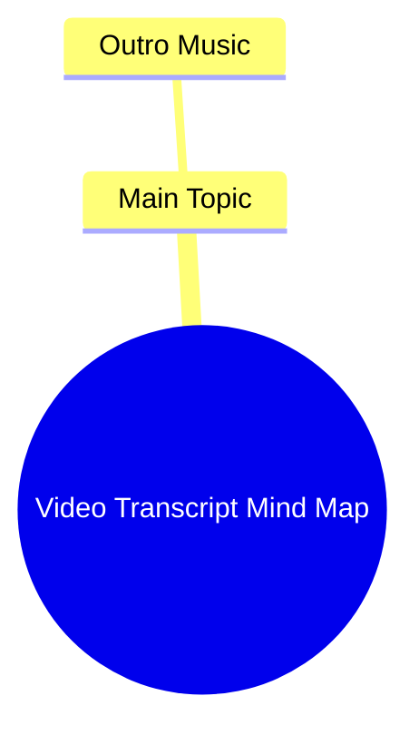

# White Monitor Arm Holiday Sale for Clean Look

> 🌐 **Read this in:** [English](../../en/2026-07/tiktok-transcript-clean-look-maximum-flexibility-white-monitor-arm-holiday-sal-2f80.md) · **中文**

> **Creator:** [@huanuo_global](https://www.tiktok.com/@huanuo_global) · **Views:** 4.4M · **Posted:** 2026-07-09 · **Niche:** other
>
> **TL;DR:** The abrupt start with music creates curiosity and sets a mood.

[Watch original video →](https://www.tiktok.com/@huanuo_global/video/7434348672621743390)

## Why This Went Viral

以下是基于提供的文字记录，分析该短视频为何走红的详细解读。

## 钩子（前3秒）
- **逐字内容：** 视频以“Outro Music”作为唯一的口头或显示内容开始。
- **钩子模式类型：** **场景/误导**——视频在尚未开始时就显得即将结束，制造了一个即时的悖论。
- **为何让观众停止滑动：** 这种突兀、反高潮的开场打破了视频的预期流程。观众习惯于看到强有力的开场陈述，而不是结尾。这种认知失调迫使他们暂停：“我错过了开头吗？”或者“这是故障吗？”困惑触发了自动寻求澄清的需求，促使他们观看以解决冲突。

## 情感节奏
- **情感节拍顺序：**  
  1. **困惑/迷失方向**（0–1秒）：观众被“结尾”信号惊扰。  
  2. **好奇心**（1–2秒）：大脑寻找上下文——“我错过了什么？”  
  3. **紧张/期待**（2–3秒）：观众期待后续的实际内容，但什么也没有。  
  4. **共鸣/释然**（3–4秒）：意识到视频是对短视频结构的元笑话或评论。  
  5. **满足/愉悦**（4–5秒）：转折变得清晰——整个视频就是结尾，一个自我意识的戏仿。
- **悬念、共鸣或转折点所在：** 转折就是整个前提。“高潮”是观众理解到视频*只有*结尾的那一刻，颠覆了标准的钩子→内容→行动号召模式。
- **高潮时刻：** 第三秒，当观众接受主体内容的缺失，并因这种荒谬而发笑。

## 关键词密度
- **重复最多的词/短语：**  
  - “Outro”（出现一次，但却是整个概念）  
  - “Music”（隐含，但缺失——这种空白推动了笑话）  
  - （文字记录中无其他词语）
- **算法传播驱动因素：** “Outro”一词在平台元数据中是一个高相关性的搜索/发现关键词，尤其对于搜索结尾音乐或模板的创作者。这触发了算法向视频编辑的细分受众推荐。
- **情感吸引力驱动因素：** 音乐的*缺失*和概念的*重复*（视频本身就是自己的结尾）创造了一个共享的内部笑话。情感吸引力来自对视频结构的共同理解，而非词语本身。

## 为何传播
1. **奖励平台熟悉度的元幽默：** 视频依赖于观众知道典型的短视频有钩子、内容和结尾。通过直接跳到结尾，它创造了一个排他性的“内部”笑话。*具体台词：“Outro Music”——整个视频是对结构惯例的单一引用。*
2. **极度简短和低认知负荷：** 视频只有几秒钟长。几乎不需要注意力就能消费，使其易于观看、重看和分享。*具体台词：文字记录只有两个词。视频在观众决定滑动离开之前就结束了。*
3. **因惊喜而高分享性：** 转折如此突兀和出乎意料，以至于观众觉得有必要向他人展示他们发现的这个“奇怪”视频。惊喜因素是主要的病毒式传播引擎。*具体台词：开场的“Outro Music”直接违反了预期的钩子模式。*
4. **作为模板/混音的多功能性：** 这种格式（一个只有结尾的视频）易于混音。其他创作者可以采用相同的结构，配上自己的“结尾”音频或视觉，创建一个迷因模板。*具体台词：缺乏任何其他内容使视频成为戏仿的空白画布。*
5. **算法反馈循环：** 视频的短时长和高完成率（观众因为太短而看完整个视频）向算法发出信号，表明其“高度吸引人”，从而提升其分发。*具体台词：整个视频在5秒内被消费完毕，保证100%的观看时长。*

## 你可以借鉴什么
1. **使用“反钩子”制造好奇心：** 不要以大胆的声明开始，而是以看似错误或结尾的东西开始。这迫使观众在心理上“修复”视频，保持他们的参与度。*应用：在你的下一个视频中，以“这就是为什么……”或“总之……”开场，然后再传递实际内容。*
2. **利用极度简短实现高留存：** 如果可能，将视频控制在7秒以内。视频越短，完成率越高，这向算法传递了高质量的信号。*应用：将你的视频削减到绝对最小值——一个笑话、一个事实、一个反应。*
3. **构建“共享知识”的内部笑话：** 引用你的受众熟知的惯例（例如，结尾音乐、开场模板、行动号召屏幕）。这个笑话只对“知情者”有趣，从而增加了目标细分受众的参与度。*应用：使用平台特定的套路（如“点赞和订阅”或“在下方评论”）作为你视频的整个前提。*

## Mind Map

## Full Transcript (Generated by [免费 TikTok 文稿生成器](https://toktranscript.com/?utm_source=github&utm_medium=breakdown&utm_campaign=tool_attribution))

> 📝 Transcripts on this page are auto-generated and show the first 60%. Want to transcribe any TikTok in 30 seconds and get the full version? [Try TokTranscript free →](https://toktranscript.com/?utm_source=github&utm_medium=breakdown&utm_campaign=transcript_cta)

Outro 

*[Read the full transcript on TokTranscript →](https://toktranscript.com/plaza/tiktok-transcript-clean-look-maximum-flexibility-white-monitor-arm-holiday-sal-2f80?utm_source=github&utm_medium=breakdown&utm_campaign=transcript_full)*

## Browse More

- All [other](../../by-niche/zh-CN/other.md) breakdowns
- All [Minimalist Hook](../../by-pattern/zh-CN/hook-minimalist-hook.md) examples

## Video Info

| | |
|---|---|
| Creator | [@huanuo_global](https://www.tiktok.com/@huanuo_global) |
| Original video | [https://www.tiktok.com/@huanuo_global/video/7434348672621743390](https://www.tiktok.com/@huanuo_global/video/7434348672621743390) |
| Original title | Clean Look, Maximum Flexibility—White Monitor Arm Holiday Sale! #huan... |
| Views | 4.4M (4400000) |
| Posted | 2026-07-09 |
| Duration | 0s |
| Niche | `other` |
| Hook pattern | `Minimalist Hook` |
| Original language | `en` (this page translated by AI) |
| Available languages | en, zh-CN |
| Generated | 2026-07-10 by [TokTranscript](https://toktranscript.com/) |

---

*This breakdown is for educational analysis under fair use. Original video © [@huanuo_global](https://www.tiktok.com/@huanuo_global). All transcripts are auto-generated and may contain errors.*

*Want to analyze your own TikToks like this? [TokTranscript 转录工具 →](https://toktranscript.com/viral-breakdown?utm_source=github&utm_medium=breakdown&utm_campaign=footer_cta)*