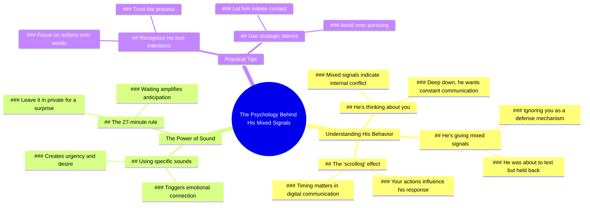

# Get Your Free Private Reading Now

> 🌐 **Read this in:** [English](../../en/2026-07/tiktok-transcript-click-the-link-in-my-bio-for-free-private-reading-mainfest-p-5783.md) · **中文**

> **Creator:** [@psychic_angeline](https://www.tiktok.com/@psychic_angeline) · **Views:** 5.8M · **Posted:** 2026-07-05 · **Niche:** other
>
> **TL;DR:** Immediately grabs attention by speaking directly to the viewer with a confident, personal claim.

[Watch original video →](https://www.tiktok.com/t/ZP8GfAfFq/)

## Why This Went Viral

## 钩子（前3秒）
- **逐字开场白：** "你就是他命中注定的那个人。"
- **钩子模式：** 大胆断言 + 个性化（直接使用"你"称呼）
- **为何能阻止滑动：** 这句话情感冲击力强且无法验证，瞬间引发好奇心。感觉像是一个秘密在直接对观众低语，利用了人们渴望被选中或特别的心理。"命中注定"一词触及命运/天意，这是一个高风险的触发点。

## 情感节奏
- **节拍1 – 好奇（0–3秒）：** "你就是他命中注定的那个人。" → 取悦观众，埋下认可的种子。
- **节拍2 – 紧张（3–8秒）：** "他给你模棱两可的信号，还忽视你。" → 引入痛点（被拒绝、困惑），制造情感摩擦。
- **节拍3 – 虚假希望（8–12秒）：** "内心深处，他想和你聊个不停。" → 提供一个安慰性的叙事，抓住观众的一厢情愿。
- **节拍4 – 行动紧迫感（12–18秒）：** "他正要给你发消息，但你划走了。相信我，当你使用那个音效时，他会疯狂地想和你在一起。" → 引入一个具体、低成本的行动（使用音效），并承诺高回报。
- **节拍5 – 高潮/神秘（18–22秒）：** "如果你把它设为私密，27分钟后，你会得到一个巨大的惊喜。" → 制造倒计时（27分钟）和模糊奖励，触发错失恐惧症和迷信心理。
- **高潮时刻：** 27分钟倒计时。这是将被动观看转化为主动参与（保存、分享、评论）的最终推动力。

## 关键词密度
| 关键词/短语 | 出现次数（约） | 驱动因素 |
|---|---|---|
| "你" / "你的" | 8+ | **算法 + 情感** – 高度个性化提升观看时长和互动；同时触发镜像神经元（观众看到自己）。 |
| "他" | 5+ | **情感** – 为观众的情感创造一个第三方目标；推动叙事张力。 |
| "命中注定" | 1（但隐含） | **情感** – 命运/天意语言触发浪漫幻想。 |
| "发消息" / "聊天" | 3 | **算法** – 情感建议类内容的高搜索量关键词。 |
| "相信我" | 1 | **情感** – 建立虚假权威；降低怀疑。 |
| "音效" | 1 | **算法** – 直接引用热门音频，平台会给予奖励。 |
| "27分钟" | 1 | **情感 + 算法** – 具体数字增加可信度；同时是一个感觉神秘的"魔法数字"。 |
| "惊喜" | 1 | **情感** – 触发多巴胺期待循环。 |

**算法传播驱动因素：** "你"、"发消息"、"音效" – 这些都是高搜索量和趋势词。  
**情感吸引力驱动因素：** "命中注定"、"相信我"、"惊喜"、"27分钟" – 这些创造情感投入和迷信心理。

## 为何能传播
1. **利用"渴望被认可"循环** – 开场白（"你就是他命中注定的那个人"）直接针对一个普遍的不安全感：*"我对他来说特别吗？"* 感到被忽视或困惑的观众在情感上更容易相信这个承诺。  
   - *文本证据：* "他给你模棱两可的信号，还忽视你。"

2. **创造基于迷信的行动号召** – 27分钟倒计时和"设为私密"的指令模仿了仪式或咒语。这触发了一种心理强迫：观众保存或分享视频，因为"万一有效呢？"  
   - *文本证据：* "如果你把它设为私密，27分钟后，你会得到一个巨大的惊喜。"

3. **低成本、高回报的行动** – 唯一需要的行动是"使用那个音效"（一个简单的平台原生操作）并等待。这降低了参与门槛，同时承诺巨大回报。  
   - *文本证据：* "当你使用那个音效时，他会疯狂地想和你在一起。"

4. **错失恐惧症 + 时间紧迫感** – 精确的时间框架（27分钟）制造了倒计时。观众觉得必须立即行动，否则就会错过"惊喜"。这推动了分享和保存（算法信号）。  
   - *文本证据：* "27分钟后，你会得到一个巨大的惊喜。"

5. **情感过山车 + "快乐结局"** – 视频带领观众从痛苦（模棱两可的信号、被忽视）→ 希望（他想聊天）→ 回报（他会为你疯狂）。这种情感弧线极具分享性，因为它为常见问题提供了解决方案。  
   - *文本证据：* "他给你模棱两可的信号" → "他会疯狂地想和你在一起。"

## 你可以借鉴什么
1. **以个性化、无法验证的断言开场** – 使用"你就是那个人……"或"这正是你现在正在经历的事情。"它能吸引人，因为观众无法反驳，而且希望它是真的。  
   - *示例：* "你就是此刻他们正在想念的那个人。"

2. **插入一个具体、神秘的时间框架** – 像"27分钟"、"3天"或"11:11"这样的数字触发迷信和紧迫感。搭配模糊的奖励（"巨大惊喜"）以最大化互动。  
   - *示例：* "如果你在接下来的9秒内截图，会有不可思议的事情发生。"

3. **使用"相信我"作为虚假权威桥梁** – 这个短语降低怀疑，创造一种内部消息的错觉。将其放在行动步骤之前。  
   - *示例：* "相信我，当你发布这个时，他们会在24小时内联系你。"

## Mind Map

## Full Transcript (Generated by [TokTranscript 转录工具](https://toktranscript.com/?utm_source=github&utm_medium=breakdown&utm_campaign=tool_attribution))

> 📝 Transcripts on this page are auto-generated and show the first 60%. Want to transcribe any TikTok in 30 seconds and get the full version? [Try TokTranscript free →](https://toktranscript.com/?utm_source=github&utm_medium=breakdown&utm_campaign=transcript_cta)

You're the one he was meant to be. He's thinking about you right now. He's giving you mixed signals and he's ignoring you. But deep down, he wants to talk to you non stop. He was about to text you, but you scrolled. Tru

*[Read the full transcript on TokTranscript →](https://toktranscript.com/plaza/tiktok-transcript-click-the-link-in-my-bio-for-free-private-reading-mainfest-p-5783?utm_source=github&utm_medium=breakdown&utm_campaign=transcript_full)*

## Browse More

- All [other](../../by-niche/zh-CN/other.md) breakdowns
- All [Direct address + certainty](../../by-pattern/zh-CN/hook-direct-address-certainty.md) examples

## Video Info

| | |
|---|---|
| Creator | [@psychic_angeline](https://www.tiktok.com/@psychic_angeline) |
| Original video | [https://www.tiktok.com/t/ZP8GfAfFq/](https://www.tiktok.com/t/ZP8GfAfFq/) |
| Original title | click the link in my bio for FREE private reading #mainfest #psychict... |
| Views | 5.8M (5800000) |
| Posted | 2026-07-05 |
| Duration | 0s |
| Niche | `other` |
| Hook pattern | `Direct address + certainty` |
| Original language | `en` (this page translated by AI) |
| Available languages | en, zh-CN |
| Generated | 2026-07-06 by [TokTranscript](https://toktranscript.com/) |

---

*This breakdown is for educational analysis under fair use. Original video © [@psychic_angeline](https://www.tiktok.com/@psychic_angeline). All transcripts are auto-generated and may contain errors.*

*Want to analyze your own TikToks like this? [拆解你自己的 TikTok →](https://toktranscript.com/viral-breakdown?utm_source=github&utm_medium=breakdown&utm_campaign=footer_cta)*