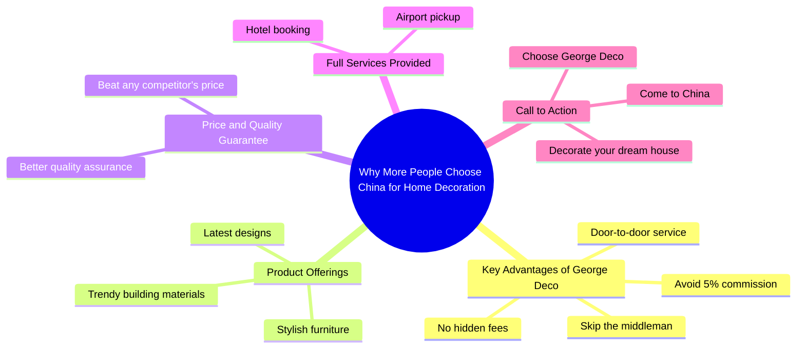

# Skip the Middleman: Build Your Dream House in China

> 🌐 **Read this in:** [English](../../en/2026-07/tiktok-transcript-come-to-china-to-build-your-dream-house-renovation-decoratio-2787.md) · **中文**

> **Creator:** [@rogerwu_georgedeco](https://www.tiktok.com/@rogerwu_georgedeco) · **Views:** 587.5K · **Posted:** 2026-07-20 · **Niche:** other
>
> **TL;DR:** The hook opens with a trending question that sparks curiosity, then immediately lists concrete financial benefits to hook viewers.

[Watch original video →](https://www.tiktok.com/@rogerwu_georgedeco/video/7496153850345180438)

## Why This Went Viral

## 钩子（前3秒）
- **逐字开场白：** "为什么越来越多的人喜欢来中国装修他们的家？"
- **钩子模式：** 提问 + 趋势引发的好奇心
- **为何能阻止滑动：** 它提出了一个反直觉的问题（从国外来中国装修家），激发了好奇心，尤其吸引注重成本的房主或外籍人士。"越来越多的人"这一表述暗示了社会认同和增长趋势，让观众觉得自己可能错过了什么。

## 情感节奏
- **节拍1 – 好奇心（0–3秒）：** 开场问题制造了知识缺口："为什么会有人这么做？"
- **节拍2 – 解脱/价值（3–7秒）：** "跳过中间商，避免5%的佣金"——解决了痛点（高成本、隐藏费用）。
- **节拍3 – 渴望/信任（7–12秒）：** "最新设计、时尚建材、别致家具"——描绘了品质和向往的画面。
- **节拍4 – 紧张/挑战（12–15秒）：** "从其他公司获取任何报价……乔治装饰将以更优品质击败它"——制造了竞争挑战，营造悬念。
- **节拍5 – 回报/收尾（15–20秒）：** "全套服务，包括机场接机和酒店预订"——消除了障碍和风险，以明确的行动号召结束。
- **高潮时刻：** 价格击败承诺（"以更优品质击败它"）——这是情感峰值，怀疑在此刻转化为潜在信任。

## 关键词密度
| 关键词/短语 | 频率（约） | 驱动因素 |
|-------------|-----------|----------|
| 中国 | 2 | 算法（地理定位，旅游/家居装饰领域） |
| 装修 | 2 | 情感（向往，梦想之家） |
| 中间商 | 1 | 情感（挫败感，节省成本） |
| 佣金 | 1 | 情感（痛点） |
| 隐藏费用 | 1 | 情感（信任，透明度） |
| 品质 | 2 | 算法 + 情感（可搜索，向往） |
| 门到门服务 | 1 | 算法（服务关键词） |
| 梦想之家 | 1 | 情感（高共鸣，视觉触发） |

- **算法驱动因素：** "中国"、"装修"、"品质"——这些是家居装饰和旅游领域的高搜索量词汇。
- **情感吸引力：** "中间商"、"隐藏费用"、"梦想之家"——这些触发了痛点和向往，增加了观看时长和分享率。

## 为何能传播
1. **第一行即痛点框架** – "为什么越来越多的人来中国装修"立即切入常见痛点（高成本、中间商）并提供解决方案。这是经典的"问题-解决"病毒式传播模式。
2. **社会认同 + 稀缺性** – "越来越多的人"暗示了增长趋势，让观众觉得自己可能落后了。"以更优品质击败它"这一短语制造了竞争挑战，显得独特而紧迫。
3. **低摩擦、高信任承诺** – "门到门服务"、"机场接机"、"酒店预订"——这些消除了所有物流障碍，使有风险的跨国采购变得安全。这减少了扼杀转化的"未知恐惧"。
4. **直接行动号召 + 情感回报** – "如果你想装修你的梦想之家，你必须来中国"——将行动与深层情感目标（梦想之家）联系起来，而不仅仅是交易。这增加了可分享性，因为"梦想之家"是普遍的向往。

## 你可以借鉴的
1. **以反直觉问题开头** – 用挑战常见假设的问题开始你的视频（例如："为什么人们要飞到另一个国家省钱？"）。这会迫使观众暂停并建立好奇心。
2. **在前10秒内堆叠痛点消除点** – 列出2-3个你消除的具体摩擦点（例如："跳过中间商，避免费用，无隐藏成本"）。这能吸引正在积极寻找解决方案的观众。
3. **以"梦想"视觉 + 明确行动结尾** – 将你的行动号召与情感强烈的词汇如"梦想之家"或"梦想假期"配对。然后给出一个单一、明确的下一步（"来中国"、"点击链接"、"私信我"）。这能提高转化率和可分享性。

## Mind Map

## Full Transcript (Generated by [TokTranscript](https://toktranscript.com/?utm_source=github&utm_medium=breakdown&utm_campaign=tool_attribution))

> 📝 Transcripts on this page are auto-generated and show the first 60%. Want to transcribe any TikTok in 30 seconds and get the full version? [Try TokTranscript free →](https://toktranscript.com/?utm_source=github&utm_medium=breakdown&utm_campaign=transcript_cta)

Why more and more people like come to China to decorate their home? Because at George Deco you can skip the middleman, avoid the 5% commission and enjoy our door to door service with no hidden fees. Here you will find the latest designs, trendy building materials and stylish furniture. Get any price from other companies in 

*[Read the full transcript on TokTranscript →](https://toktranscript.com/plaza/tiktok-transcript-come-to-china-to-build-your-dream-house-renovation-decoratio-2787?utm_source=github&utm_medium=breakdown&utm_campaign=transcript_full)*

## Browse More

- All [other](../../by-niche/zh-CN/other.md) breakdowns
- All [Curiosity Gap + Benefit Stacking](../../by-pattern/zh-CN/hook-curiosity-gap-benefit-stacking.md) examples

## Video Info

| | |
|---|---|
| Creator | [@rogerwu_georgedeco](https://www.tiktok.com/@rogerwu_georgedeco) |
| Original video | [https://www.tiktok.com/@rogerwu_georgedeco/video/7496153850345180438](https://www.tiktok.com/@rogerwu_georgedeco/video/7496153850345180438) |
| Original title | Come to China to build your dream house! #renovation #decoration #one... |
| Views | 587.5K (587500) |
| Posted | 2026-07-20 |
| Duration | 0s |
| Niche | `other` |
| Hook pattern | `Curiosity Gap + Benefit Stacking` |
| Original language | `en` (this page translated by AI) |
| Available languages | en, zh-CN |
| Generated | 2026-07-23 by [TokTranscript](https://toktranscript.com/) |

---

*This breakdown is for educational analysis under fair use. Original video © [@rogerwu_georgedeco](https://www.tiktok.com/@rogerwu_georgedeco). All transcripts are auto-generated and may contain errors.*

*Want to analyze your own TikToks like this? [TikTok 转录工具 →](https://toktranscript.com/viral-breakdown?utm_source=github&utm_medium=breakdown&utm_campaign=footer_cta)*