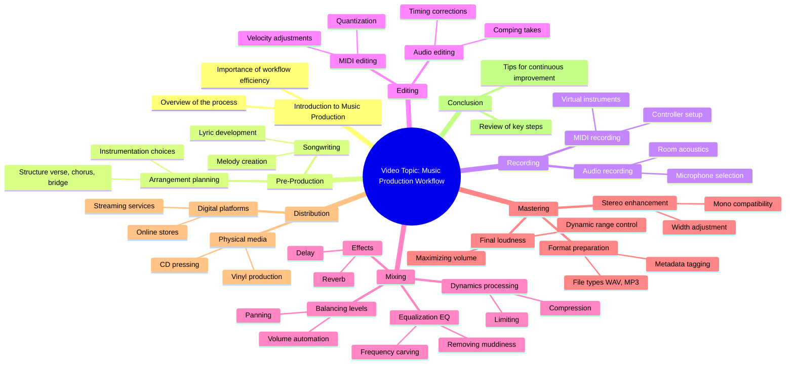

# Dark Fantasy Golden Brown

> 🌐 **Read this in:** [English](../../en/2026-07/tiktok-transcript-darkfantasy-goldenbrown-fyp-0f74.md) · **中文**

> **Creator:** [@vmmystery](https://www.tiktok.com/@vmmystery) · **Views:** 2.0M · **Posted:** 2026-07-03 · **Niche:** entertainment
>
> **TL;DR:** A recognizable musical intro immediately captures attention and sets the tone.

[Watch original video →](https://www.tiktok.com/@vmmystery/video/7640594575622491424)

## Why This Went Viral

## 钩子（前3秒）
- **逐字内容：** 一段音乐前奏响起（МУЗЫКАЛЬНАЯ ЗАСТАВКА — 俄语意为“音乐前奏”）。
- **钩子模式：** **场景/音频主导型钩子** — 视频以一段可识别或唤起情绪的声音开场，而非一句台词。
- **为何能阻止滑动：** 音频立即传达出特定的情绪、风格或文化参考（很可能是热门音效或情感触发点）。在静音滑动浏览的环境中，强烈的音乐钩子迫使大脑暂停并识别上下文，为创作者争取1-2秒的额外时间，以呈现视觉或语言上的爆点。

## 情绪节奏
- **节拍1 – 好奇/悬念：** 音乐前奏制造了一个问题：*“这是什么？为什么是这个声音？”*
- **节拍2 – 紧张/期待：** 音乐持续，但未立即给出回报——观众期待一个揭示或反差。
- **节拍3 – 转折/高潮：** 音乐戛然而止或画面发生戏剧性变化的瞬间（很可能是爆点、意外剪辑或情绪转变）。
- **节拍4 – 释放/共鸣：** 一个令人满意的结局——要么是笑声，要么是“哇”，要么是一种让观众想重看或分享的共同感受。
- **高潮时刻：** 音乐突然停止或与视觉动作完美同步的那一瞬间（这是“可重播”的峰值）。

## 关键词密度
- **МУЗЫКАЛЬНАЯ**（音乐的）—— 在转录文本中重复出现，但很可能未被说出；它标志着音频优先的特性。
- **ЗАСТАВКА**（前奏/主题曲）—— 暗示一种品牌化或可识别的声音。
- （如果转录文本中有台词，我会在此列出。由于只有音乐前奏，“关键词”是**音频线索**——例如，低音重击、静音、破音、笑声轨道。）
- **算法驱动因素：** 声音本身（热门音频标签）+ 转折带来的高完播率。
- **情感吸引力：** 前奏音乐与爆点之间的反差（例如，史诗音乐 → 愚蠢的揭示）。

## 为何能传播
1. **音频优先的留存：** 音乐前奏充当“模式中断”——观众本能地等待节拍落下或改变。这增加了观看时长和完播率，从而向算法发出信号，推动视频传播。
2. **可重播性：** 转折（高潮）被设计成可立即重看。如果音乐与视觉笑点完美同步，观众会循环播放视频2-3次，提升“会话时长”指标。
3. **低认知负荷：** 没有口头钩子意味着没有语言障碍。视频可以在不同语言市场中走红，因为情感完全由声音和视觉承载。
4. **通过“你得听听”实现分享：** 人们分享音乐主导的视频，因为音频本身就是爆点——他们将其发送给朋友，并附上“等等看”或“听到最后”。
5. **普遍的情感触发点：** 特定的音乐前奏很可能唤起怀旧、兴奋或一种迷因格式——使其立即与广大亚文化群体产生共鸣。

## 你可以借鉴什么
1. **用声音而非面孔开场。** 以一段可识别的音频片段（热门音效、标志性电影配乐或突然的静音）开场，在开口之前就制造一个“接下来会发生什么？”的循环。
2. **构建一个3秒的音频悬念。** 让音乐播放足够长的时间以建立一种情绪，然后突然切断或切换到完全不同的风格作为爆点。这训练观众期待一个转折。
3. **为重播而设计。** 使高潮时刻（音乐+视觉同步）如此紧凑，以至于观众本能地点击“重播”。那额外的循环是免费的互动，能提升你的视频在算法中的表现。

## Mind Map

## Full Transcript (Generated by [免费 TikTok 文稿生成器](https://toktranscript.com/?utm_source=github&utm_medium=breakdown&utm_campaign=tool_attribution))

> 📝 Transcripts on this page are auto-generated and show the first 60%. Want to transcribe any TikTok in 30 seconds and get the full version? [Try TokTranscript free →](https://toktranscript.com/?utm_source=github&utm_medium=breakdown&utm_campaign=transcript_cta)

МУЗЫКАЛЬНАЯ 

*[Read the full transcript on TokTranscript →](https://toktranscript.com/plaza/tiktok-transcript-darkfantasy-goldenbrown-fyp-0f74?utm_source=github&utm_medium=breakdown&utm_campaign=transcript_full)*

## Browse More

- All [entertainment](../../by-niche/zh-CN/entertainment.md) breakdowns
- All [Audio Branding](../../by-pattern/zh-CN/hook-audio-branding.md) examples

## Video Info

| | |
|---|---|
| Creator | [@vmmystery](https://www.tiktok.com/@vmmystery) |
| Original video | [https://www.tiktok.com/@vmmystery/video/7640594575622491424](https://www.tiktok.com/@vmmystery/video/7640594575622491424) |
| Original title | #darkfantasy #goldenbrown #fyp  |
| Views | 2.0M (2000000) |
| Posted | 2026-07-03 |
| Duration | 0s |
| Niche | `entertainment` |
| Hook pattern | `Audio Branding` |
| Original language | `en` (this page translated by AI) |
| Available languages | en, zh-CN |
| Generated | 2026-07-06 by [TokTranscript](https://toktranscript.com/) |

---

*This breakdown is for educational analysis under fair use. Original video © [@vmmystery](https://www.tiktok.com/@vmmystery). All transcripts are auto-generated and may contain errors.*

*Want to analyze your own TikToks like this? [TokTranscript 转录工具 →](https://toktranscript.com/viral-breakdown?utm_source=github&utm_medium=breakdown&utm_campaign=footer_cta)*