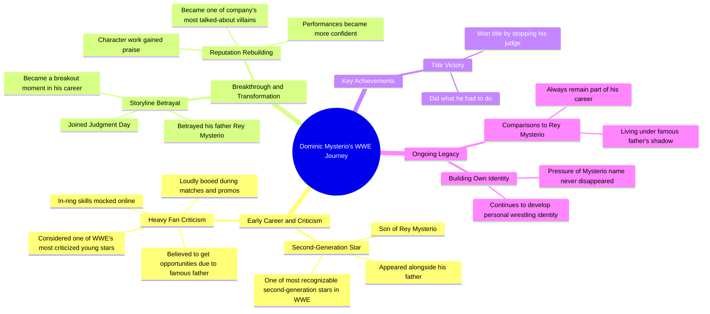

# Dominik Mysterio Betrays His Father Rey to Join Judgment Day

> 🌐 **Read this in:** [English](../../en/2026-07/tiktok-transcript-dominik-mysterio-was-the-son-of-a-wrestling-legend-who-enter-34e1.md) · **中文**

> **Creator:** [@eliakoteasmovie](https://www.tiktok.com/@eliakoteasmovie) · **Views:** 1.6M · **Posted:** 2026-07-01 · **Niche:** entertainment
>
> **TL;DR:** Opens with a direct question to engage viewers, then immediately presents a shocking event to hook curiosity.

[Watch original video →](https://www.tiktok.com/t/ZP8GhqyTh/)

## Why This Went Viral

## 钩子（前3秒）
- **逐字开场白：**“你还记得多米尼克·米斯特里奥吗？”
- **钩子模式：** 提问 + 点名（怀旧诱饵）
- **为何能阻止用户划走：** 它利用了错失恐惧症。通过问“你还记得吗”，迫使观众在脑海中搜索记忆。具体点名“多米尼克·米斯特里奥”同时瞄准了摔跤迷（他们立刻被吸引）和普通观众（他们感到被排除在外，点击观看以跟上节奏）。这是一个低投入、高互动的触发点。

## 情感节奏
- **节拍1 – 好奇：** “你还记得多米尼克·米斯特里奥吗？” → 大脑开始搜索。
- **节拍2 – 确认：** “多米尼克·米斯特里奥今晚做了他必须做的事……” → 确认观众来对了地方。
- **节拍3 – 紧张：** “粉丝们严厉批评他……在网上被嘲笑……比赛中被嘘。” → 营造同情/弱者紧张感。
- **节拍4 – 转折/共鸣：** “慢慢重建了声誉……表现变得更加自信。” → 情感回报。宽慰与钦佩。
- **节拍5 – 反转/高潮：** “与雷·米斯特里奥的比较将永远是他职业生涯的一部分。” → 苦乐参半的结局。留下挥之不去的情感余韵，而非一个圆满的快乐结局。
- **为何有效：** 这种节奏模仿了经典的英雄之旅（坠落 → 挣扎 → 崛起 → 未竟的遗产），压缩在60秒内。结尾的反转避免了它变成一个普通的“他变好了”的故事。

## 关键词密度
- **多米尼克·米斯特里奥** – 出现9次。推动算法覆盖（名字识别度 = 搜索量）。
- **父亲 / 雷·米斯特里奥** – 出现4次。情感吸引力（遗产、比较、家庭压力）。
- **批评 / 嘲笑 / 被嘘** – 出现3次。情感吸引力（弱者紧张感、共鸣）。
- **重建 / 自信 / 赞扬** – 出现3次。情感吸引力（救赎弧线）。
- **WWE** – 出现2次。算法覆盖（品牌关键词）。
- **第二代 / 遗产** – 出现2次。情感吸引力（身份冲突）。

**为何有效：** “多米尼克·米斯特里奥”的高频重复向平台推荐算法发出高相关性的信号（尤其是对摔跤迷而言）。情感关键词（“批评”、“重建”）触发人类共情，让观众在钩子之后继续观看。

## 为何能传播
1. **“你还记得”的钩子利用了怀旧 + 错失恐惧症。** 这是一个低承诺的问题，迫使观众进行心理参与。*转录行：*“你还记得多米尼克·米斯特里奥吗？” → 观众感到有必要证明自己记得，或者如果不记得就去了解。
2. **从弱者到救赎的弧线具有普遍共鸣。** 这不仅仅是摔跤故事；这是一个“著名父亲的被讨厌的孩子扭转局面”的故事。*转录行：*“许多人认为他之所以获得机会，只是因为他的著名父亲……人群大声嘘他。” → 任何曾被忽视或低估的人都会感同身受。
3. **苦乐参半的结局创造了“评论诱饵”循环。** 最后一句（“与雷·米斯特里奥的比较将永远是他职业生涯的一部分”）不是一个快乐结局。它是一个辩论的起点。*转录行：*“与雷·米斯特里奥的比较将永远是他职业生涯的一部分。” → 观众评论：“他现在比雷强”或“他永远逃不出父亲的阴影。”这推动了算法互动。
4. **高密度名字重复提升了可发现性。** 算法看到“多米尼克·米斯特里奥”9次 → 它会为每个与摔跤相关的搜索标记该视频。*转录行：*“多米尼克·米斯特里奥……多米尼克·米斯特里奥……多米尼克·米斯特里奥……” → 针对短视频的简单SEO。
5. **它连接了两个观众群体：铁杆粉丝和普通观众。** 铁杆粉丝获得深层背景（审判日、雷·米斯特里奥的遗产）。普通观众获得一个清晰、情感化的故事，无需内部知识。*转录行：*“如果你在20年代看WWE，你绝对记得他。” → 这种包容性语言扩大了潜在的分享范围。

## 你可以借鉴什么
1. **以“记忆检查”问题开头。** 不要问“这是为什么X出名”，而是问“你还记得X吗？”它迫使心理参与，降低了互动门槛。适用于任何领域（体育、音乐、电影、科技）。
2. **使用三幕情感结构：坠落 → 挣扎 → 未竟的遗产。** 不要给出一个干净的“然后一切都完美了”的结局。留下微妙的紧张感（例如，“但比较将永远存在”）。这会引发评论。
3. **在60秒内重复主题人物的名字8-10次。** 这不是冗余；这是算法的燃料。平台的推荐系统会将视频推送给任何搜索或与该名字互动的人。适用于任何以人物为中心的故事（运动员、网红、历史人物）。

## Mind Map

## Full Transcript (Generated by [TokTranscript 转录工具](https://toktranscript.com/?utm_source=github&utm_medium=breakdown&utm_campaign=tool_attribution))

> 📝 Transcripts on this page are auto-generated and show the first 60%. Want to transcribe any TikTok in 30 seconds and get the full version? [Try TokTranscript free →](https://toktranscript.com/?utm_source=github&utm_medium=breakdown&utm_campaign=transcript_cta)

Do you remember Dominic Mysterio? Dominic Mysterio tonight did what he had to do and he won the title by stopping his judge. Dominic was one of the most recognizable second generation stars in WWE, appearing alongside his father Rey Mysterio. His storyline betrayal in the Judgment Day be came a breakout moment. If you watch WWE in the 20 twenties, you absolutely remember him. You also might remember that fans heavily criticized him early in his career. Many believed he only got opportunities because of his famous father. His in ring skills were constantly mocked online and crowds loudly booed him during matches and promos. Despite the backlash, Dominic slowly reb

*[Read the full transcript on TokTranscript →](https://toktranscript.com/plaza/tiktok-transcript-dominik-mysterio-was-the-son-of-a-wrestling-legend-who-enter-34e1?utm_source=github&utm_medium=breakdown&utm_campaign=transcript_full)*

## Browse More

- All [entertainment](../../by-niche/zh-CN/entertainment.md) breakdowns
- All [Rhetorical Question + Surprising Action](../../by-pattern/zh-CN/hook-rhetorical-question-surprising-action.md) examples

## Video Info

| | |
|---|---|
| Creator | [@eliakoteasmovie](https://www.tiktok.com/@eliakoteasmovie) |
| Original video | [https://www.tiktok.com/t/ZP8GhqyTh/](https://www.tiktok.com/t/ZP8GhqyTh/) |
| Original title | Dominik Mysterio was the son of a wrestling legend who entered WWE wi... |
| Views | 1.6M (1600000) |
| Posted | 2026-07-01 |
| Duration | 0s |
| Niche | `entertainment` |
| Hook pattern | `Rhetorical Question + Surprising Action` |
| Original language | `en` (this page translated by AI) |
| Available languages | en, zh-CN |
| Generated | 2026-07-02 by [TokTranscript](https://toktranscript.com/) |

---

*This breakdown is for educational analysis under fair use. Original video © [@eliakoteasmovie](https://www.tiktok.com/@eliakoteasmovie). All transcripts are auto-generated and may contain errors.*

*Want to analyze your own TikToks like this? [TokTranscript →](https://toktranscript.com/viral-breakdown?utm_source=github&utm_medium=breakdown&utm_campaign=footer_cta)*