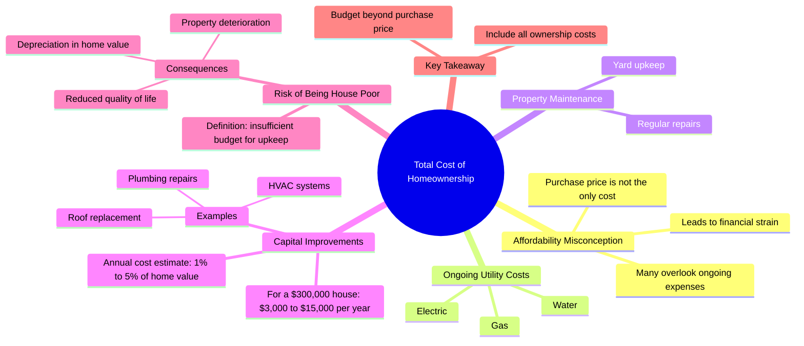

# Avoid Being House Poor: Real Estate Upkeep Costs

> 🌐 **Read this in:** [English](../../en/2026-07/tiktok-transcript-don-t-be-house-poor-glenndabaker-realestate-atlantarealestat-077f.md) · **中文**

> **Creator:** [@glenndabaker](https://www.tiktok.com/@glenndabaker) · **Views:** 2.8M · **Posted:** 2026-07-10 · **Niche:** finance
>
> **TL;DR:** Debunks a common assumption to immediately engage viewers who may be misinformed.

[Watch original video →](https://vt.tiktok.com/ZSXdyaYsj/)

## Why This Went Viral

## 钩子（前3秒）
- **逐字开场白：** "很多人觉得，只要买得起标价X美元的房子，就万事大吉了。"
- **钩子模式：** 对比 / 破除迷思（先提出一个普遍认知，然后立刻暗示它是错的）
- **为何能让人停下滑动：** 它直接挑战了人们对购房的普遍假设。"大多数人没有意识到的是"这句话触发了知识缺口——观众会觉得自己可能错过了关键信息，于是继续看下去，以免犯下代价高昂的错误。

## 情绪节奏
1. **好奇**（0–3秒）："很多人觉得……"——铺垫一个熟悉的认知。
2. **紧张**（3–8秒）："大多数人没有意识到的是……持有成本才是真正要命的地方。"——引入一个隐藏的威胁。
3. **焦虑**（8–18秒）：具体数字（每年3000–15000美元）和特定灾难（暖通空调、屋顶、管道）制造了财务上的恐惧。
4. **释然 / 清晰**（18–25秒）："如果你不算清楚这笔账……你就会变成房奴。"——点出问题，给观众一个标签来定义他们的恐惧。
5. **紧迫**（25–30秒）："别以为购房价格就是……"——话说到一半戛然而止，留下一个悬念，迫使观众重看或留言。
- **高潮时刻：** "你就会变成房奴"——情绪峰值，抽象的风险变成了一个具体的身份标签。

## 关键词密度
- **"房子"**（8次）——房地产内容的算法锚点。
- **"资本性改善"**（3次）——专业短语，彰显专业度，提升搜索可见性。
- **"买得起" / "负担得起"**（3次）——高搜索量词汇，触发财务焦虑的情绪按钮。
- **"持有成本"**（2次）——独特短语，区别于泛泛的"买房"内容。
- **"房奴"**（2次）——易记、有传播力的术语，观众会重复使用或分享。
- **"贬值"**（1次）——高情绪词汇，与"房子是投资"的迷思形成反差。

**算法驱动词：** "房子"、"买得起"、"成本"——宽泛的搜索词。
**情绪牵引力：** "房奴"、"要命"、"贬值"——恐惧与紧迫感。

## 为何能传播
1. **"隐藏成本"的揭示**——视频揭露了一个普遍的盲点。台词："大多数人没有意识到的是，维护费用……才是真正要命的地方。"这让观众觉得学到了东西，并忍不住分享给正在看房的朋友。
2. **具体吓人的数字**——"每年3000到15000美元"既具体到让人觉得真实，又模糊到适用于任何人。台词："你每年需要准备3000到15000美元……"——这种精确性建立了权威感，也提供了可分享的数据。
3. **"房奴"这个标签**——一个易记、可自我诊断的术语。台词："你就会变成房奴。"观众立刻会问自己"我是房奴吗？"，并@可能也是的朋友。这推动了评论和分享。
4. **悬念式结尾**——视频在句子中间戛然而止："别以为购房价格就是……"这迫使观众留言"把话说完！"或重看，提升了留存率和互动指标。
5. **普适性**——几乎每个成年人要么有房，要么想买房。视频针对一个庞大的人群，用特定的恐惧引发共鸣，跨越年龄和收入阶层。

## 你可以借鉴的点
1. **以"你错了"的模式开场**——先提出一个普遍认知，然后立刻反驳它。公式："很多人觉得[X]，但他们没有意识到的是[Y]。"这能瞬间制造好奇心和权威感。
2. **使用具体的金额范围**——不要说"很贵"，而是给出一个具体、吓人的数字范围（3000–15000美元）。取整的数字显得有研究依据，而范围覆盖多种情况，让更多观众觉得与自己相关。
3. **创造一个易记的标签**——发明一个令人印象深刻的术语（如"房奴"），让观众可以用它来诊断自己或他人。这能让你的视频变成一种文化参考，在真实对话中被反复提及，推动病毒式传播。

## Mind Map

## Full Transcript (Generated by [TikTok 转录工具](https://toktranscript.com/?utm_source=github&utm_medium=breakdown&utm_campaign=tool_attribution))

> 📝 Transcripts on this page are auto-generated and show the first 60%. Want to transcribe any TikTok in 30 seconds and get the full version? [Try TokTranscript free →](https://toktranscript.com/?utm_source=github&utm_medium=breakdown&utm_campaign=transcript_cta)

A lot of people think that if you can afford a house that's X number of dollars, you're good to go. What most people don't realize is the upkeep and the total cost to own is what kills you on real estate. Let's say that you can afford a $300,000 house. You need to keep in mind, you've still got to have gas, electric, water. You've got to keep up the yard. You've also got capital improvements. And you can be assured that you're probably going to spend somewhere between 1% and 5% per year on capital improvements. So if you're in a $300,000 house, you need to have betw

*[Read the full transcript on TokTranscript →](https://toktranscript.com/plaza/tiktok-transcript-don-t-be-house-poor-glenndabaker-realestate-atlantarealestat-077f?utm_source=github&utm_medium=breakdown&utm_campaign=transcript_full)*

## Browse More

- All [finance](../../by-niche/zh-CN/finance.md) breakdowns
- All [Myth vs. Reality](../../by-pattern/zh-CN/hook-myth-vs-reality.md) examples

## Video Info

| | |
|---|---|
| Creator | [@glenndabaker](https://www.tiktok.com/@glenndabaker) |
| Original video | [https://vt.tiktok.com/ZSXdyaYsj/](https://vt.tiktok.com/ZSXdyaYsj/) |
| Original title | Don’t be house poor! #GlenndaBaker #RealEstate #AtlantaRealEstate #Re... |
| Views | 2.8M (2800000) |
| Posted | 2026-07-10 |
| Duration | 0s |
| Niche | `finance` |
| Hook pattern | `Myth vs. Reality` |
| Original language | `en` (this page translated by AI) |
| Available languages | en, zh-CN |
| Generated | 2026-07-11 by [TokTranscript](https://toktranscript.com/) |

---

*This breakdown is for educational analysis under fair use. Original video © [@glenndabaker](https://www.tiktok.com/@glenndabaker). All transcripts are auto-generated and may contain errors.*

*Want to analyze your own TikToks like this? [我们用的转录工具 →](https://toktranscript.com/viral-breakdown?utm_source=github&utm_medium=breakdown&utm_campaign=footer_cta)*