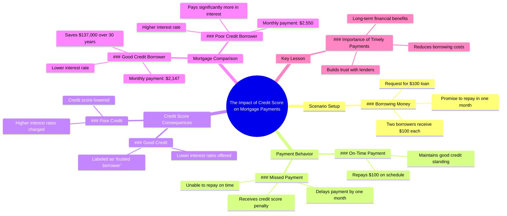

# Don't Let This Mistake Cost You Your Credit Score

> 🌐 **Read this in:** [English](../../en/2026-07/tiktok-transcript-dont-let-this-mistake-cost-you-personalfinance-interest-cred-104b.md) · **中文**

> **Creator:** [@humphreytalks](https://www.tiktok.com/@humphreytalks) · **Views:** 5.2M · **Posted:** 2026-07-16 · **Niche:** finance
>
> **TL;DR:** Opens with a relatable, high-stakes request that instantly engages viewers.

[Watch original video →](https://vt.tiktok.com/ZSXDRNeT9/)

## Why This Went Viral

## 钩子（前3秒）
- **逐字开场白：**"能借我100美元吗？一个月后还你。"
- **钩子模式：**场景 + 直接提问（立即升级："等等，那个我也能要吗？"）
- **为何能阻止滑动：**以几乎人人都经历过的、令人感同身受的尴尬社交场景（借钱）开场，随后第二个人插话，立即引入冲突。紧张感瞬间建立，且十分熟悉。

## 情感节奏
- **好奇**（0–3秒）："他会还钱吗？"
- **紧张**（3–10秒）："一个月后"——第一个人还不上钱。信用评分下降。
- **期待**（10–15秒）："一年后"——时间跳跃，为对比做铺垫。
- **悬念**（15–25秒）：两人申请同一笔房贷。答案却不同。
- **揭示**（25–30秒）："他是可信赖借款人"——反转解释了差异。
- **怨恨 → 释然**（30–40秒）：受罚的借款人意识到自己的错误。教训深入人心。
- **高潮时刻：**"我将少付13.7万美元利息"——具体的数字让信用评分这一抽象概念变得无比真实。

## 关键词密度
- **"还款"**（6次）——驱动算法相关性（金融内容）
- **"信用评分"**（2次）——高搜索量的金融术语
- **"利息"**（3次）——情感吸引力（展示不良行为的代价）
- **"房贷"**（3次）——理想生活目标，受众广泛
- **"可信赖借款人"**（2次）——品牌化概念，创造人们渴望归属的类别
- **"月"**（4次）——营造时间压力与紧迫感
- **"更低"/"更少"**（3次）——负面框架，触发损失厌恶
- **"13.7万美元"**——具体、惊人的数字，驱动分享欲

## 为何能传播
1. **普遍痛点 + 具体数字**——"我将少付13.7万美元利息"是一个令人瞠目的数据，让人想将其作为警示或胜利分享。数字足够具体以令人难忘，足够庞大以令人震惊。
2. **角色驱动的教训**——视频不是说教。它通过两个角色（负责任的借款人与不负责任的借款人）展示因果关系。观众会自我代入其中一个，从情感而非理智上感受教训。
3. **时间压缩制造利害关系**——"一个月后"/"一年后"跳过无聊的中间过程，直接跳到后果。这保持了高留存率，因为每个场景都有回报。
4. **令人感同身受的社交摩擦**——开场"能借我100美元吗"是每个人都经历过的场景。它吸引了几乎所有借过钱或借出过钱的人。
5. **预期反转**——观众预期两人获得相同的房贷利率。反转（"他的还款额低得多"）创造了"等等，什么？"的时刻，迫使人们重看和分享。

## 你可以借鉴什么
1. **"带有反转的前后对比"结构**——展示两个角色从相同起点出发，然后走向不同结果。反转（不同的房贷利率）是驱动力。将此应用于任何主题：两人开始相同的饮食、相同的投资、相同的习惯——其中一人做了一件不同的事，结果天差地别。
2. **将惊人数字锚定在 relatable 场景上**——"少付13.7万美元利息"之所以有效，是因为它与买房（一个普遍梦想）相关联。选择一个大的、具体的数字，并将其与你受众已经渴望的东西联系起来。
3. **使用"时间戳"作为场景过渡**——"一个月后"/"一年后"无需铺垫即可创造即时叙事动力。在40秒的视频中，每一秒都必须物有所值。时间跳跃让你跳过解释，直接进入后果。

## Mind Map

## Full Transcript (Generated by [拆解你自己的 TikTok](https://toktranscript.com/?utm_source=github&utm_medium=breakdown&utm_campaign=tool_attribution))

> 📝 Transcripts on this page are auto-generated and show the first 60%. Want to transcribe any TikTok in 30 seconds and get the full version? [Try TokTranscript free →](https://toktranscript.com/?utm_source=github&utm_medium=breakdown&utm_campaign=transcript_cta)

can I borrow $100 I'll pay you back in a month wait can I also get that too sure here's 100 bucks for both of you one month later I can't pay that $100 back just yet I'm gonna miss this payment here's my payment thanks to the man in the hat we're gonna lower your credit score since you missed the payment one year later I'd like to buy a house can you tell me what my monthly payments gonna be on a 30 year mortgage twenty five fifty a month which includes interest I'd like that same mortgage how much for me twenty one forty seven 

*[Read the full transcript on TokTranscript →](https://toktranscript.com/plaza/tiktok-transcript-dont-let-this-mistake-cost-you-personalfinance-interest-cred-104b?utm_source=github&utm_medium=breakdown&utm_campaign=transcript_full)*

## Browse More

- All [finance](../../by-niche/zh-CN/finance.md) breakdowns
- All [Hypothetical scenario with immediate stakes](../../by-pattern/zh-CN/hook-hypothetical-scenario-with-immediate-stakes.md) examples

## Video Info

| | |
|---|---|
| Creator | [@humphreytalks](https://www.tiktok.com/@humphreytalks) |
| Original video | [https://vt.tiktok.com/ZSXDRNeT9/](https://vt.tiktok.com/ZSXDRNeT9/) |
| Original title | Dont let this mistake cost you! #personalfinance #interest #credit (i... |
| Views | 5.2M (5200000) |
| Posted | 2026-07-16 |
| Duration | 0s |
| Niche | `finance` |
| Hook pattern | `Hypothetical scenario with immediate stakes` |
| Original language | `en` (this page translated by AI) |
| Available languages | en, zh-CN |
| Generated | 2026-07-17 by [TokTranscript](https://toktranscript.com/) |

---

*This breakdown is for educational analysis under fair use. Original video © [@humphreytalks](https://www.tiktok.com/@humphreytalks). All transcripts are auto-generated and may contain errors.*

*Want to analyze your own TikToks like this? [TokTranscript →](https://toktranscript.com/viral-breakdown?utm_source=github&utm_medium=breakdown&utm_campaign=footer_cta)*