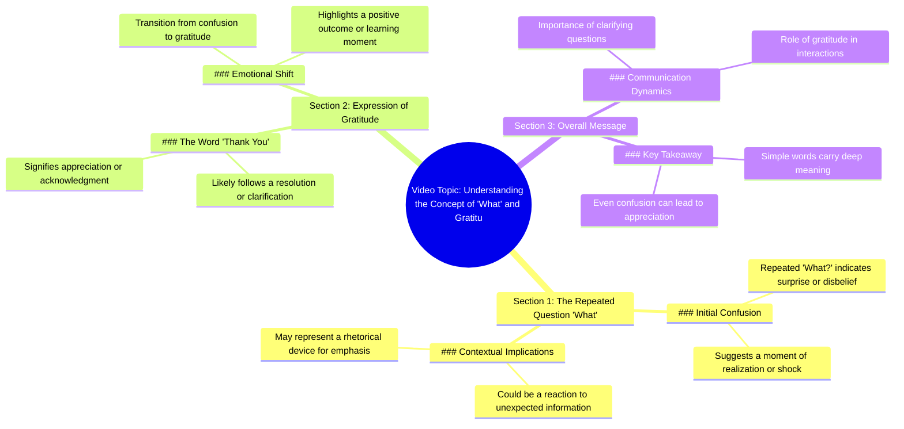

# Funny Monkey Protects Balloons from Theft

> 🌐 **Read this in:** [English](../../en/2026-07/tiktok-transcript-funny-monkey-protect-balloons-adoreblemonkey-monkey-funnyani-a4ed.md) · **中文**

> **Creator:** [@monkeymisters](https://www.tiktok.com/@monkeymisters) · **Views:** 25.9M · **Posted:** 2026-07-29 · **Niche:** other
>
> **TL;DR:** The rapid repetition of 'What?' creates immediate confusion and curiosity, compelling viewers to watch for context.

[Watch original video →](https://vt.tiktok.com/ZS4N91K2K/)

## Why This Went Viral

## 钩子（前3秒）
- **逐字内容：** 说话者快速重复"什么？什么？什么？什么？"，紧接着说"谢谢。"
- **钩子模式：** **场景 + 惊讶/难以置信**——重复的"什么？"暗示意外或震惊事件，"谢谢"则增添了感激的转折。
- **为何能阻止滑动：** 快速、困惑的重复创造了**模式中断**——观众会本能地停下来，想看看是什么引发了如此强烈的反应。从困惑到感谢的突然转变立即激起好奇心。

## 情感节奏
- **节拍1 – 困惑/难以置信（0–2秒）：** "什么？什么？什么？什么？"——观众被带入说话者的震惊中。
- **节拍2 – 感激/释然（2–3秒）：** "谢谢。"——突然的情感转折，形成一个小型收束。
- **节拍3 – 好奇心（3–5秒）：** 观众现在需要了解情感转变的背景——发生了什么？
- **高潮：** "谢谢"这句话——这是情感回报的时刻，让观众感觉目睹了一个真实、脆弱的反应。

## 关键词密度
| 关键词/短语 | 频率 | 功能 |
|----------------|-----------|----------|
| "什么？" | 4次 | **算法触达**——高重复触发观看时长和留存率。 |
| "谢谢" | 1次 | **情感吸引**——创造收束感和人际连接。 |
| （隐含）"惊讶" | 0次但可感知 | **情感吸引**——通过好奇心缺口驱动参与。 |
| （隐含）"感激" | 0次但可感知 | **情感吸引**——让视频显得真实且易于分享。 |
| （隐含）"反应" | 0次但可感知 | **算法触达**——暗示"反应视频"格式，平台偏好此类内容。 |

**关键洞察：** 视频的病毒式传播力来自**隐含关键词**（惊讶、感激、反应）而非显性关键词——算法通过观看时长和完成率捕捉情感语境。

## 为何能传播
1. **模式中断 + 情感冲击**——快速的"什么？什么？什么？"打破观众的滑动模式，而突然的"谢谢"创造了感觉真实且令人惊讶的情感转变。这种组合驱动高留存率。
2. **无背景的好奇心缺口**——视频对反应未作任何解释，迫使观众再次观看或在评论中寻找背景。这推动了**重复观看**和**评论参与**（例如，"发生了什么？！"）。
3. **普遍情感触发点**——困惑后的感激是 relatable 的人类时刻。观众分享是因为它感觉真实且振奋人心——它触发了"感觉良好"的分享冲动。
4. **短小精悍 = 高完成率**——约3秒的视频几乎无法跳过。平台奖励高完成率，给予更广泛的传播。
5. **声音设计是钩子**——断奏式的"什么？"重复像声音迷因——易于混音、采样或引用，鼓励用户生成内容和跨平台传播。

## 你可以借鉴什么
1. **以模式中断开头**——以重复的词语或声音开头（例如，"不。不。不。"或"等等。等等。等等。"）来打破滑动势头。保持在2秒以内。
2. **使用情感冲击**——快速连续地配对两种对比情感（困惑+感激、愤怒+释然）。这种转变感觉真实，让观众持续观看。
3. **省略背景**——不要解释反应。让观众填补缺口——他们会评论、重看和分享以获取完整故事。这将3秒的片段变成病毒式循环。

## Mind Map

## Full Transcript (Generated by [免费 TikTok 文稿生成器](https://toktranscript.com/?utm_source=github&utm_medium=breakdown&utm_campaign=tool_attribution))

> 📝 Transcripts on this page are auto-generated and show the first 60%. Want to transcribe any TikTok in 30 seconds and get the full version? [Try TokTranscript free →](https://toktranscript.com/?utm_source=github&utm_medium=breakdown&utm_campaign=transcript_cta)

What? What? What? Wh

*[Read the full transcript on TokTranscript →](https://toktranscript.com/plaza/tiktok-transcript-funny-monkey-protect-balloons-adoreblemonkey-monkey-funnyani-a4ed?utm_source=github&utm_medium=breakdown&utm_campaign=transcript_full)*

## Browse More

- All [other](../../by-niche/zh-CN/other.md) breakdowns
- All [Repetitive shock](../../by-pattern/zh-CN/hook-repetitive-shock.md) examples

## Video Info

| | |
|---|---|
| Creator | [@monkeymisters](https://www.tiktok.com/@monkeymisters) |
| Original video | [https://vt.tiktok.com/ZS4N91K2K/](https://vt.tiktok.com/ZS4N91K2K/) |
| Original title | Funny monkey protect balloons 🎈  #adoreblemonkey #monkey #funnyanimal... |
| Views | 25.9M (25900000) |
| Posted | 2026-07-29 |
| Duration | 0s |
| Niche | `other` |
| Hook pattern | `Repetitive shock` |
| Original language | `en` (this page translated by AI) |
| Available languages | en, zh-CN |
| Generated | 2026-07-30 by [TokTranscript](https://toktranscript.com/) |

---

*This breakdown is for educational analysis under fair use. Original video © [@monkeymisters](https://www.tiktok.com/@monkeymisters). All transcripts are auto-generated and may contain errors.*

*Want to analyze your own TikToks like this? [TokTranscript →](https://toktranscript.com/viral-breakdown?utm_source=github&utm_medium=breakdown&utm_campaign=footer_cta)*