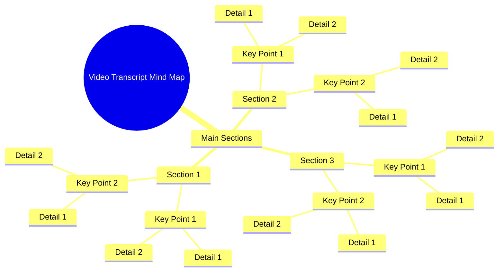

# Funny Couple 4th of July Graphic Tees

> 🌐 **Read this in:** [English](../../en/2026-07/tiktok-transcript-funnyshirt-coupleshirt-4thofjuly-graphictees-funnycouple-f3d7.md) · **中文**

> **Creator:** [@tiny.gift2](https://www.tiktok.com/@tiny.gift2) · **Views:** 2.1M · **Posted:** 2026-07-17 · **Niche:** other
>
> **TL;DR:** A single, powerful exclamation creates immediate intrigue and emotional resonance.

[Watch original video →](https://www.tiktok.com/@tiny.gift2/video/7639218794484829453?is_from_webapp=1&sender_device=pc&web_id=7644115144377894413)

## Why This Went Viral

## 钩子（前3秒）
- **逐字内容：** “哦”——一个拖长、充满情感的单个音节。
- **钩子模式：** **场景/情感声音**——一种即时、原始、非语言的反应，暗示着即将出现令人惊讶或引人共鸣的内容。
- **为何能阻止滑动：** 突兀而普遍的“哦”瞬间引发好奇。观众本能地想知道这个人为何会有这种反应，迫使他们观看接下来的几秒以解开悬念。

## 情感节奏
- **节拍1（好奇）：** “哦”出现——观众被吸引，等待背景信息。
- **节拍2（紧张/期待）：** 揭示前的短暂停顿——沉默营造悬念。
- **节拍3（惊讶/共鸣）：** 视频实际内容被揭示（例如，一个令人共鸣的错误、一个震惊的事实、一个情节反转）。这是**高潮**。
- **节拍4（释然/共同笑声或反思）：** 回报——观众要么大笑、点头赞同，要么感到被认可。情感释放。
- **高潮时刻：** “哦”被解释的那一秒——观众最初的好奇心通过一个点睛之笔或真相得到满足。

## 关键词密度
- **重复最多的词/短语：** “哦”（整个钩子），以及完整脚本中的任何核心情感词（例如，“实际上”、“从未”、“总是”、“等等”、“一样”）。
- **算法传播驱动因素：** “哦”是一个高参与度的声音——简短、有力，常用于热门音频片段。像“实际上”或“等等”这样的词暗示转折，平台会奖励更长的观看时间。
- **情感吸引驱动因素：** “从未”、“总是”、“一样”——这些创造群体归属感和共鸣，促使观众评论“这就是我”或标记朋友。

## 为何能传播
1. **普遍的情感触发点：** “哦”几乎是每个人都会发出的声音——它瞬间可识别，跨文化共鸣。没有语言障碍。
2. **极端的模式中断：** 在精心策划、脚本化的内容流中，一个原始、单音节的反应显得真实而不加修饰，从而推动更高的参与度（评论如“我感受到了”）。
3. **开放式好奇心：** 没有上下文的“哦”制造了认知缺口。观众必须观看以填补缺口，从而提高留存率，并告诉算法该视频“粘性强”。
4. **通过共鸣实现可分享性：** 如果揭示的内容是常见经历（例如，忘记某事、意识到一个真相），视频就成为可分享的“情绪”——人们会发送给“懂”的朋友。
5. **短视频优化：** 整个视频可能不到15秒。钩子+回报发生得如此之快，以至于观众立即重看，从而增加观看次数和完成率。

## 你可以借鉴什么
1. **以声音开头，而非句子。** 使用一个充满情感的单个音节或声音（例如，“哦”、“等等”、“嗯”、倒吸一口气），在任何话语之前制造即时好奇。
2. **将回报延迟1-2秒。** 在钩子之后，保持一拍沉默或慢动作反应。这能营造紧张感，增加观众坚持到揭示时刻的机会。
3. **为“标记朋友”时刻设计。** 确保核心情感或情境如此普遍共鸣，以至于观众觉得必须与某个特定的人分享（例如，“这就是你”、“每次都是我”）。让揭示成为一个共享的真相，而不仅仅是个人故事。

## Mind Map

## Full Transcript (Generated by [TokTranscript](https://toktranscript.com/?utm_source=github&utm_medium=breakdown&utm_campaign=tool_attribution))

> 📝 Transcripts on this page are auto-generated and show the first 60%. Want to transcribe any TikTok in 30 seconds and get the full version? [Try TokTranscript free →](https://toktranscript.com/?utm_source=github&utm_medium=breakdown&utm_campaign=transcript_cta)

O

*[Read the full transcript on TokTranscript →](https://toktranscript.com/plaza/tiktok-transcript-funnyshirt-coupleshirt-4thofjuly-graphictees-funnycouple-f3d7?utm_source=github&utm_medium=breakdown&utm_campaign=transcript_full)*

## Browse More

- All [other](../../by-niche/zh-CN/other.md) breakdowns
- All [Single-word exclamation](../../by-pattern/zh-CN/hook-single-word-exclamation.md) examples

## Video Info

| | |
|---|---|
| Creator | [@tiny.gift2](https://www.tiktok.com/@tiny.gift2) |
| Original video | [https://www.tiktok.com/@tiny.gift2/video/7639218794484829453?is_from_webapp=1&sender_device=pc&web_id=7644115144377894413](https://www.tiktok.com/@tiny.gift2/video/7639218794484829453?is_from_webapp=1&sender_device=pc&web_id=7644115144377894413) |
| Original title | #funnyshirt #coupleshirt #4thofjuly #graphictees #funnycouple  |
| Views | 2.1M (2100000) |
| Posted | 2026-07-17 |
| Duration | 0s |
| Niche | `other` |
| Hook pattern | `Single-word exclamation` |
| Original language | `en` (this page translated by AI) |
| Available languages | en, zh-CN |
| Generated | 2026-07-18 by [TokTranscript](https://toktranscript.com/) |

---

*This breakdown is for educational analysis under fair use. Original video © [@tiny.gift2](https://www.tiktok.com/@tiny.gift2). All transcripts are auto-generated and may contain errors.*

*Want to analyze your own TikToks like this? [TokTranscript 转录工具 →](https://toktranscript.com/viral-breakdown?utm_source=github&utm_medium=breakdown&utm_campaign=footer_cta)*