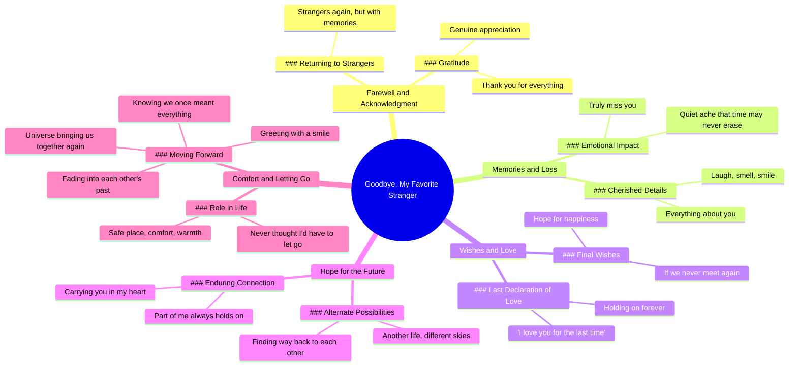

# Goodbye My Favorite Stranger With Memories

> 🌐 **Read this in:** [English](../../en/2026-07/tiktok-transcript-goodbye-my-favorite-stranger-motivacion-inspiration-displine-84e6.md) · **中文**

> **Creator:** [@deep.within2](https://www.tiktok.com/@deep.within2) · **Views:** 9.8M · **Posted:** 2026-07-03 · **Niche:** entertainment
>
> **TL;DR:** The phrase 'favorite stranger' creates an emotional paradox that instantly hooks viewers.

[Watch original video →](https://vm.tiktok.com/ZNRKDhsF1/)

## Why This Went Viral

## 钩子（前3秒）
- **逐字开场白：** "再见了，我最爱的陌生人。"
- **钩子模式：** 对比 / 情感悖论（"最爱" + "陌生人"——两个对立的概念）
- **为何能让人停下滑动：** "最爱的陌生人"是一个矛盾修辞，会立即引发认知失调。观众会暂停以解开这个矛盾，制造出一个微小的谜团，促使他们继续观看以理解其中的情感背景。

## 情感节奏
1. **好奇**（0–2秒）："再见了，我最爱的陌生人"——这是什么意思？
2. **怀旧的温暖**（3–10秒）："感谢你的一切……你的笑声、你的气息、你的微笑"——感官细节营造亲密感
3. **悬而未决的渴望**（11–20秒）："如果我们再也无法相见……我最后一次爱你"——苦乐参半的接受
4. **充满希望的幻想**（21–27秒）："也许在另一世……我们会找到回到彼此身边的路"——情感上的逃避出口
5. **安静的隐痛**（28–35秒）："一种时间或许永远无法抹去的安静隐痛"——与悲伤的深度共鸣
6. **高潮**（36–40秒）："如果宇宙再次让我们相遇，我希望我们带着微笑问候彼此"——通过优雅而非重逢来达成和解

**高潮时刻：** "我最后一次爱你"——最原始、最脆弱的一句台词，凝聚了整个情感弧线。

## 关键词密度
| 词语/短语 | 次数 | 功能 |
|-------------|-------|----------|
| "陌生人" / "陌生人们" | 2 | 算法层面：情感搜索量高；触发"前任"内容集群 |
| "再也" / "最后一次" | 3 | 情感吸引力：终结感制造紧迫感和共鸣感 |
| "微笑" | 2 | 算法层面：积极、可分享的关键词 |
| "另一世" / "不同的天空" | 2 | 情感层面：幻想逃避，极具引用价值 |
| "心" / "带着你" | 2 | 情感层面：发自肺腑的浪漫意象 |
| "感谢" | 2 | 算法层面：感恩类内容表现良好 |
| "一切" | 2 | 情感层面：夸张手法，放大失落感 |
| "保重" | 1 | 算法层面：常见告别语，可搜索 |
| "几乎永远" | 1 | 病毒式短语：独特、易记、可专属化 |

## 传播原因
1. **通用分手脚本，而非个人故事**——脚本使用"你"和"我"，没有名字或具体细节。这让任何观众都能将自己的前任代入这些文字中。*台词："你的笑声、你的气息、你的微笑，以及关于你的一切"——足够通用，适合任何人。*

2. **情感上的悲伤许可**——视频为观众提供了一种社会可接受的方式来感受自己的分手之痛。*台词："现在我把你藏在心里。一种时间或许永远无法抹去的安静隐痛"——验证了"继续前行并不意味着忘记"这一观点。*

3. **可引用、可分享的结尾台词**——最后10秒包含了一个完整、富有诗意的情感，人们想要转发或用作标题。*台词："如果宇宙再次让我们相遇，我希望我们带着微笑问候彼此，知道我们曾经意味着一切"——完美适用于评论、标题或私信。*

4. **有张力但无结局**——视频从未说"我们复合了"或"我们彻底放下了"。它停留在苦乐参半的中间地带，这能让观众保持更长时间的参与度，并鼓励反复观看。*台词："也许在另一世，在不同的天空下，我们会找到回到彼此身边的路"——在情感上留有余地。*

5. **富有节奏感、近乎音乐性的措辞**——"你的[名词]"的重复以及平行的句子结构使其易于记忆和背诵。*台词："你的笑声、你的气息、你的微笑" + "我的安全港湾、我的慰藉、那份温暖"——模式识别驱动记忆和分享。*

## 你可以借鉴之处
1. **以矛盾修辞或情感悖论开头**——"最爱的陌生人"、"几乎永远"、"带着回忆告别"。这些会迫使观众停下来思考。在你的下一个视频中，用一个短语中包含两种冲突情感来开场（例如，"苦乐参半的自由"、"快乐的心碎"）。

2. **使用感官上的具体性，但避免个人细节**——提到"笑声"、"气息"、"微笑"——任何人都能联想到的具体感官——但避免名字、日期或独特事件。这会让视频对每个观众都感觉像个人经历，而不仅仅是创作者的故事。

3. **以有条件的希望结尾，而非终结**——最后一句台词提供了一个温和的"如果"场景，而不是一个明确的结局。这保持了情感循环的开放性，鼓励诸如"我希望你能再次找到他们"之类的评论，从而推动互动。在你的脚本中，以"如果……"或"也许有一天……"结尾，而不是"结束"。

## Mind Map

## Full Transcript (Generated by [TokTranscript](https://toktranscript.com/?utm_source=github&utm_medium=breakdown&utm_campaign=tool_attribution))

> 📝 Transcripts on this page are auto-generated and show the first 60%. Want to transcribe any TikTok in 30 seconds and get the full version? [Try TokTranscript free →](https://toktranscript.com/?utm_source=github&utm_medium=breakdown&utm_campaign=transcript_cta)

Goodbye, my favorite stranger. I guess we're strangers again. But this time with memories. Thank you for everything you did for me. I know I will truly miss you. Your laugh, your smell, your smile, and everything about you. If we never meet again, I hope you'll be happy for the rest of your life. Thank you. And I love you for the last time. No matter where life takes us, a part of me will always hold on to you. Maybe in another life, under different skies, we'll find our way back to each other. Until then, take

*[Read the full transcript on TokTranscript →](https://toktranscript.com/plaza/tiktok-transcript-goodbye-my-favorite-stranger-motivacion-inspiration-displine-84e6?utm_source=github&utm_medium=breakdown&utm_campaign=transcript_full)*

## Browse More

- All [entertainment](../../by-niche/zh-CN/entertainment.md) breakdowns
- All [Contradictory juxtaposition](../../by-pattern/zh-CN/hook-contradictory-juxtaposition.md) examples

## Video Info

| | |
|---|---|
| Creator | [@deep.within2](https://www.tiktok.com/@deep.within2) |
| Original video | [https://vm.tiktok.com/ZNRKDhsF1/](https://vm.tiktok.com/ZNRKDhsF1/) |
| Original title | goodbye my favorite stranger #motivacion #inspiration #displine #mind... |
| Views | 9.8M (9800000) |
| Posted | 2026-07-03 |
| Duration | 0s |
| Niche | `entertainment` |
| Hook pattern | `Contradictory juxtaposition` |
| Original language | `en` (this page translated by AI) |
| Available languages | en, zh-CN |
| Generated | 2026-07-04 by [TokTranscript](https://toktranscript.com/) |

---

*This breakdown is for educational analysis under fair use. Original video © [@deep.within2](https://www.tiktok.com/@deep.within2). All transcripts are auto-generated and may contain errors.*

*Want to analyze your own TikToks like this? [TokTranscript →](https://toktranscript.com/viral-breakdown?utm_source=github&utm_medium=breakdown&utm_campaign=footer_cta)*