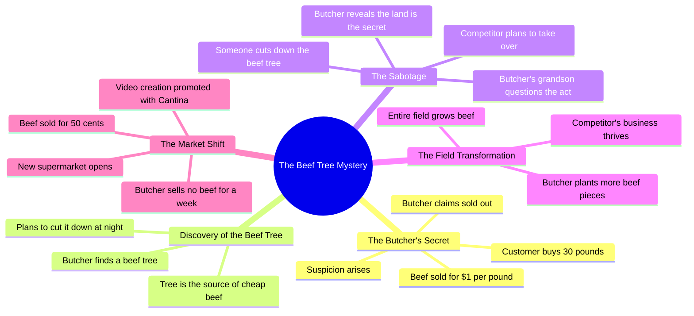

# Man Destroys Beef Tree to Ruin Rival

> 🌐 **Read this in:** [English](../../en/2026-07/tiktok-transcript-he-destroyed-the-beef-tree-to-ruin-his-rival-madewithcantina-329a.md) · **中文**

> **Creator:** [@nightzai0](https://www.tiktok.com/@nightzai0) · **Views:** 926.8K · **Posted:** 2026-07-14 · **Niche:** entertainment
>
> **TL;DR:** A skeptical question paired with an absurdly low price immediately grabs attention and sets up the mystery.

[Watch original video →](https://www.tiktok.com/t/ZP8GngKGT/)

## Why This Went Viral

## 钩子（前3秒）
- **逐字内容**："打扰一下，你的招牌没错吧？牛肉只要1美元一磅！"
- **钩子模式**：**反差**（低得离谱的价格 vs 现实预期）+ **提问**（质疑招牌准确性）
- **为何能阻止滑动**：价格低得荒谬（1美元/磅的牛肉不可能存在），瞬间制造认知失调。观众必须看下去，看这是骗局、错误还是玩笑——好奇心立刻被激发。

## 情绪节奏
- **节拍1 – 好奇**："你的招牌没错吧？" → 观众凑近观看。
- **节拍2 – 悬念**："我要30磅……已经卖完了？" → 紧张感升级。
- **节拍3 – 反转**："一棵牛肉树！" → 荒诞揭示，惊喜。
- **节拍4 – 悬念升级**："我今晚就要砍掉那棵树！" → 反派意图。
- **节拍5 – 喜剧/放松**："牛肉树？哈哈哈！" → 笑声打破紧张。
- **节拍6 – 道德高潮**："树从来不是秘密。土地就是土地。" → 智慧落地。
- **节拍7 – 最终反转**："新超市开业了……牛肉只卖50美分。" → 讽刺完成循环。
- **高潮时刻**："树从来不是秘密。土地就是土地。"——这是情感巅峰：关于贪婪与可持续性的教训。

## 关键词密度
- **牛肉**（12次）——驱动**算法覆盖**（高搜索量，产品类别）
- **树**（7次）——**情感吸引力**（荒诞、令人难忘的视觉）
- **秘密**（4次）——**好奇心驱动**（吸引观众思考"秘密是什么？"）
- **卖/售罄**（5次）——**冲突驱动**（商业紧张感）
- **美元/美分**（3次）——**价值锚点**（价格反差）
- **土地**（3次）——**主题锚点**（道德教训）
- **不可能/邪恶**（各2次）——**情感强度**（夸张手法）

## 传播原因
1. **荒诞前提+低价立即引发分享欲**——"1美元牛肉"太不现实，观众会@朋友说"哈哈这太疯狂了"。价格是普遍的注意力磁铁。
2. **道德寓言结构（贪婪vs可持续性）引发共鸣**——"树从来不是秘密。土地就是土地。"这句话可引用、易记，符合永恒叙事模式（寓言）。观众分享因为它感觉"有深度"。
3. **层层反转保持高留存**——第一次反转（牛肉树），第二次反转（砍树），第三次反转（整片地长牛肉），最终反转（50美分超市）。每次转折重置好奇心，防止流失。
4. **反派原型（贪婪屠夫）让观众容易站队**——"我今晚就要砍掉那棵树！"是明确的反派行为。观众想看他失败，驱动情感投入。
5. **讽刺作为回报**——贪婪屠夫的计划适得其反（新超市压价）。这是令人满意、可分享的"因果报应"时刻，符合短视频对正义的偏爱。

## 可借鉴之处
1. **以不可能的价格或声明开头**——使用一个荒谬到让人不得不回看的数字（1美元牛肉、免费披萨、99%折扣）。这是阻止滑动最廉价的方式。
2. **采用"道德寓言"结构**——讲述一个贪婪受罚、智慧获胜的故事。以一句感觉深刻（即使简单）的教训结尾。这让视频感觉"值得分享"。
3. **每10-15秒设置一次反转**——不要一次性揭示完整故事。每次反转都应重新吸引观众。牛肉树→整片地长牛肉→50美分超市是完美的三重反转弧线。

## Mind Map

## Full Transcript (Generated by [TokTranscript](https://toktranscript.com/?utm_source=github&utm_medium=breakdown&utm_campaign=tool_attribution))

> 📝 Transcripts on this page are auto-generated and show the first 60%. Want to transcribe any TikTok in 30 seconds and get the full version? [Try TokTranscript free →](https://toktranscript.com/?utm_source=github&utm_medium=breakdown&utm_campaign=transcript_cta)

Excuse me, is your sign correct? Beef for only $1 a pound! Yes ma'am, $1 a pound! Buy as much as you'd like. Wow! I'll take 30 pounds, please. Sold out already? That's impossible! Nobody can sell beef that cheap and stay in business. Tomorrow I'm gonna find out his secret. A beef tree! Oh! I am cutting that tree down tonight! Nighty night! Beef tree? Hahaha! Who could have really done this to us? Why would somebody really do this wicked act? How will I now sell more meat, my grandson? The tree was never the secret. The land is the land. Perfect! His business is finished. Tomorrow I'll be the o

*[Read the full transcript on TokTranscript →](https://toktranscript.com/plaza/tiktok-transcript-he-destroyed-the-beef-tree-to-ruin-his-rival-madewithcantina-329a?utm_source=github&utm_medium=breakdown&utm_campaign=transcript_full)*

## Browse More

- All [entertainment](../../by-niche/zh-CN/entertainment.md) breakdowns
- All [Question + Incredible Claim](../../by-pattern/zh-CN/hook-question-incredible-claim.md) examples

## Video Info

| | |
|---|---|
| Creator | [@nightzai0](https://www.tiktok.com/@nightzai0) |
| Original video | [https://www.tiktok.com/t/ZP8GngKGT/](https://www.tiktok.com/t/ZP8GngKGT/) |
| Original title | He destroyed the beef tree to ruin his rival #madewithcantina #emotio... |
| Views | 926.8K (926800) |
| Posted | 2026-07-14 |
| Duration | 0s |
| Niche | `entertainment` |
| Hook pattern | `Question + Incredible Claim` |
| Original language | `en` (this page translated by AI) |
| Available languages | en, zh-CN |
| Generated | 2026-07-17 by [TokTranscript](https://toktranscript.com/) |

---

*This breakdown is for educational analysis under fair use. Original video © [@nightzai0](https://www.tiktok.com/@nightzai0). All transcripts are auto-generated and may contain errors.*

*Want to analyze your own TikToks like this? [免费 TikTok 文稿生成器 →](https://toktranscript.com/viral-breakdown?utm_source=github&utm_medium=breakdown&utm_campaign=footer_cta)*