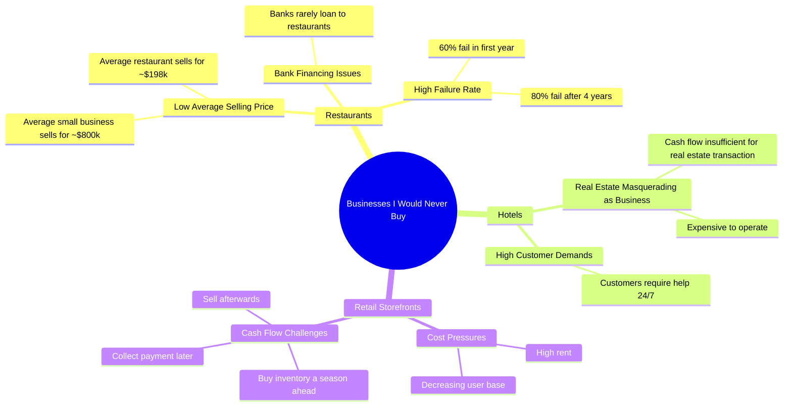

# The 3 Worst Businesses to Buy According to an Expert

> 🌐 **Read this in:** [English](../../en/2026-07/tiktok-transcript-here-are-the-3-worst-businesses-you-could-ever-buy-because-i-b7ad.md) · **中文**

> **Creator:** [@realcodiesanchez](https://www.tiktok.com/@realcodiesanchez) · **Views:** 12.4M · **Posted:** 2026-07-01 · **Niche:** finance
>
> **TL;DR:** The hook immediately challenges conventional wisdom by listing businesses to avoid, creating curiosity and tension.

[Watch original video →](https://www.tiktok.com/@realcodiesanchez/video/7231635464380370219?lang=en)

## Why This Went Viral

## 钩子（前3秒）
- **逐字开场白：**“3种我绝不会买的生意。第一种，餐厅。”
- **钩子模式：**大胆断言 + 列表格式（“3种生意”）+ 即时具体化（“餐厅”）
- **为何能阻止滑动：**“绝不会买”这句话瞬间营造出反直觉的权威感。观众期待的是泛泛的商业建议，但这却是一个明确、固执的否定。列表结构承诺了快速、易懂的回报——认知负担低，好奇心高。

## 情绪节奏
- **节拍：**权威 → 好奇 → 震惊 → 认同 → 紧张 → 释然 → 赞同
  - **0–3秒：**权威（“我绝不会买”——将创作者定位为有强烈观点的专家）
  - **3–10秒：**好奇 + 震惊（“60%第一年倒闭，80%四年后倒闭”——硬数据制造难以置信）
  - **10–15秒：**认同（“难怪银行不贷款”——证实观众的怀疑）
  - **15–25秒：**紧张（“酒店……现金流根本不够”——引入复杂性）
  - **25–30秒：**释然（“就是别碰”——干脆利落的否定释放紧张感）
  - **30秒–结束：**赞同（“不是好生意”——对论点的最终确认）
- **高潮：**关于酒店“伪装”的那句话——用一个令人难忘的比喻重新定义整个行业。这是视频的情绪巅峰。

## 关键词密度
- **“生意/企业”** — 6次。核心主题；驱动算法分类。
- **“餐厅”** — 4次。第一个例子；搜索量高，痛点 relatable。
- **“钱”/“赚钱”** — 4次。直接触及财务焦虑；驱动情感拉力。
- **“失败”/“倒闭”** — 3次。情绪冲击力强；触发损失恐惧。
- **“房地产”** — 2次。将框架从“生意”转向“资产类别”；显示专业性。
- **“平均”** — 2次。将主张锚定在数据上；建立可信度。
- **“数字不会说谎”** — 1次。强有力的短语，作为整个论点的信任印章。

## 为何能传播
1. **反直觉的权威引发争论。**“我绝不会买的生意”邀请反驳。餐厅老板、酒店经营者和零售商都会评论来捍卫自己的行业——从而产生互动。“酒店不是生意，而是伪装成生意的房地产”这句话就是专门用来挑事的。
2. **硬数据创造可分享的证据。**“餐厅平均售价19.8万 vs 小企业80万”和“60%第一年倒闭”是可引用的统计数据。观众分享以显得消息灵通。这些数字充当社交货币——“你知道吗，餐厅生意那么差？”
3. **用“伪装”一词打断模式。**这一个词重新定义了整个行业。它出人意料、令人难忘且易于引用。人们分享的是*概念*，而不仅仅是数据。这句话是病毒式传播的种子。
4. **三幕结构适合短注意力。**三个例子，每个都有清晰的笑点。没有废话。酒店部分结尾的“就是别碰”是一种节奏重置，让观众继续观看下一个节拍。
5. **企业家的 relatable 痛点。**任何考虑过购买餐厅、酒店或零售店的人都会在警告中看到自己。视频预先阻止了后悔，使其在有抱负的企业主中高度可分享。

## 你可以借鉴什么
1. **以编号的反直觉列表开头。**“3件我绝不会[动词]的事”立即创造结构和好奇心。选择一个你有强烈、不受欢迎观点的主题——然后用数据支持它。列表格式保证完整性。
2. **每个段落使用一个“重新定义”的词。**选择一个重新定义类别的词或短语（“伪装”、“不是生意”、“只擅长一件事”）。这将成为可分享的要点。测试它：如果有人能引用你的话，那就有效。
3. **用具体数字锚定每个主张。**模糊的观点不会传播。硬数据（“60%倒闭”、“19.8万 vs 80万”）创造权威和可分享性。如果你没有统计数据，就去找到它——否则就不要提出主张。数字是让观点病毒式传播的证据。

## Mind Map

## Full Transcript (Generated by [TikTok 转录工具](https://toktranscript.com/?utm_source=github&utm_medium=breakdown&utm_campaign=tool_attribution))

> 📝 Transcripts on this page are auto-generated and show the first 60%. Want to transcribe any TikTok in 30 seconds and get the full version? [Try TokTranscript free →](https://toktranscript.com/?utm_source=github&utm_medium=breakdown&utm_campaign=transcript_cta)

3. Businesses I would never buy. Number one restaurants. They ain't for making money. The numbers don't lie. The average small business in the US sells for around 800 k. The average restaurant 198 k. Because 60% fail in the first year, 80% after 4. No wonder banks don't loan to restaurants. Number 2 hotels. Hotels are not businesses. They're real estate with a lot of parts masquerading as a business. Cash flow ain't enough to cover the real estate transaction. Think about these things. They'r

*[Read the full transcript on TokTranscript →](https://toktranscript.com/plaza/tiktok-transcript-here-are-the-3-worst-businesses-you-could-ever-buy-because-i-b7ad?utm_source=github&utm_medium=breakdown&utm_campaign=transcript_full)*

## Browse More

- All [finance](../../by-niche/zh-CN/finance.md) breakdowns
- All [Listicle with contrarian premise](../../by-pattern/zh-CN/hook-listicle-with-contrarian-premise.md) examples

## Video Info

| | |
|---|---|
| Creator | [@realcodiesanchez](https://www.tiktok.com/@realcodiesanchez) |
| Original video | [https://www.tiktok.com/@realcodiesanchez/video/7231635464380370219?lang=en](https://www.tiktok.com/@realcodiesanchez/video/7231635464380370219?lang=en) |
| Original title | Here are the 3 worst businesses you could ever buy… Because I want yo... |
| Views | 12.4M (12400000) |
| Posted | 2026-07-01 |
| Duration | 0s |
| Niche | `finance` |
| Hook pattern | `Listicle with contrarian premise` |
| Original language | `en` (this page translated by AI) |
| Available languages | en, zh-CN |
| Generated | 2026-07-02 by [TokTranscript](https://toktranscript.com/) |

---

*This breakdown is for educational analysis under fair use. Original video © [@realcodiesanchez](https://www.tiktok.com/@realcodiesanchez). All transcripts are auto-generated and may contain errors.*

*Want to analyze your own TikToks like this? [TokTranscript 转录工具 →](https://toktranscript.com/viral-breakdown?utm_source=github&utm_medium=breakdown&utm_campaign=footer_cta)*