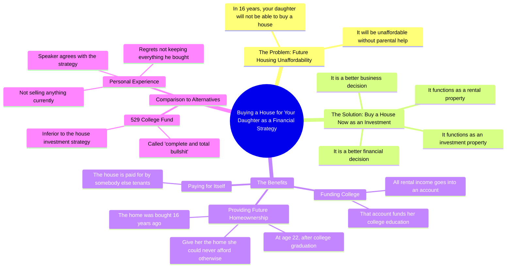

# Buying Your Kid a House Funds Their College

> 🌐 **Read this in:** [English](../../en/2026-07/tiktok-transcript-how-buying-your-kid-a-house-will-pay-for-their-college-glenn-63b3.md) · **中文**

> **Creator:** [@glenndabaker](https://www.tiktok.com/@glenndabaker) · **Views:** 5.7M · **Posted:** 2026-07-20 · **Niche:** finance
>
> **TL;DR:** Creates urgency by projecting a bleak future for a loved one, immediately grabbing attention.

[Watch original video →](https://vt.tiktok.com/ZSXXrrN1C/)

## Why This Went Viral

## 钩子（前3秒）
- **逐字开场白：** "16年后，你的女儿将买不起房"
- **钩子模式：** 大胆断言 + 定时炸弹（具体未来日期 + 稀缺性）
- **为何能阻止滑动：** 它立即引发对孩子未来的切身恐惧。具体数字（"16年"）让人感觉像预言，而非泛泛之谈。父母无法忽视对孩子未来的威胁。

## 情感节奏
- **第一拍 – 恐惧/稀缺：** "将买不起房" → 触发父母焦虑
- **第二拍 – 紧张/紧迫：** "除非你帮她" → 制造行动负担
- **第三拍 – 求知欲：** "更好的商业决策" → 将问题重新定义为机会
- **第四拍 – 解脱/清晰：** "房子由别人来付钱" → 解决资金问题
- **第五拍 – 情感回报：** "来，宝贝，这是你的家" → 描绘幸福未来
- **第六拍 – 反叛自信：** "529计划……完全是胡说八道" → 引发认同或愤怒
- **高潮时刻：** "我现在就告诉你……这是你能为孩子做的最好的事" —— 这个果断、毫不犹豫的宣言，为论点画上句号

## 关键词密度
| 关键词/短语 | 频率 | 功能 |
|---|---|---|
| "买房子" | 4次 | 核心问题 — 搜索量高，触发房地产算法 |
| "16年" | 2次 | 具体时间线 — 制造紧迫感，可重复的心理锚点 |
| "投资房产" | 2次 | 金融关键词 — 驱动算法分类 |
| "最好的财务决策" | 2次 | 情感权威 — 表明专业度，触发信任 |
| "大学"/"529计划" | 3次 | 高意图父母搜索词 — 算法覆盖 |
| "胡说八道" | 1次 | 反叛一击 — 通过分歧驱动互动 |
| "我现在就告诉你" | 2次 | 口头强调 — 创造记忆节奏 |

**算法覆盖驱动因素：** "买房子"、"大学"、"投资房产" — 个人理财/育儿领域的高搜索量词。
**情感吸引力驱动因素：** "16年"、"胡说八道"、"宝贝" — 这些词创造共鸣、愤怒或温暖。

## 为何能传播
1. **代际恐惧 + 具体时间线：** "16年后，你的女儿将买不起房" — 这是一个时间锁定的威胁。父母会立即计算自己孩子的年龄。这是个人化的，而非抽象的。
2. **对神圣话题的反叛观点：** 称529计划"完全是胡说八道"是一颗炸弹。一半观众认同（通过验证引发互动），一半观众反对（通过争论引发互动）。双方都会评论。
3. **具体、可视化的回报：** "来，宝贝，这是你的家" — 这是观众脑海中一个5秒的电影场景。它将枯燥的财务论点转化为情感上的赠礼时刻。可分享，因为它感觉像是一个秘密的生活窍门。
4. **不推销的权威感：** "我不卖任何东西" — 这是一个信任炸弹。在一个充满骗子的领域里，这句话让建议显得纯粹。它还邀请观众自我认同为"聪明人"，因为他们在倾听。
5. **有节奏的重复：** "我现在就告诉你"说了两次 — 这创造了一种催眠般的节奏。观众感觉像是被透露了一个秘密，而不是被说教。第二次重复时，留存率会飙升。

## 你可以借鉴什么
1. **以具体、个人化的威胁开场：** 不要说"房价很贵"。要说"16年后，你的女儿将买不起房"。选择一个具体的数字（年龄、年份、金额），并将其与亲人联系起来。这会让泛泛的建议显得紧迫且个人化。
2. **自信地打破神圣话题：** 选择一个被广泛接受的"好建议"（529计划、401(k)退休计划、大学学位），并称其为"胡说八道"——但前提是你必须能用一个更好、更具体的替代方案来取代它。愤怒驱动评论，解决方案驱动收藏。
3. **描绘10秒的电影场景：** 在逻辑之后，给出情感结局。"来，宝贝，这是你的家" — 这10个字让整个论点感觉像一份礼物。每个爆款视频都需要一个让观众能"看到"结果的时刻。先写出那句话，然后倒推构建论点。

## Mind Map

## Full Transcript (Generated by [TokTranscript 转录工具](https://toktranscript.com/?utm_source=github&utm_medium=breakdown&utm_campaign=tool_attribution))

> 📝 Transcripts on this page are auto-generated and show the first 60%. Want to transcribe any TikTok in 30 seconds and get the full version? [Try TokTranscript free →](https://toktranscript.com/?utm_source=github&utm_medium=breakdown&utm_campaign=transcript_cta)

in 16 years your daughter will not be able to buy a house it will not be affordable for her to buy a house unless you help her I would argue that it is a better business decision it is a better financial decision for you to buy a house for her it's an investment property it's a rental property all of the money that comes from that goes into an account and that is her college number one and number 2 that house is being paid for by somebody else so then when she is 22 years old graduated from college you can say here sweetheart here is the home that you will never ever have been able to afford if I had not bought it fo

*[Read the full transcript on TokTranscript →](https://toktranscript.com/plaza/tiktok-transcript-how-buying-your-kid-a-house-will-pay-for-their-college-glenn-63b3?utm_source=github&utm_medium=breakdown&utm_campaign=transcript_full)*

## Browse More

- All [finance](../../by-niche/zh-CN/finance.md) breakdowns
- All [Future Shock + Emotional Stake](../../by-pattern/zh-CN/hook-future-shock-emotional-stake.md) examples

## Video Info

| | |
|---|---|
| Creator | [@glenndabaker](https://www.tiktok.com/@glenndabaker) |
| Original video | [https://vt.tiktok.com/ZSXXrrN1C/](https://vt.tiktok.com/ZSXXrrN1C/) |
| Original title | How buying your kid a house will pay for their college! #GlenndaBaker... |
| Views | 5.7M (5700000) |
| Posted | 2026-07-20 |
| Duration | 0s |
| Niche | `finance` |
| Hook pattern | `Future Shock + Emotional Stake` |
| Original language | `en` (this page translated by AI) |
| Available languages | en, zh-CN |
| Generated | 2026-07-21 by [TokTranscript](https://toktranscript.com/) |

---

*This breakdown is for educational analysis under fair use. Original video © [@glenndabaker](https://www.tiktok.com/@glenndabaker). All transcripts are auto-generated and may contain errors.*

*Want to analyze your own TikToks like this? [TokTranscript →](https://toktranscript.com/viral-breakdown?utm_source=github&utm_medium=breakdown&utm_campaign=footer_cta)*