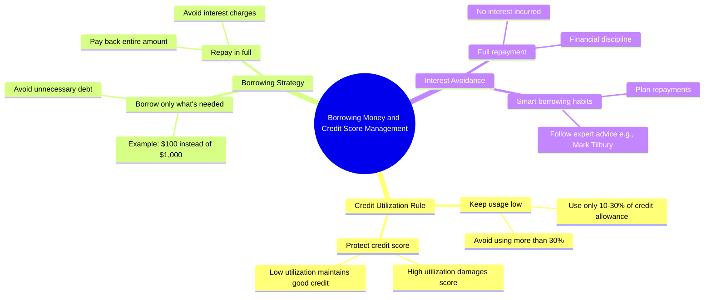

# How to Beat Evil Credit Cards

> 🌐 **Read this in:** [English](../../en/2026-07/tiktok-transcript-how-to-beat-evil-credit-cards-learnontiktok-personalfinance-4b51.md) · **中文**

> **Creator:** [@marktilbury](https://www.tiktok.com/@marktilbury) · **Views:** 17.7M · **Posted:** 2026-07-28 · **Niche:** finance
>
> **TL;DR:** The hook creates immediate intrigue by offering a large loan, then subverts expectations with a small request.

[Watch original video →](https://vt.tiktok.com/ZS4dyhkjf/)

## Why This Went Viral

## 钩子（前3秒）
- **逐字开场白：** "嘿，你能借我点钱吗？"
- **钩子模式：** 场景 + 问题（一个直接、个人化的请求，让人感觉像在偷听）
- **为何能阻止滑动：** 它以一段关于借钱的中段对话开场——瞬间引发共鸣（谁没被借过钱？）并制造出"有什么猫腻？"的紧张感。观众被迫凑近看回复。

## 情感节奏
- **节拍1 — 好奇：** 借钱请求显得冒险或尴尬；观众预期会是个骗局或冲突。
- **节拍2 — 惊喜（转折）：** "当然，你可以借到1000美元"——出乎意料的慷慨颠覆了预期。
- **节拍3 — 机智 / 紧张：** "那我借100美元吧"——借款人展现出财务知识，形成权力反转。
- **节拍4 — 释然 + 钦佩：** "我知道如果我用超过信用额度的10%到30%，你会损害我的信用评分"——观众意识到这其实是*一堂课*，而非一笔交易。
- **节拍5 — 幽默 + 满足：** "哦，有人觉得自己很聪明……他怎么知道我的秘密？"——放贷人被智取；观众感觉自己看懂了笑话。
- **高潮时刻：** "我会全额还清，这样就不用付任何利息了，非常感谢。"——借款人策略的全面揭示。

## 关键词密度
- **"信用"** — 重复3次；驱动算法覆盖（高意向金融术语，可搜索）。
- **"还清" / "还款"** — 重复3次；情感吸引力（责任感、信任）。
- **"利息"** — 重复2次；情感共鸣（对债务的恐惧、明智的理财方式）。
- **"10%到30%"** — 具体数字；算法 + 情感（可信度、可操作规则）。
- **"秘密"** — 只出现一次但效果强烈；情感吸引力（独家性、内幕知识）。
- **"马克·蒂尔伯里"** — 品牌提及；算法（创作者标签、社区信号）。

*算法驱动因素：* "信用"、"10%到30%"、"利息"——这些是高搜索量、低竞争度的金融关键词。  
*情感驱动因素：* "秘密"、"还清"、"聪明"——这些创造了共鸣和满足感。

## 为何能传播
1. **角色反转的惊喜：** 借款人（通常是弱势方）实际上是专家。这颠覆了常见的社会脚本——"我需要钱"→"我在教你"。那句*"哦，有人觉得自己很聪明"*标志着权力反转，使其成为可分享的"逮到了"时刻。
2. **对话中嵌入可操作的财务规则：** 10%-30%的信用使用率规则自然呈现，而非说教。观众会复制并分享*"信用额度的10%到30%"*这个确切短语，因为它是一个具体、可用的收获。
3. **30秒内完成悬念 + 解答：** 整个弧线——请求、反击、揭示、点睛——在30秒内完成。*"他怎么知道我的秘密？"*这句话充当了笑点与分享触发点，使其易于转发给朋友。
4. **创作者品牌植入作为社交证明：** 以*"因为我关注了马克·蒂尔伯里"*结尾，将视频变成推荐。想要同样"秘密知识"的观众会被激励去关注创作者，而现有粉丝则通过分享来验证自己的选择。
5. **将尴尬转化为赋能：** 几乎每个人都曾被借过钱。视频将一个尴尬时刻转化为自信提升——*"我知道如何保护我的信用"*——使其成为值得分享的励志内容。

## 你可以借鉴什么
1. **以高风险的请求开场：** 从一个直接、个人化的问题开始，立即制造紧张感（"能借点钱吗？"）。不要解释背景——让观众感觉像走进了对话。
2. **通过对话传递反直觉的规则：** 不要列出建议，而是让一个角色*演示*规则（例如，"我只用信用额度的10%-30%"）。观众在不知不觉中学习。
3. **以奖励观众的品牌植入结尾：** 点名知识的来源（"因为我关注了[创作者]"）——这给观众一个明确的下一步，并将视频变成推荐引擎。

## Mind Map

## Full Transcript (Generated by [免费 TikTok 文稿生成器](https://toktranscript.com/?utm_source=github&utm_medium=breakdown&utm_campaign=tool_attribution))

> 📝 Transcripts on this page are auto-generated and show the first 60%. Want to transcribe any TikTok in 30 seconds and get the full version? [Try TokTranscript free →](https://toktranscript.com/?utm_source=github&utm_medium=breakdown&utm_campaign=transcript_cta)

Hey, you got some money I can borrow? Sure, you can have up to $1,000. Cool, I'll take $100, please. Are you sure you don't want more? Yeah, because I know that if I use more than 10 to 30% of my credit allowance, you'll damage my credit score. Oh, someone thinks they're clever. By the way, you o

*[Read the full transcript on TokTranscript →](https://toktranscript.com/plaza/tiktok-transcript-how-to-beat-evil-credit-cards-learnontiktok-personalfinance-4b51?utm_source=github&utm_medium=breakdown&utm_campaign=transcript_full)*

## Browse More

- All [finance](../../by-niche/zh-CN/finance.md) breakdowns
- All [Unexpected Generosity](../../by-pattern/zh-CN/hook-unexpected-generosity.md) examples

## Video Info

| | |
|---|---|
| Creator | [@marktilbury](https://www.tiktok.com/@marktilbury) |
| Original video | [https://vt.tiktok.com/ZS4dyhkjf/](https://vt.tiktok.com/ZS4dyhkjf/) |
| Original title | How To Beat Evil Credit Cards! 😈 #learnontiktok #personalfinance #cre... |
| Views | 17.7M (17700000) |
| Posted | 2026-07-28 |
| Duration | 0s |
| Niche | `finance` |
| Hook pattern | `Unexpected Generosity` |
| Original language | `en` (this page translated by AI) |
| Available languages | en, zh-CN |
| Generated | 2026-07-29 by [TokTranscript](https://toktranscript.com/) |

---

*This breakdown is for educational analysis under fair use. Original video © [@marktilbury](https://www.tiktok.com/@marktilbury). All transcripts are auto-generated and may contain errors.*

*Want to analyze your own TikToks like this? [TokTranscript →](https://toktranscript.com/viral-breakdown?utm_source=github&utm_medium=breakdown&utm_campaign=footer_cta)*