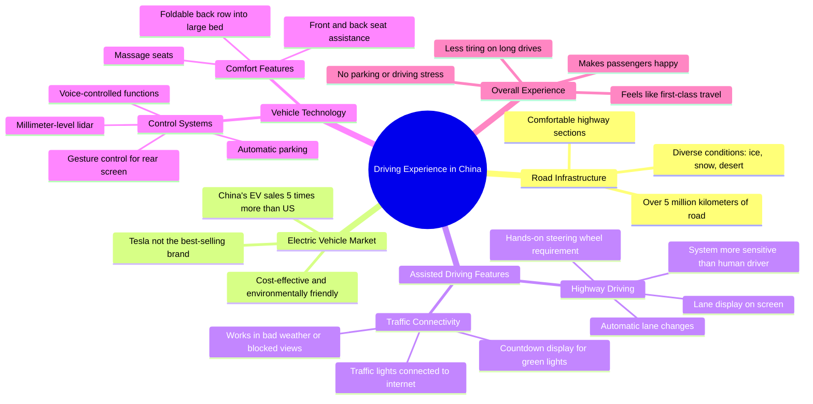

# Driving an Electric Car on a Chinese Highway

> 🌐 **Read this in:** [English](../../en/2026-07/tiktok-transcript-if-you-come-to-china-you-might-as-well-rent-an-electric-car-336a.md) · **中文**

> **Creator:** [@rogerwu_georgedeco](https://www.tiktok.com/@rogerwu_georgedeco) · **Views:** 2.3M · **Posted:** 2026-07-18 · **Niche:** other
>
> **TL;DR:** Opens with a curiosity gap about a specific, culturally intriguing experience.

[Watch original video →](https://www.tiktok.com/@rogerwu_georgedeco/video/7294087290576571680)

## Why This Went Viral

## 钩子（前3秒）
- **逐字开场白：**“在中国开车是什么体验？我现在正在中国高速公路上，带你感受一下。”
- **钩子模式：**提问 + 场景设定（好奇心驱动，沉浸式）
- **为何能阻止滑动：**这个问题具有普遍性（每个司机都好奇），但场景（中国）对大多数西方观众来说很陌生。它承诺提供第一手、内行视角，探讨一个充满刻板印象和好奇心的话题。

## 情感节奏
- **节拍1 – 好奇心：**“在中国开车是什么体验？” → 打开知识缺口。
- **节拍2 – 规模与惊喜：**“500万公里道路……冰雪和沙漠” → 确立规模，打破对“路况差”的预期。
- **节拍3 – 紧张感（对比）：**“特斯拉……但中国年销量是美国的五倍多” → 竞争张力，弱者叙事。
- **节拍4 – 轻松与愉悦：**“自动变道……开得比我还好” → 科技奇迹，自豪感。
- **节拍5 – 不断升级的惊叹：**“红绿灯和电动车都联网……你不用担心错过绿灯” → “未来已来”的高潮。
- **节拍6 – 舒适与收尾：**“我想休息一下……比在家还舒服” → 向往的生活方式，令人满意的结局。

## 关键词密度
- **“中国”**（7次以上） – 驱动算法覆盖（地缘政治好奇心，搜索量）。
- **“电动车”/“电动汽车”**（6次以上） – 高热度话题，算法友好。
- **“开车”/“驾驶”**（8次以上） – 核心动作，情感吸引力（共鸣感）。
- **“自动”/“辅助驾驶”**（4次以上） – 科技新奇感，情感吸引力（惊叹）。
- **“舒服”/“舒适”**（3次以上） – 向往的情感，可分享性。
- **“头等舱”**（1次，但影响力大） – 奢华联想，情感吸引力。
- **“特斯拉”**（2次） – 对比锚点，算法覆盖（品牌搜索）。
- **“互联网”/“联网”**（2次） – 未来科技信号，算法覆盖。

## 为何能传播
1. **普遍问题 + 异域场景：**“在中国开车是什么体验？”是数百万西方人想问但很少有人能回答的问题。视频将自己定位为罕见的、真实的视角。
2. **弱者叙事 + 数据支撑：**“中国电动车销量是美国五倍”是一个具体、令人惊讶的数据，能引发自豪感（中国观众）或震惊（西方观众）——两者都能推动分享。
3. **科技奇迹视觉升级：**每个功能（自动变道、联网红绿灯、手势控制、按摩座椅）都比上一个更令人印象深刻，形成“惊叹链”，让观众持续观看并评论“我们国家没有这个”。
4. **亲切谦逊的主持人：**“我想在车里休息一下……比在家还舒服”这句话让奢华感变得触手可及，而非炫耀。最后的“我扶你走……哦，对了，我是你的好朋友Roger”增添了个人特色和真实感——人们会分享那些感觉像朋友在炫耀酷东西的内容。
5. **对比驱动的结构：**视频不断对比“你以为的”（路况差、特斯拉主导）和“实际上的”（500万公里道路、中国品牌领先）——这种张力是病毒式传播的引擎。

## 你可以借鉴的
1. **用一个暗示知识缺口的普遍问题开场。**“在[陌生地方]做[X]是什么体验？”适用于任何领域——旅行、科技、美食、工作文化。它能同时吸引内行（寻求验证）和外行（寻求发现）。
2. **使用“对比升级”——不止一个对比，而是三个。**这里：道路（规模）→ 电动车销量（市场）→ 功能（科技）。每个对比都提升赌注，防止观众划走。
3. **用一个平凡、有共鸣的时刻收尾，让人性化地呈现惊叹。**在展示所有未来科技后，主持人说想小睡一会儿，并把车比作家。这让内容感觉像真实的体验，而非企业广告——这种信任感正是人们点击分享的原因。

## Mind Map

## Full Transcript (Generated by [TokTranscript](https://toktranscript.com/?utm_source=github&utm_medium=breakdown&utm_campaign=tool_attribution))

> 📝 Transcripts on this page are auto-generated and show the first 60%. Want to transcribe any TikTok in 30 seconds and get the full version? [Try TokTranscript free →](https://toktranscript.com/?utm_source=github&utm_medium=breakdown&utm_campaign=transcript_cta)

What's the experience of driving in China? I'm now driving on a Chinese highway to show you how it feels. China has a more than 5 million kilometers of road, including ice, snow and desert. In comparison, the weather was good today and I'm driving on a comfortable section of road with my electrical car. When people talk about electric cars, the usual thing of Tesla in the United States. But did you know that China's annual sales of electric cars are more than five times out of the United States? And Tesla is not the best selling here. Automatic driveway makes me less tired on long highway drives. It drives even better than me. If the car in front of you is too slow, it will automatically change lands to passage and the display will tell you exactly which land you are in. The functions in the car can be controlled by what it makes me, the driver, feel like. I'm enjoying first class. Always. I enjoy driving this car to give a ride to my friends. It always makes everyone happy. Is this ultra pilot? Yes, this. But it is still request me put my hand on the steering wheel. This is my first experience riding this panel electric car I never seen before in other countries. After leaving the highway, assisted driving. The steel effect. The system is more sensitive than me and is always paying attention to any emergencies on the road. Aradhamp has the cross team. I see How long the traffic lights will turn green in the car? Because traffic nights and th

*[Read the full transcript on TokTranscript →](https://toktranscript.com/plaza/tiktok-transcript-if-you-come-to-china-you-might-as-well-rent-an-electric-car-336a?utm_source=github&utm_medium=breakdown&utm_campaign=transcript_full)*

## Browse More

- All [other](../../by-niche/zh-CN/other.md) breakdowns
- All [Question-Answer](../../by-pattern/zh-CN/hook-question-answer.md) examples

## Video Info

| | |
|---|---|
| Creator | [@rogerwu_georgedeco](https://www.tiktok.com/@rogerwu_georgedeco) |
| Original video | [https://www.tiktok.com/@rogerwu_georgedeco/video/7294087290576571680](https://www.tiktok.com/@rogerwu_georgedeco/video/7294087290576571680) |
| Original title | If you come to China, you might as well rent an electric car to exper... |
| Views | 2.3M (2300000) |
| Posted | 2026-07-18 |
| Duration | 0s |
| Niche | `other` |
| Hook pattern | `Question-Answer` |
| Original language | `en` (this page translated by AI) |
| Available languages | en, zh-CN |
| Generated | 2026-07-19 by [TokTranscript](https://toktranscript.com/) |

---

*This breakdown is for educational analysis under fair use. Original video © [@rogerwu_georgedeco](https://www.tiktok.com/@rogerwu_georgedeco). All transcripts are auto-generated and may contain errors.*

*Want to analyze your own TikToks like this? [TokTranscript →](https://toktranscript.com/viral-breakdown?utm_source=github&utm_medium=breakdown&utm_campaign=footer_cta)*