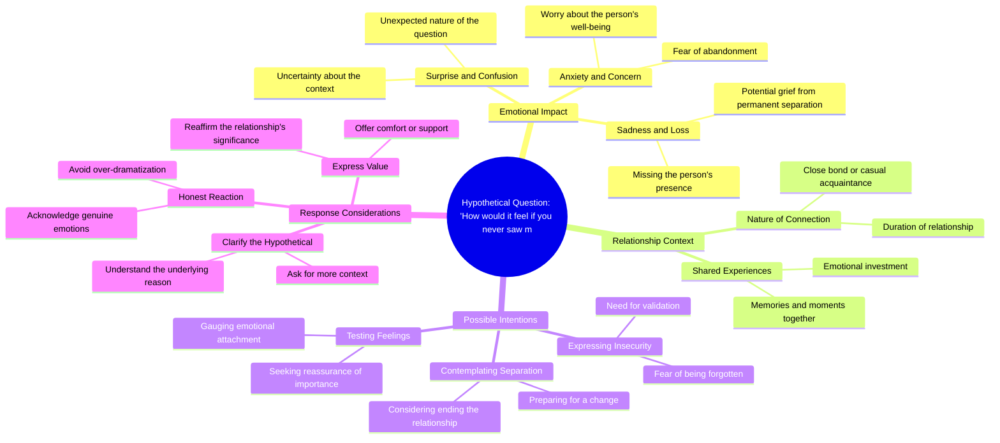

# Steve Harvey Asks How You'd Feel If You Never Saw Him Again

> 🌐 **Read this in:** [English](../../en/2026-07/tiktok-transcript-if-you-never-saw-me-again-steveharvey-mindset-mentality-succ-5e54.md) · **中文**

> **Creator:** [@_mentality4life_](https://www.tiktok.com/@_mentality4life_) · **Views:** 25.0M · **Posted:** 2026-07-02 · **Niche:** other
>
> **TL;DR:** Opens with a disarming, intimate question that creates immediate curiosity and emotional stakes.

[Watch original video →](https://www.tiktok.com/t/ZP8GBQCRW/)

## Why This Went Viral

## 钩子（前3秒）
- **逐字开场白：**“我能问你一个问题吗？只是……只是假设。如果你再也见不到我了，你会有什么感觉？”
- **钩子模式：****提问**（个人化、假设性、情感冲击强）
- **为何能阻止滑动：**它打破第四面墙，瞬间营造亲密感，并触发本能的情感反应（内疚、好奇或防御心理）。停顿“只是……只是假设”增加了紧张感，让观众不由自主地凑近。

## 情感节奏
1. **好奇**——“我能问你一个问题吗？”（低风险开场）
2. **紧张感飙升**——“如果你再也见不到我了，你会有什么感觉？”（突然的高风险假设）
3. **悬念**——观众等待说话者的反应或下一句话（未解决的感受）
4. **共鸣/自我反思**——观众被迫想象失去，产生个人情感冲击
5. **高潮**——问题落地的瞬间，观众意识到视频是关于*他们*与创作者（或生活中某人）的关系
6. **解脱或内疚**——取决于后续内容，但情感峰值在于问题本身

## 关键词密度
- **“你”**——4次（推动个性化，通过直接称呼提升算法互动）
- **“感觉”**——2次（情感牵引，触发共情）
- **“假设”**——2次（降低威胁感，营造安全空间）
- **“再也”**——1次（绝对化、高情感词汇）
- **“问题”**——1次（设定框架，邀请参与）
- **“见”**——1次（终结感、失去）

**算法触达驱动因素：**“你”（通过评论/分享实现高互动），“问题”（鼓励回复）。  
**情感牵引驱动因素：**“感觉”、“再也”、“见”（激活损失厌恶和共情）。

## 为何能传播
1. **直接称呼 + 脆弱感 = 高分享性**——“如果你再也见不到我了，你会有什么感觉？”这个问题迫使观众想象失去创作者。人们分享它来@朋友或伴侣，说“这让我想到了你。”
2. **开放循环引发评论**——问题未得到回答，观众评论自己的感受、猜测或反应。每条评论都提升算法分发。
3. **低参与门槛**——任何人都能回答一个假设性问题，无需专业知识。这推动快速互动（观看→评论→分享）。
4. **情感摩擦**——“假设”与“现实”之间的界限模糊。观众感到内疚、好奇和爱意的混合，促使他们再次观看或发送给在乎的人。
5. **模式中断**——停顿“只是……只是假设”打破了正常对话的节奏，让大脑格外注意。这增加了观看时长。

## 你可以借鉴的
1. **以个人问题而非陈述开场。**问题迫使大脑参与。使用“你”来营造一对一的感觉。
2. **插入微停顿或结巴来制造紧张感。**“只是……只是假设”的技巧增加了真实感和悬念。微小的犹豫让钩子显得即兴而真实。
3. **保持循环开放。**在前15秒内不要回答自己的问题。让观众沉浸在不适中——他们会评论或观看更久来看到你的反应。

## Mind Map

## Full Transcript (Generated by [TokTranscript 转录工具](https://toktranscript.com/?utm_source=github&utm_medium=breakdown&utm_campaign=tool_attribution))

> 📝 Transcripts on this page are auto-generated and show the first 60%. Want to transcribe any TikTok in 30 seconds and get the full version? [Try TokTranscript free →](https://toktranscript.com/?utm_source=github&utm_medium=breakdown&utm_campaign=transcript_cta)

Can I ask you a question? Just. Just hypothetical. How would i

*[Read the full transcript on TokTranscript →](https://toktranscript.com/plaza/tiktok-transcript-if-you-never-saw-me-again-steveharvey-mindset-mentality-succ-5e54?utm_source=github&utm_medium=breakdown&utm_campaign=transcript_full)*

## Browse More

- All [other](../../by-niche/zh-CN/other.md) breakdowns
- All [Hypothetical Question](../../by-pattern/zh-CN/hook-hypothetical-question.md) examples

## Video Info

| | |
|---|---|
| Creator | [@_mentality4life_](https://www.tiktok.com/@_mentality4life_) |
| Original video | [https://www.tiktok.com/t/ZP8GBQCRW/](https://www.tiktok.com/t/ZP8GBQCRW/) |
| Original title | “If you never saw me again” #steveharvey #mindset #mentality #success... |
| Views | 25.0M (25000000) |
| Posted | 2026-07-02 |
| Duration | 0s |
| Niche | `other` |
| Hook pattern | `Hypothetical Question` |
| Original language | `en` (this page translated by AI) |
| Available languages | en, zh-CN |
| Generated | 2026-07-03 by [TokTranscript](https://toktranscript.com/) |

---

*This breakdown is for educational analysis under fair use. Original video © [@_mentality4life_](https://www.tiktok.com/@_mentality4life_). All transcripts are auto-generated and may contain errors.*

*Want to analyze your own TikToks like this? [TikTok 转录工具 →](https://toktranscript.com/viral-breakdown?utm_source=github&utm_medium=breakdown&utm_campaign=footer_cta)*