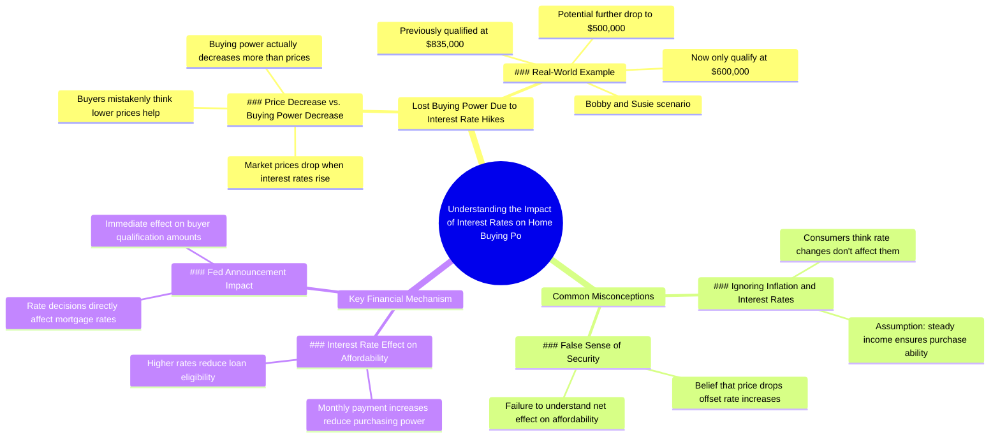

# Waiting on Market Drop to Buy? You Lost Buying Power

> 🌐 **Read this in:** [English](../../en/2026-07/tiktok-transcript-if-you-re-waiting-on-the-market-to-go-down-to-buy-you-may-be-a80b.md) · **中文**

> **Creator:** [@glenndabaker](https://www.tiktok.com/@glenndabaker) · **Views:** 1.6M · **Posted:** 2026-07-12 · **Niche:** finance
>
> **TL;DR:** Directly calls out a common objection and immediately reframes it as a loss.

[Watch original video →](https://vt.tiktok.com/ZSXN4UfJP/)

## Why This Went Viral

## 钩子（前3秒）
- **逐字原文：** "那些说'我要等市场跌下来'的人——哦，格伦达，市场要崩盘了，价格要跌了"
- **钩子模式：** 对比/直接点名（"那些说……的人"）+ 嘲讽（"哦，格伦达"）
- **为何能阻止滑动：** 立即以居高临下且令人共鸣的语气点名特定受众（说要等待的人）。"哦，格伦达"的嘲讽制造了即时情绪张力——观众要么感到被冒犯，要么觉得有趣。

## 情绪节奏
- **好奇 →** "那些说'我要等'的人"（这是在说谁？）
- **紧张 →** "哦，格伦达，市场要崩盘了"（嘲讽语气升级）
- **挫败感 →** "喂，利率刚涨了，价格跌了"（快速逻辑输出）
- **顿悟 →** "你明白你失去了什么吗？你失去了购买力"（高潮——真正的损失）
- **共鸣 →** "我们有个鲍比和苏茜，一年半前他们看的是835，现在到了600"（具体案例）
- **紧迫感 →** "如果今天下午2点利率上涨……他们可能从600跌到500"（时间压力）
- **高潮：** "你才不是牛"——直白、不屑的真相，打破观众的幻想

## 关键词密度
- **"利率"** — 5次（算法覆盖：热门金融话题）
- **"价格跌了" / "价格可能跌"** — 3次（情绪牵引：虚假希望 vs 现实）
- **"购买力"** — 2次（情绪牵引：失去能力的核心恐惧）
- **"失去" / "损失"** — 2次（情绪牵引：后悔与稀缺感）
- **"市场"** — 2次（算法覆盖：广泛金融关键词）
- **"600" / "500" / "835"** — 数字（算法：具体数据增强可信度）

## 为何能传播
1. **共鸣的挫败感** — "那些说'我要等'的人"直接瞄准大量犹豫不决的买家，引发自我认同或幸灾乐祸
2. **具体、情绪化的数字** — "他们看的是835，现在到了600"将抽象市场概念转化为个人损失故事（鲍比和苏茜）
3. **紧迫感 + 错失恐惧** — "如果今天下午2点利率上涨"制造倒计时，让观众觉得必须立即行动，否则损失更大
4. **直白、可做成梗的表达** — "你才不是牛"简短有力，可作为片段或引文重新分享
5. **算法友好话题** — "利率"、"通胀"、"市场崩盘"是高搜索量词汇，YouTube/Instagram/TikTok会放大

## 你可以借鉴什么
1. **点名一个具体的错误信念** — 以"那些说[常见错误观点]的人"开头。这能立即吸引持有该信念的人，或喜欢看它被驳斥的人。
2. **使用一个共鸣的"鲍比和苏茜"故事** — 用假名和真实数字给出具体案例。让抽象金融概念变得个人化且紧迫。
3. **以直白、不屑的真相结尾** — 像"你才不是牛"这样简短有力的句子极具分享性，可作为独立片段或梗模板。

## Mind Map

## Full Transcript (Generated by [TokTranscript](https://toktranscript.com/?utm_source=github&utm_medium=breakdown&utm_campaign=tool_attribution))

> 📝 Transcripts on this page are auto-generated and show the first 60%. Want to transcribe any TikTok in 30 seconds and get the full version? [Try TokTranscript free →](https://toktranscript.com/?utm_source=github&utm_medium=breakdown&utm_campaign=transcript_cta)

for those of you who said i'm gonna wait till the market comes down oh glenda the market's gonna crash it's gonna come down in value hello the interest rate just went up the price came down the interest rate just went up do you understand what you lost you lost your buying power that's the thing that i can't get the consumer to understand we've got bobby and susie over here a year and a half ago they're looking at 8 35 now they're at 600 and if the interest rate at 2 o'clock goes

*[Read the full transcript on TokTranscript →](https://toktranscript.com/plaza/tiktok-transcript-if-you-re-waiting-on-the-market-to-go-down-to-buy-you-may-be-a80b?utm_source=github&utm_medium=breakdown&utm_campaign=transcript_full)*

## Browse More

- All [finance](../../by-niche/zh-CN/finance.md) breakdowns
- All [Direct Address + Contrarian Question](../../by-pattern/zh-CN/hook-direct-address-contrarian-question.md) examples

## Video Info

| | |
|---|---|
| Creator | [@glenndabaker](https://www.tiktok.com/@glenndabaker) |
| Original video | [https://vt.tiktok.com/ZSXN4UfJP/](https://vt.tiktok.com/ZSXN4UfJP/) |
| Original title | If you’re waiting on the market to go down to buy… You may be shit ou... |
| Views | 1.6M (1600000) |
| Posted | 2026-07-12 |
| Duration | 0s |
| Niche | `finance` |
| Hook pattern | `Direct Address + Contrarian Question` |
| Original language | `en` (this page translated by AI) |
| Available languages | en, zh-CN |
| Generated | 2026-07-13 by [TokTranscript](https://toktranscript.com/) |

---

*This breakdown is for educational analysis under fair use. Original video © [@glenndabaker](https://www.tiktok.com/@glenndabaker). All transcripts are auto-generated and may contain errors.*

*Want to analyze your own TikToks like this? [拆解你自己的 TikTok →](https://toktranscript.com/viral-breakdown?utm_source=github&utm_medium=breakdown&utm_campaign=footer_cta)*