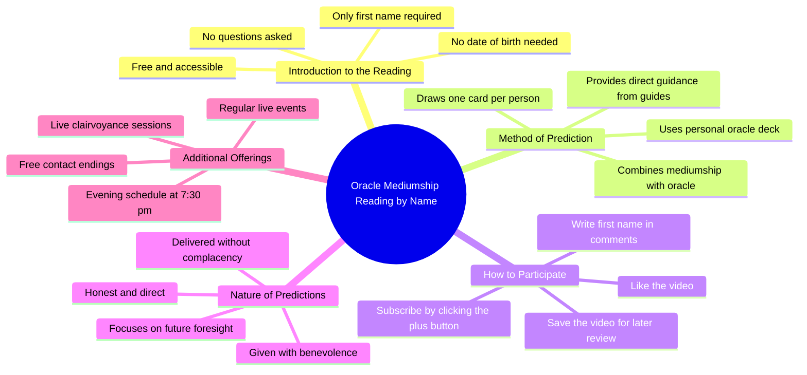

# Real Fortune Telling: Write Your First Name in Comments

> 🌐 **Read this in:** [English](../../en/2026-07/tiktok-transcript-je-vais-te-faire-de-la-vrai-divination-crit-ton-pr-nom-en-co-8805.md) · **中文**

> **Creator:** [@voyancevenda](https://www.tiktok.com/@voyancevenda) · **Views:** 630.1K · **Posted:** 2026-07-06 · **Niche:** other
>
> **TL;DR:** Commands immediate action while promising a mysterious reward, driving engagement.

[Watch original video →](https://www.tiktok.com/t/ZP8G5xN3o/)

## Why This Went Viral

## 钩子（前3秒）
- **逐字内容：** "别问我任何问题，只需在评论区写下你的名字。"
- **钩子模式：** 指令 + 好奇心缺口（带有禁止行为的指令）
- **为何能阻止滑动：** 开场白是一条严格而神秘的指令，立即引发好奇。它通过禁止提问打破了典型的"问我任何事"模式，让观众感觉自己即将获得独家、私密的信息。"没有具体问题，没有出生日期"这句话增添了一层神秘感和专属感。

## 情感节奏
- **节拍1 – 好奇（0–3秒）：** "别问我任何问题"——一条反直觉的指令，激起兴趣。
- **节拍2 – 神秘（3–8秒）：** "我会告诉你，我的指引者通过一张牌、我的神谕卡告诉你什么"——引入超自然元素，营造紧张感。
- **节拍3 – 悬念（8–12秒）：** "我进行真正的通灵"——赌注升级；这不是游戏，而是"真实的"。
- **节拍4 – 期待（12–18秒）：** "我会告诉你什么能预见你的未来"——承诺明确，激发参与欲望。
- **节拍5 – 紧迫感（18–24秒）：** "订阅、点赞、写下你的名字"——快速行动号召，利用积累的好奇心。
- **高潮时刻：** "不骄不躁，但心怀善意"这句话——这种道德框架增加了分量和信任，让观众觉得预测将是诚实且充满关怀的。

## 关键词密度
- **"名字"** – 重复3次。推动算法覆盖（评论互动）和情感吸引力（个性化）。
- **"未来"** – 重复2次。情感吸引力——触及人类普遍的焦虑/好奇心。
- **"神谕卡"** – 重复2次。情感吸引力——神秘、权威，营造古老智慧感。
- **"指引者"** – 重复1次（隐含）。情感吸引力——暗示精神支持，而非随意之人。
- **"订阅"** – 重复1次。算法覆盖——直接行动号召，提升平台指标。
- **"评论"** – 重复2次。算法覆盖——推动互动信号。
- **"牌"** – 重复1次。情感吸引力——视觉化、具体化，为占卜说法增添真实性。
- **"善意"** – 重复1次。情感吸引力——建立信任，缓和"不骄不躁"的警告。
- **"免费"** – 重复1次。算法覆盖 + 情感吸引力——触发成本效益心理。
- **"晚上7:30"** – 重复1次。算法覆盖——为直播活动创造时间紧迫感。

## 为何能传播
1. **低门槛互动循环：** "在评论区写下你的名字"是最简单的操作。无需提问、出生日期或个人资料。这大大降低了参与门槛，使评论区爆满，触发算法的互动信号。
2. **个性化作为奖励：** "我会告诉你什么能预见你的未来"的承诺让每个评论者都觉得自己将获得独特、私密的解读。这为零成本行动创造了高感知价值，推动大规模参与。
3. **神秘权威 + 信任框架：** "不骄不躁，但心怀善意"这句话是建立信任的典范。它承认解读可能严厉（"不骄不躁"），但将其框定为关怀（"善意"），让观众更愿意相信和分享。
4. **时间敏感稀缺性：** "在我的直播中见……晚上7:30"创造了截止日期。错过直播的观众感到错失恐惧，而参与的观众则获得专属感。这同时推动了即时互动和未来观看量。
5. **算法友好结构：** 视频前置钩子，然后立即过渡到清晰的行动号召（"订阅、点赞、写下你的名字"）。它还提到保存视频（"收藏此视频以回顾你的预测"），这增加了观看时间和收藏量——两个关键的算法信号。

## 你可以借鉴什么
1. **"禁止行为"钩子：** 以反直觉的指令开场，打破预期模式。不要说"问我任何事"，而是说"别问我任何事"。这能立即引发好奇，让你的视频在拥挤的信息流中脱颖而出。
2. **超低门槛行动号召：** 要求最简单的操作（只需名字，无需问题或细节）。要求越简单，互动率越高。然后为这一微小行动承诺高价值、个性化的回报。
3. **"诚实但关怀"的信任框架：** 预先应对质疑，承认你的内容可能直白（"不骄不躁"），但立即用温暖软化它（"心怀善意"）。这能建立可信度和情感安全感，让观众更愿意互动和分享。

## Mind Map

## Full Transcript (Generated by [TokTranscript](https://toktranscript.com/?utm_source=github&utm_medium=breakdown&utm_campaign=tool_attribution))

> 📝 Transcripts on this page are auto-generated and show the first 60%. Want to transcribe any TikTok in 30 seconds and get the full version? [Try TokTranscript free →](https://toktranscript.com/?utm_source=github&utm_medium=breakdown&utm_campaign=transcript_cta)

Don't ask me any questions, just write me your first name in comments. No specific questions, no date of birth. I'll tell you what my guides tell you through 1 card, my oracle that I created. I do some real mediumship I will do it through my oracle. You put me your name in comments and I will tell you what foresees your future without complacency but in benevolence. To get your answer, su

*[Read the full transcript on TokTranscript →](https://toktranscript.com/plaza/tiktok-transcript-je-vais-te-faire-de-la-vrai-divination-crit-ton-pr-nom-en-co-8805?utm_source=github&utm_medium=breakdown&utm_campaign=transcript_full)*

## Browse More

- All [other](../../by-niche/zh-CN/other.md) breakdowns
- All [Direct Command with Mystery](../../by-pattern/zh-CN/hook-direct-command-with-mystery.md) examples

## Video Info

| | |
|---|---|
| Creator | [@voyancevenda](https://www.tiktok.com/@voyancevenda) |
| Original video | [https://www.tiktok.com/t/ZP8G5xN3o/](https://www.tiktok.com/t/ZP8G5xN3o/) |
| Original title | Je vais te faire de la vrai divination - écrit ton prénom en commenta... |
| Views | 630.1K (630100) |
| Posted | 2026-07-06 |
| Duration | 0s |
| Niche | `other` |
| Hook pattern | `Direct Command with Mystery` |
| Original language | `en` (this page translated by AI) |
| Available languages | en, zh-CN |
| Generated | 2026-07-08 by [TokTranscript](https://toktranscript.com/) |

---

*This breakdown is for educational analysis under fair use. Original video © [@voyancevenda](https://www.tiktok.com/@voyancevenda). All transcripts are auto-generated and may contain errors.*

*Want to analyze your own TikToks like this? [TokTranscript →](https://toktranscript.com/viral-breakdown?utm_source=github&utm_medium=breakdown&utm_campaign=footer_cta)*