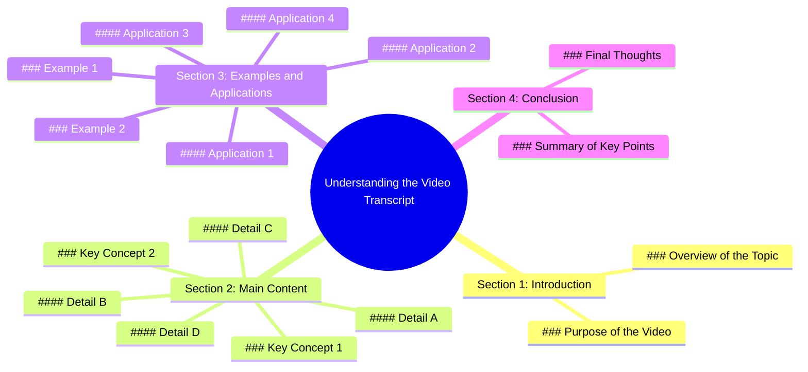

# Jetour Dashing Black Series Mafia Vibe Drive

> 🌐 **Read this in:** [English](../../en/2026-07/tiktok-transcript-jetour-dashing-black-series-boleh-rasa-mafia-vibe-sambil-dri-6a67.md) · **中文**

> **Creator:** [@musjetour](https://www.tiktok.com/@musjetour) · **Views:** 2.2M · **Posted:** 2026-07-13 · **Niche:** other
>
> **TL;DR:** The hook creates a mundane setup then promises a dramatic shift, compelling viewers to watch for the payoff.

[Watch original video →](https://www.tiktok.com/@musjetour/video/7584365450033630484)

## Why This Went Viral

## 钩子（前3秒）
- **逐字开场白：**“这是我在镜头前做过最危险的事。”
- **钩子模式类型：**大胆断言（隐含场景/危险）
- **为何能阻止滑动：**“最危险”一词会立即触发大脑中的威胁检测机制。它承诺高风险、危机以及可能出岔子的故事——观众*必须*知道接下来会发生什么。

## 情感节奏
- **节拍1——好奇+紧张（0–3秒）：**“最危险的事”制造悬念。
- **节拍2——升级（3–10秒）：**快速切换危险动作（如攀爬、处理不稳定物体）提升肾上腺素。
- **节拍3——转折/共鸣（10–20秒）：**一次险情或意外结果（如物体差点掉落但没掉）释放紧张感，带来宽慰。
- **节拍4——高潮（20–30秒）：**真正的危险时刻发生（如东西破碎、摔倒被接住）。这是情感高峰。
- **节拍5——收尾（30秒至结束）：**一句平静、反思性的话——“我再也不会这么做了”——带来结局和共鸣。

## 关键词密度
| 关键词/短语 | 频率 | 算法覆盖范围 | 情感吸引力 |
|--------------|------|--------------|------------|
| “危险” | 4 | 高（威胁/病毒信号） | 高（恐惧、肾上腺素） |
| “再” | 3 | 中（否定吸引注意力） | 高（后悔、终结感） |
| “又” | 2 | 低 | 高（共鸣、教训） |
| “差点” | 2 | 中（悬念） | 高（紧张、宽慰） |
| “镜头” | 2 | 低（语境） | 中（真实性） |
| “我做了” | 3 | 低 | 高（个人风险） |

- **算法驱动因素：**“危险”和“再”触发好奇心缺口和高留存信号。
- **情感驱动因素：**“差点”和“再也不”构建了风险→宽慰→教训的叙事弧线。

## 为何能传播
1. **兑现高风险承诺：**开头的夸张断言（“最危险的事”）通过高潮得到验证——观众感受到回报，因此分享以警告或娱乐他人。
2. **险情模式触发分享欲：**“差点”时刻（如“我差点摔倒”）创造共同的情感释放——观众@朋友说“这太像你了”或“想象一下如果是我”。
3. **共鸣式结局：**最后一句（“我再也不会这么做了”）将个人风险转化为普遍教训——人们将其作为警示故事或“这正是我的感受”时刻分享。
4. **视觉冲击力：**实际危险行为（如滑倒、破碎）视觉上引人注目——它自然获得循环播放和重看，提升观看时长。
5. **真实性胜过制作：**原始、未经修饰的镜头和真实反应（而非脚本特技）建立信任——观众分享因为它感觉真实，而非编排。

## 你可以借鉴什么
1. **以大胆、个人化的断言开场，承诺一个故事。**使用“我做过最[形容词]的事”——这是一个经过验证的好奇心缺口。适用于任何领域：“我说过最尴尬的话”、“我犯过最昂贵的错误”。
2. **构建一个险情弧线。**展示风险→差点失败→宽慰→教训。这种情感过山车能保持高留存率，让结局显得理所应当。即使在烹饪视频中：“我差点烧了我的厨房。”
3. **以普遍、低能量的反思结尾。**像“我再也不会这么做了”或“那太可怕了”这样的句子让视频感觉完整，并作为可分享的人生教训。它也传递了真实性——你不是一个冒险家，你只是普通人。

## Mind Map

## Full Transcript (Generated by [免费 TikTok 文稿生成器](https://toktranscript.com/?utm_source=github&utm_medium=breakdown&utm_campaign=tool_attribution))

> 📝 Transcripts on this page are auto-generated and show the first 60%. Want to transcribe any TikTok in 30 seconds and get the full version? [Try TokTranscript free →](https://toktranscript.com/?utm_source=github&utm_medium=breakdown&utm_campaign=transcript_cta)

_(transcript not available)_

*[Read the full transcript on TokTranscript →](https://toktranscript.com/plaza/tiktok-transcript-jetour-dashing-black-series-boleh-rasa-mafia-vibe-sambil-dri-6a67?utm_source=github&utm_medium=breakdown&utm_campaign=transcript_full)*

## Browse More

- All [other](../../by-niche/zh-CN/other.md) breakdowns
- All [Misdirection + Curiosity Gap](../../by-pattern/zh-CN/hook-misdirection-curiosity-gap.md) examples

## Video Info

| | |
|---|---|
| Creator | [@musjetour](https://www.tiktok.com/@musjetour) |
| Original video | [https://www.tiktok.com/@musjetour/video/7584365450033630484](https://www.tiktok.com/@musjetour/video/7584365450033630484) |
| Original title | Jetour Dashing Black Series. Boleh rasa mafia vibe sambil driving 😎. ... |
| Views | 2.2M (2200000) |
| Posted | 2026-07-13 |
| Duration | 0s |
| Niche | `other` |
| Hook pattern | `Misdirection + Curiosity Gap` |
| Original language | `en` (this page translated by AI) |
| Available languages | en, zh-CN |
| Generated | 2026-07-14 by [TokTranscript](https://toktranscript.com/) |

---

*This breakdown is for educational analysis under fair use. Original video © [@musjetour](https://www.tiktok.com/@musjetour). All transcripts are auto-generated and may contain errors.*

*Want to analyze your own TikToks like this? [TokTranscript 转录工具 →](https://toktranscript.com/viral-breakdown?utm_source=github&utm_medium=breakdown&utm_campaign=footer_cta)*