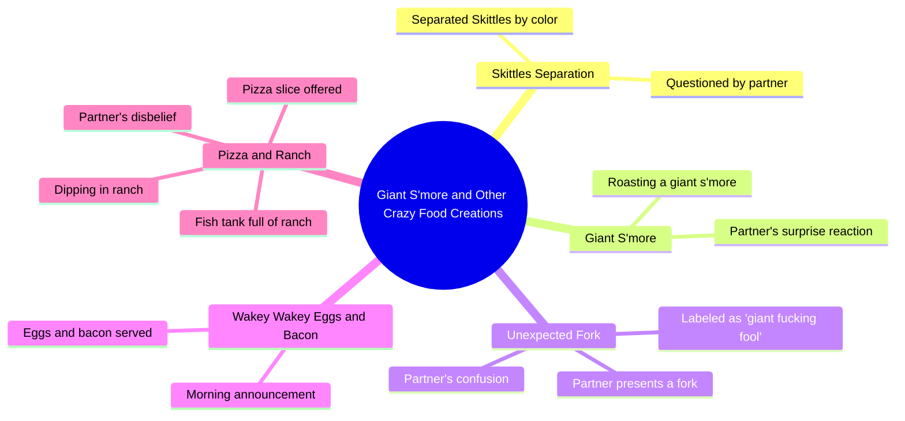

# Giant S'more Roast and Skittles Separation Reaction

> 🌐 **Read this in:** [English](../../en/2026-07/tiktok-transcript-jtvjember-evakuasi-sidoarjo-fyp-foryou-b9ba.md) · **中文**

> **Creator:** [@vincentwilliams6018](https://www.tiktok.com/@vincentwilliams6018) · **Views:** 12.0M · **Posted:** 2026-07-03 · **Niche:** other
>
> **TL;DR:** The hook uses rapid exclamations and a question to create immediate intrigue about an unexpected food item.

[Watch original video →](https://www.tiktok.com/@vincentwilliams6018/video/7643013038341164319)

## Why This Went Viral

## 钩子（前3秒）
- **逐字开场白：** "宝贝！哦，我的天。哦，我的天。什么？你现在在吃什么？什么？你到底能有什么？宝贝，那到底是什么？"
- **钩子模式：** 场景 + 高情绪反应（震惊/难以置信）+ 连珠炮式提问
- **为何能阻止滑动：** 极度近乎狂热的反应立即引发好奇心——观众必须看到是什么引发了这种程度的难以置信。断断续续的语速和重复的"什么？"模仿了现场即兴时刻，让人感觉真实而紧迫。

## 情绪节奏
1. **困惑/震惊（0–3秒）：** "宝贝！哦，我的天。"——观众被原始反应吸引。
2. **好奇（3–6秒）：** "你现在在吃什么？"——营造关于物体的神秘感。
3. **惊讶（6–8秒）：** "彩虹糖？你把它们全分开了？"——首次揭示，但仍显平常。
4. **升级（8–15秒）：** "我们要烤一个巨大的棉花糖夹心饼。"——转折：这是一个过程，而不仅仅是零食。
5. **荒诞（15–25秒）：** "一个巨大的该死的傻瓜。"——叉子揭示时喜剧张力达到顶峰。
6. **释然/大笑（25–30秒）：** "哦，不。真他妈见鬼，宝贝，这个人疯了。"——观众与叙述者的恼怒产生共鸣。
7. **新转折（30–40秒）：** "醒醒，醒醒。鸡蛋和培根。"——用新的荒诞场景重置好奇心。
8. **高潮（40–45秒）：** "一鱼缸的牧场酱？"——视觉上最离谱的揭示，抛出笑点。
- **高潮时刻：** "一鱼缸的牧场酱"揭示——这是视觉上最荒诞、最意想不到的物品，为一系列不断升级的怪事画上句号。

## 关键词密度
- **"什么"**（8次）——通过高互动（评论、分享）和情感吸引（好奇心）推动算法覆盖。
- **"宝贝"**（4次）——情感吸引；营造亲密感和共鸣感（情侣动态）。
- **"巨大"**（3次）——算法覆盖（大小对比具有点击吸引力）；情感吸引（夸张以制造幽默）。
- **"傻瓜/该死的"**（2次）——情感吸引（喜剧强调、冲击价值）。
- **"牧场酱"**（2次）——算法覆盖（具体、令人难忘的食物引发搜索/分享）。
- **"疯了"**（1次）——情感吸引（给荒诞行为贴上标签，让观众觉得自己的反应得到了认可）。
- **"披萨/彩虹糖/鸡蛋和培根"**——算法覆盖（常见食物，易于想象和讨论）。

## 为何能传播
- **可共鸣的震惊循环：** 叙述者不断升级的难以置信（"真他妈见鬼，宝贝，这个人疯了"）反映了观众自己的反应，创造了共享体验。观众标记朋友说"我们"或"这就是我们"。
- **视觉荒诞升级：** 每次揭示（分开的彩虹糖 → 巨大的棉花糖夹心饼 → 叉子 → 一鱼缸的牧场酱）都变得更加离谱。"鱼缸"是顶峰——它如此怪异，以至于可以作为"你能相信吗？"的时刻被分享。
- **高重看性：** 快节奏剪辑和多次揭示奖励重看。观众在第二次观看时会发现新细节（例如叉子、"巨大"的棉花糖夹心饼），从而提高留存指标。
- **评论诱饵：** 视频以一个问题（"今天的标题是什么？"）和一个震撼的视觉画面结束，促使观众评论"什么？"或"这太疯狂了。"牧场酱的转折也引发争论（例如"披萨上放牧场酱？！"）。
- **合拍/合作潜力：** 格式（一个人对另一个人的荒谬食物选择做出反应）易于复制。创作者可以通过对原视频做出反应或制作自己的版本来进行合拍。

## 你可以借鉴什么
1. **"不断升级的荒诞"结构：** 从一个稍微奇怪的东西开始（分开的彩虹糖），然后不断用更离谱的揭示（巨大的棉花糖夹心饼、叉子、一鱼缸的牧场酱）来超越它。每个新物品都提高赌注，让观众保持兴趣。
2. **使用快节奏、反应式对话：** 像"什么？"和"宝贝，那到底是什么？"这样的简短有力台词创造了一种感觉自发且高能量的节奏。避免冗长的解释——让视觉效果发挥作用。
3. **以最具分享性的视觉画面结尾：** "一鱼缸的牧场酱"是视频的高潮，也是最有可能被脱离上下文分享的片段。始终把最疯狂、视觉上最荒诞的元素留到最后——它成为笑点和可分享的钩子。

## Mind Map

## Full Transcript (Generated by [TokTranscript](https://toktranscript.com/?utm_source=github&utm_medium=breakdown&utm_campaign=tool_attribution))

> 📝 Transcripts on this page are auto-generated and show the first 60%. Want to transcribe any TikTok in 30 seconds and get the full version? [Try TokTranscript free →](https://toktranscript.com/?utm_source=github&utm_medium=breakdown&utm_campaign=transcript_cta)

Babe! Oh, my god. Oh, my god. What? What are you eating now? What? What could you possibly have? Baby, the hell is that? Skittles. Skittles? You separated all of that? Hey, baby, we are going to roast a giant s'more. What? A giant s'more. Oh, hey, baby, what's on the menu today? I have another step. What? What is this? A fork? A giant fucking fool. What? Oh, no. In the actual fuck, b

*[Read the full transcript on TokTranscript →](https://toktranscript.com/plaza/tiktok-transcript-jtvjember-evakuasi-sidoarjo-fyp-foryou-b9ba?utm_source=github&utm_medium=breakdown&utm_campaign=transcript_full)*

## Browse More

- All [other](../../by-niche/zh-CN/other.md) breakdowns
- All [Surprise and escalating curiosity](../../by-pattern/zh-CN/hook-surprise-and-escalating-curiosity.md) examples

## Video Info

| | |
|---|---|
| Creator | [@vincentwilliams6018](https://www.tiktok.com/@vincentwilliams6018) |
| Original video | [https://www.tiktok.com/@vincentwilliams6018/video/7643013038341164319](https://www.tiktok.com/@vincentwilliams6018/video/7643013038341164319) |
| Original title | #jtvjember #evakuasi #sidoarjo #fyp#foryou |
| Views | 12.0M (12000000) |
| Posted | 2026-07-03 |
| Duration | 0s |
| Niche | `other` |
| Hook pattern | `Surprise and escalating curiosity` |
| Original language | `en` (this page translated by AI) |
| Available languages | en, zh-CN |
| Generated | 2026-07-04 by [TokTranscript](https://toktranscript.com/) |

---

*This breakdown is for educational analysis under fair use. Original video © [@vincentwilliams6018](https://www.tiktok.com/@vincentwilliams6018). All transcripts are auto-generated and may contain errors.*

*Want to analyze your own TikToks like this? [TokTranscript 转录工具 →](https://toktranscript.com/viral-breakdown?utm_source=github&utm_medium=breakdown&utm_campaign=footer_cta)*