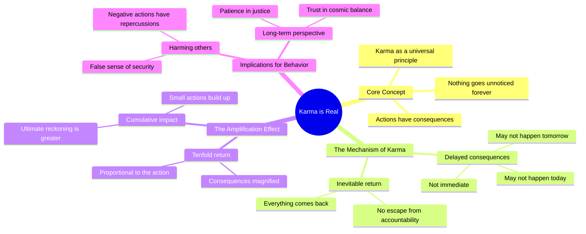

# Karma Is Real: What Goes Around Comes Back Tenfold

> 🌐 **Read this in:** [English](../../en/2026-07/tiktok-transcript-karma-is-real-motivation-podcast-quotes-podcastclips-womene-dd79.md) · **中文**

> **Creator:** [@pro_success.7](https://www.tiktok.com/@pro_success.7) · **Views:** 2.9M · **Posted:** 2026-07-04 · **Niche:** other
>
> **TL;DR:** Opens with a universal truth that immediately grabs attention.

[Watch original video →](https://vm.tiktok.com/ZNRwHH1sK/)

## Why This Went Viral

## 钩子（前3秒）
- **逐字开场：** "因果报应是真实的，是的，你可以伤害别人，以为什么都不会发生"
- **钩子模式：** 大胆断言 + 对比（伤害别人 vs. 什么都不会发生）
- **为何能让人停止滑动：** 它直接挑战了一种常见的自我欺骗（"我可以逃脱惩罚"），用一条普遍的道德真理制造了人们*想要*相信与*害怕*是真实之间的即时张力。

## 情感节奏
1. **好奇** – "因果报应是真实的" 引入了一个熟悉的概念，但措辞暗示了新的见解。
2. **紧张** – "你可以伤害别人，以为什么都不会发生" – 观众认出了自己或他人的否认。
3. **悬念** – "也许不是今天，也许不是明天，是的，但总有一天" – 通过重复和延迟建立期待。
4. **释放 / 共鸣** – "一切都会回来" – 回报，满足累积的期待。
5. **放大** – "十倍" – 提升情感赌注，营造正义感。
6. **高潮 / 终结** – "生活中没有什么是永远不被注意的" – 最终的道德裁决，不留任何逃脱余地。

## 关键词密度
- **因果报应** – 情感吸引力（普遍正义概念，引发内疚/解脱）
- **伤害/伤害他人** – 情感吸引力（识别错误行为）
- **什么/没什么** – 算法覆盖（高频词，简单，可搜索）
- **回来/会回来** – 情感吸引力（循环意象，令人满意的结局）
- **十倍** – 算法覆盖（独特，易记，可在评论中分享）
- **永远** – 情感吸引力（终结性，存在感重量）
- **天/日子** – 两者兼具（时间锚点，易于想象，算法重复）

## 为何能传播
1. **普遍内疚触发点** – "你可以伤害别人，以为什么都不会发生" 命名了一种近乎普遍的人类体验（做错事后的否认），让观众感到被看穿，并被迫分享作为忏悔或警告。
2. **节奏悬念结构** – "也许不是今天，也许不是明天，是的，但总有一天" 模仿了口头叙事的节奏，使其感觉像古老的智慧而非泛泛之谈，增加了可分享性。
3. **升级回报** – "十倍" 是一个具体、易记的倍数，人们在评论中引用和争论，推动互动。
4. **最终掷地有声的台词** – "生活中没有什么是永远不被注意的" 是一个完整、可引用的真理，可作为标题、评论或状态，最大化跨平台传播。
5. **无歧义 = 高评论潜力** – 绝对的确定性（"没有...永远"）既引发赞同（"事实"）也引发反驳（"并非总是如此"），推动评论区活跃度。

## 你可以借鉴什么
1. **以矛盾开场** – 从一个人们*想要*相信的陈述开始（例如，"你可以伤害别人，以为什么都不会发生"），同时勾起否认和好奇。
2. **使用"也许...不是...但是..."节奏** – 用三部分悬念（不是今天，不是明天，但总有一天）延迟回报，在释放前建立情感张力。
3. **以绝对句结尾** – 一个不留怀疑余地的最终台词（"没有...永远"）使视频值得引用，并迫使观众要么同意要么争论，两者都能推动分享。

## Mind Map

## Full Transcript (Generated by [TokTranscript](https://toktranscript.com/?utm_source=github&utm_medium=breakdown&utm_campaign=tool_attribution))

> 📝 Transcripts on this page are auto-generated and show the first 60%. Want to transcribe any TikTok in 30 seconds and get the full version? [Try TokTranscript free →](https://toktranscript.com/?utm_source=github&utm_medium=breakdown&utm_campaign=transcript_cta)

Karma is real yeah you can hurt people and think nothing will happen maybe not today maybe not tomorrow yeah but one day everything comes back

*[Read the full transcript on TokTranscript →](https://toktranscript.com/plaza/tiktok-transcript-karma-is-real-motivation-podcast-quotes-podcastclips-womene-dd79?utm_source=github&utm_medium=breakdown&utm_campaign=transcript_full)*

## Browse More

- All [other](../../by-niche/zh-CN/other.md) breakdowns
- All [Bold Statement](../../by-pattern/zh-CN/hook-bold-statement.md) examples

## Video Info

| | |
|---|---|
| Creator | [@pro_success.7](https://www.tiktok.com/@pro_success.7) |
| Original video | [https://vm.tiktok.com/ZNRwHH1sK/](https://vm.tiktok.com/ZNRwHH1sK/) |
| Original title | Karma is Real..   #motivation #podcast #quotes  #podcastclips #womene... |
| Views | 2.9M (2900000) |
| Posted | 2026-07-04 |
| Duration | 0s |
| Niche | `other` |
| Hook pattern | `Bold Statement` |
| Original language | `en` (this page translated by AI) |
| Available languages | en, zh-CN |
| Generated | 2026-07-05 by [TokTranscript](https://toktranscript.com/) |

---

*This breakdown is for educational analysis under fair use. Original video © [@pro_success.7](https://www.tiktok.com/@pro_success.7). All transcripts are auto-generated and may contain errors.*

*Want to analyze your own TikToks like this? [TokTranscript 转录工具 →](https://toktranscript.com/viral-breakdown?utm_source=github&utm_medium=breakdown&utm_campaign=footer_cta)*