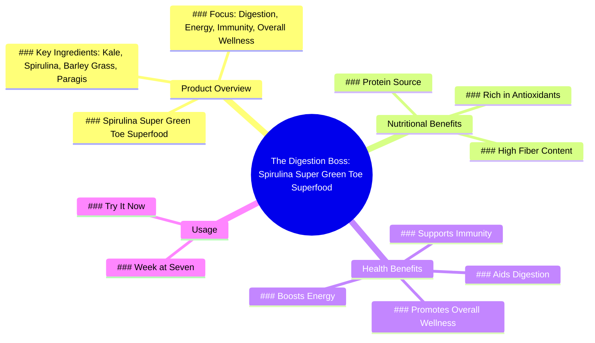

# Bloated After Eating Little? Try Spirulina Superfoods

> 🌐 **Read this in:** [English](../../en/2026-07/tiktok-transcript-laging-bloated-kahit-konti-lang-kinain-tyan-mo-rin-ba-ganito-0deb.md) · **中文**

> **Creator:** [@shopwithsonjie](https://www.tiktok.com/@shopwithsonjie) · **Views:** 235.9K · **Posted:** 2026-07-29 · **Niche:** other
>
> **TL;DR:** Opens with a relatable discomfort to hook viewers seeking relief.

[Watch original video →](https://www.tiktok.com/@shopwithsonjie/video/7619133069861211399?shop_region=PH&shop_id=7495310222761495027)

## Why This Went Viral

## 钩子（前3秒）
- **逐字开场白：**“我受不了这体重，又胀气了。我肚子胀。谁能帮帮我？”
- **钩子模式：**场景+痛点（与腹胀/胀气相关的普遍困扰）
- **为何能让人停下滑动：**对一种常见不适的即时、切身认同。“谁能帮帮我？”这个问题制造了一个需要解答的开放循环。

## 情绪节奏
- **节拍1（0–3秒）：** **沮丧/不适**——“我受不了这体重，又胀气了。我肚子胀。”观众感到被看见。
- **节拍2（3–5秒）：** **绝望/求助**——“谁能帮帮我？”制造紧张感和好奇心。
- **节拍3（5–7秒）：** **权威登场**——“消化之王来了”——引入解决方案角色。
- **节拍4（7–12秒）：** **科普/建立信任**——“我是螺旋藻。我富含抗氧化剂、纤维和蛋白质。”建立可信度。
- **节拍5（12–16秒）：** **清晰/共鸣**——列出具体超级食物（羽衣甘蓝、螺旋藻、大麦草、Paragis）强化“这是为像我这样的人准备的”。
- **节拍6（16秒–结束）：** **行动号召/高潮**——“Week at seven螺旋藻超级绿色超级食物，助力消化、能量、免疫力和全面健康。立即尝试！”——解脱+紧迫感。

**高潮时刻：**“Week at seven螺旋藻超级绿色”这句话——一个品牌承诺，将痛点与具体产品绑定，创造清晰的下一步行动。

## 关键词密度
| 词语/短语 | 次数（约） | 功能 |
|-------------|-----------------|----------|
| 腹胀 / 胀气 / 消化 | 4 | **情感拉动**——触发痛点认同 |
| 螺旋藻 | 3 | **算法触达**——品牌关键词+健康趋势 |
| 超级食物 / 超级绿色 | 3 | **算法触达**——热门健康品类 |
| 抗氧化剂 / 纤维 / 蛋白质 | 3 | **情感拉动**——建立信任的益处词 |
| 能量 / 免疫力 / 健康 | 3 | **情感拉动**——理想化结果 |
| 谁能帮帮我 | 1 | **情感拉动**——制造开放循环 |
| 立即尝试 | 1 | **算法触达**——促进互动/点击的CTA |

**算法驱动词：**“螺旋藻”、“超级食物”、“超级绿色”——高搜索量的健康词汇。  
**情感驱动词：**“腹胀”、“胀气”、“消化”、“能量”、“免疫力”——痛点+理想。

## 为何能广泛传播
1. **痛点优先的框架绕过抗拒心理**——视频以“我肚子胀”开场，而不是“快来买”。有腹胀困扰的观众会立刻自我代入，从而对解决方案持开放态度。*文案证据：“我受不了这体重，又胀气了。我肚子胀。”*
2. **产品拟人化创造角色**——“我是螺旋藻”将补充剂变成了一个亲切的帮手（“消化之王”）。这让推销感觉像故事，而不是广告。*文案证据：“我是螺旋藻。我富含抗氧化剂……”*
3. **具体成分清单建立可信度**——点名羽衣甘蓝、螺旋藻、大麦草和Paragis，传递出“这是真实配方，不是普通粉末”的信号。具体=信任。*文案证据：“超级食物：羽衣甘蓝、螺旋藻、大麦草和Paragis”*
4. **聚合式益处解决多个痛点**——“消化、能量、免疫力和全面健康”意味着视频能因不同原因吸引不同观众，扩大可分享的受众群体。*文案证据：“超级食物力量，助力消化、能量、免疫力和全面健康。”*
5. **紧迫的CTA闭环**——在构建痛点+解决方案+信任之后，“立即尝试！”给观众一个清晰、低门槛的下一步行动。*文案证据：“立即尝试！”*

## 你可以借鉴什么
1. **从具体痛点开始，而不是产品。**在介绍解决方案之前，先用3秒钟的场景展示一个 relatable 的挣扎（例如“我无法集中注意力”、“我背疼”、“我总是很累”）。痛点制造钩子；产品成为英雄。
2. **将产品拟人化为角色。**给你的补充剂、工具或服务一个声音和角色（例如“消化之王”、“专注教练”、“睡眠魔法师”）。这将枯燥的推销变成观众会记住并分享的迷你故事。
3. **在一句话中堆叠3个以上具体益处。**不要只说“对健康有益”。列出“消化、能量、免疫力和全面健康”——你点名的益处越多，越多不同的受众群体就会觉得这个视频“是为他们准备的”。

## Mind Map

## Full Transcript (Generated by [TokTranscript](https://toktranscript.com/?utm_source=github&utm_medium=breakdown&utm_campaign=tool_attribution))

> 📝 Transcripts on this page are auto-generated and show the first 60%. Want to transcribe any TikTok in 30 seconds and get the full version? [Try TokTranscript free →](https://toktranscript.com/?utm_source=github&utm_medium=breakdown&utm_campaign=transcript_cta)

The weight I can't Gas again. I'm bloated. Who can help me The digestion boss continues I am the spirulina. I am rich in Antioxidants, Fiber and Protein. We also put together Super Foods Kale, Spirulina, Barly grass and Paragis thus aids 

*[Read the full transcript on TokTranscript →](https://toktranscript.com/plaza/tiktok-transcript-laging-bloated-kahit-konti-lang-kinain-tyan-mo-rin-ba-ganito-0deb?utm_source=github&utm_medium=breakdown&utm_campaign=transcript_full)*

## Browse More

- All [other](../../by-niche/zh-CN/other.md) breakdowns
- All [Problem Agitation](../../by-pattern/zh-CN/hook-problem-agitation.md) examples

## Video Info

| | |
|---|---|
| Creator | [@shopwithsonjie](https://www.tiktok.com/@shopwithsonjie) |
| Original video | [https://www.tiktok.com/@shopwithsonjie/video/7619133069861211399?shop_region=PH&shop_id=7495310222761495027](https://www.tiktok.com/@shopwithsonjie/video/7619133069861211399?shop_region=PH&shop_id=7495310222761495027) |
| Original title | Laging bloated kahit konti lang kinain? 😣 Tyan mo rin ba ganito? #Tim... |
| Views | 235.9K (235900) |
| Posted | 2026-07-29 |
| Duration | 0s |
| Niche | `other` |
| Hook pattern | `Problem Agitation` |
| Original language | `en` (this page translated by AI) |
| Available languages | en, zh-CN |
| Generated | 2026-08-01 by [TokTranscript](https://toktranscript.com/) |

---

*This breakdown is for educational analysis under fair use. Original video © [@shopwithsonjie](https://www.tiktok.com/@shopwithsonjie). All transcripts are auto-generated and may contain errors.*

*Want to analyze your own TikToks like this? [免费 TikTok 文稿生成器 →](https://toktranscript.com/viral-breakdown?utm_source=github&utm_medium=breakdown&utm_campaign=footer_cta)*