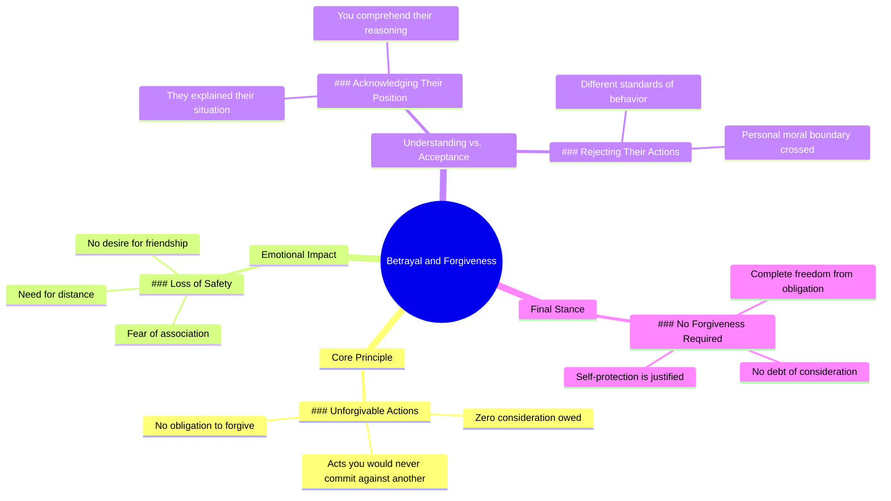

# Leo Skepi on Betrayal and Ending a Friendship

> 🌐 **Read this in:** [English](../../en/2026-07/tiktok-transcript-leo-skepi-fyp-betrayal-hurt-forgiveness-leoskepi-loyalty-fri-e611.md) · **中文**

> **Creator:** [@thecuratedclips](https://www.tiktok.com/@thecuratedclips) · **Views:** 9.9M · **Posted:** 2026-07-01 · **Niche:** other
>
> **TL;DR:** Sets up a powerful ethical imbalance that immediately engages the listener's sense of justice.

[Watch original video →](https://www.tiktok.com/t/ZTSkSVG6L/)

## Why This Went Viral

## 钩子（前3秒）
- **逐字开场白：** "你对我做了我永远不会对你做的事。"
- **钩子模式：** 对比 / 道德高地主张
- **为何能让人停下滑动：** 这句话瞬间建立起背叛的动态关系，制造出强烈的情感失衡。观众感受到不公的分量，想要了解具体细节——或者他们曾经历过同样的痛苦，瞬间感到被理解。

## 情感节奏
- **节拍1 – 背叛刺痛（0–3秒）：** "你对我做了我永远不会对你做的事。" ——尖锐、针对个人的指责。
- **节拍2 – 设定边界（3–8秒）：** "我不想要任何形式的友谊……我感觉不安全。" ——从受伤升级为保护性疏远。
- **节拍3 – 共情陷阱（8–12秒）：** "我理解你当时的处境。" ——制造暂时的缓解，降低防备。
- **节拍4 – 道德反转（12–16秒）：** "但如果我处在那个位置，我仍然不会那样对你。" ——高潮部分。将共情反转成更高的道德标准。
- **节拍5 – 解脱（16秒至结束）：** "你不需要对他们有一丝一毫的顾及……" ——最终释放，允许自己毫无愧疚地离开。

**高潮时刻：** "但如果我处在那个位置，我仍然不会那样对你。" ——这是会被反复播放、引用和截图的一句话。

## 关键词密度
1. **"你"** – 重复7次。驱动算法触达（直接称呼引发互动）。同时具有情感吸引力——制造指责性的亲密感。
2. **"我"** – 重复6次。将道德立场个人化，使其感觉像是从一个人经历中提炼出的普遍真理。
3. **"永远"** – 重复2次。绝对化的语言制造高对比度和记忆点。
4. **"不会"** – 重复3次。强化道德边界——"会"在算法中权重高（在关系类内容中搜索量大）。
5. **"原谅"** – 重复2次。高情感吸引力的关键词——引发任何与内疚或原谅压力作斗争的人的共鸣。
6. **"处境"** – 重复2次。在反转前建立共情的语境词。
7. **"安全"** – 出现1次但情感权重高——触发创伤/依恋算法信号。
8. **"欠"** – 出现1次但冲击力强——从情感语言转向交易性语言，感觉新颖。

**算法触达驱动词：** "你"、"我"、"不会"、"原谅"  
**情感吸引力驱动词：** "永远"、"安全"、"欠"、"处境"

## 为何能传播
1. **通用的背叛模板** – "你对我做了我永远不会对你做的事"这句话是一个模板，适用于90%的人际冲突（友谊、分手、家庭、工作）。观众会在脑海中用自己遭遇的背叛者替换"你"。
2. **给予许可的高潮** – "你不需要对他们有一丝一毫的顾及……"消除了内疚感。这是最容易被分享的一句话——人们会把它发给那些陷入有毒原谅循环的朋友。
3. **不带傲慢的道德高地** – 说话者首先肯定对方的立场（"我理解……"），然后揭示自己更高的标准。这让道德主张显得经过深思熟虑，而非说教。
4. **30秒内紧凑的情感弧线** – 视频在20秒内呈现了完整的旅程（受伤 → 理解 → 边界 → 解脱）。非常适合短视频的留存率。
5. **高评论诱饵结构** – 最后一句（"你不需要原谅他们"）故意制造争议。它吸引两个评论阵营："没错，终于有人说出来了" vs. "但原谅是为了你自己。"双方都会评论，提升触达率。

## 你可以借鉴的
1. **"共情后反转"模式** – 先肯定对方（"我理解你的处境"），然后用"但是"转向你自己的道德边界。这让你的立场显得经过深思熟虑，而非情绪化反应。
2. **绝对对比语言** – 在同一句话中使用"永远" vs. "会"。他们所做的和你永远不会做的事之间的差距，创造了一个令人难忘的道德鸿沟，观众想要分享。
3. **许可式结尾** – 以一句陈述句结尾，让观众获得毫无愧疚地行动的许可（"你不需要……"）。这会让你的视频成为他们与他人分享的工具，那些人也需要同样的许可。

## Mind Map

## Full Transcript (Generated by [TokTranscript](https://toktranscript.com/?utm_source=github&utm_medium=breakdown&utm_campaign=tool_attribution))

> 📝 Transcripts on this page are auto-generated and show the first 60%. Want to transcribe any TikTok in 30 seconds and get the full version? [Try TokTranscript free →](https://toktranscript.com/?utm_source=github&utm_medium=breakdown&utm_campaign=transcript_cta)

You did to me what I never would have done to you. I don't want any type of friendship. I don't feel safe having you know anything about me or having any association with me. I understand the position that you were in. You described it to me perfectly. But if I was in that position, I still would not have done that to you. And

*[Read the full transcript on TokTranscript →](https://toktranscript.com/plaza/tiktok-transcript-leo-skepi-fyp-betrayal-hurt-forgiveness-leoskepi-loyalty-fri-e611?utm_source=github&utm_medium=breakdown&utm_campaign=transcript_full)*

## Browse More

- All [other](../../by-niche/zh-CN/other.md) breakdowns
- All [Moral Contrast](../../by-pattern/zh-CN/hook-moral-contrast.md) examples

## Video Info

| | |
|---|---|
| Creator | [@thecuratedclips](https://www.tiktok.com/@thecuratedclips) |
| Original video | [https://www.tiktok.com/t/ZTSkSVG6L/](https://www.tiktok.com/t/ZTSkSVG6L/) |
| Original title | @Leo Skepi #fyp #betrayal #hurt #forgiveness #leoskepi #loyalty #frie... |
| Views | 9.9M (9900000) |
| Posted | 2026-07-01 |
| Duration | 0s |
| Niche | `other` |
| Hook pattern | `Moral Contrast` |
| Original language | `en` (this page translated by AI) |
| Available languages | en, zh-CN |
| Generated | 2026-07-01 by [TokTranscript](https://toktranscript.com/) |

---

*This breakdown is for educational analysis under fair use. Original video © [@thecuratedclips](https://www.tiktok.com/@thecuratedclips). All transcripts are auto-generated and may contain errors.*

*Want to analyze your own TikToks like this? [TokTranscript →](https://toktranscript.com/viral-breakdown?utm_source=github&utm_medium=breakdown&utm_campaign=footer_cta)*