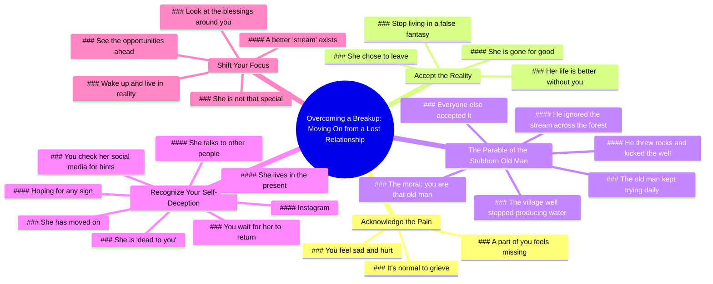

# Lightsunzayn’s Advice on Moving On After a Breakup

> 🌐 **Read this in:** [English](../../en/2026-07/tiktok-transcript-lightsunzayn-s-advice-on-how-to-move-on-properly-lights-7a98.md) · **中文**

> **Creator:** [@lightsunzayn](https://www.tiktok.com/@lightsunzayn) · **Views:** 3.5M · **Posted:** 2026-07-08 · **Niche:** entertainment
>
> **TL;DR:** Opens with a relatable personal problem and a direct question to engage the viewer immediately.

[Watch original video →](https://www.tiktok.com/t/ZTSCUpVrf/)

## Why This Went Viral

## 钩子（前3秒）
- **逐字开场白：**“就像，我和我女朋友刚分手，我忍不住一直想她。我该怎么办？”
- **钩子模式：**  relatable 问题 + 直接提问（共情 + 寻求解决方案）
- **为何能阻止滑动：** 瞬间映射目标受众（心碎男性）的精确情感状态。这个问题感觉私密、亲密且紧迫——像朋友在倾诉。陷入同样循环的观众会点击观看答案。

## 情感节奏
1. **共情 / 认同**（0–3秒）——“我知道你感到难过。我知道你感到受伤。”讲述者确认观众的痛苦。
2. **紧张 / 残酷真相**（6–12秒）——“当她决定分手的那一刻……没有你，她的生活会更好。”一个尖锐、令人不适的现实检验。
3. **悬念 / 故事铺垫**（15–25秒）——“有一个关于老人的故事……”这个寓言制造了好奇心：*这要往哪走？*
4. **挫败 / 共鸣**（25–40秒）——老人徒劳的日常仪式反映了观众自己的强迫行为（查看社交媒体、抱有希望）。
5. **高潮 / 转折**（40–50秒）——“穿过森林，有一条小溪……更加令人叹为观止。”回报：井是空的，但有更好的东西存在。
6. **共鸣 / 唤醒**（50秒至结束）——“你就是那个固执的老人……醒醒！”直接对抗 + 行动号召。情感释放。

## 关键词密度
| 关键词 / 短语 | 频率（约） | 目的 |
|---|---|---|
| “你” / “你的” | 20+ | 算法：高互动（直接称呼）。情感：创造亲密感和责任感。 |
| “幻想” / “虚假幻想” | 5 | 情感吸引力：命名观众陷入的认知扭曲。 |
| “井” / “空井” | 8 | 算法：故事锚点（易于搜索/剪辑）。情感：前女友的隐喻。 |
| “她” | 10 | 情感：执念的对象。算法：触发关系/分手关键词。 |
| “醒醒” | 2 | 情感：高潮短语。算法：高留存时刻（人们重看/分享这句台词）。 |
| “继续前进” / “已经前进” | 3 | 情感：期望的结果。算法：高搜索量关键词。 |
| “固执的老人” | 3 | 情感：自我认同。算法：令人难忘的角色，用于评论/引用。 |

## 为何能传播
1. **“残酷真相”格式**——视频不溺爱。它传递残酷的现实（“没有你，她的生活会更好”），感觉像朋友在摇醒你。这种模式高度可分享，因为观众会标记那些“需要听到这个”的朋友。
2. **寓言作为特洛伊木马**——老人和井的故事简单、形象且情感上令人难忘。观众记住这个隐喻，并在评论中或向朋友复述。它是超越视频传播的病毒式“心智模型”。
3. **直接称呼 + 第二人称重复**——持续的“你”（你感到、你查看、你活在）创造了一对一的指导动态。这增加了观看时间（感觉私密）和评论量（“这就是我”）。
4. **高潮行动号召**——“醒醒！”是一个有力、可重复、可分享的命令。它是混音、拼接和二重唱的完美片段。情感高峰也是最容易被引用的台词。
5. **小众 + 普遍**——目标：心碎男性（狭窄小众）。但隐喻（执着于空虚的东西而忽视更好的选择）适用于工作、友谊、习惯。这扩大了超越分手小众的可分享性。

## 你可以借鉴什么
1. **以观众的确切想法开头**——以观众所思所感的逐字引用开场（“我忍不住一直想她”）。这创造了即时认同。在任何小众领域，用直接引用引出痛点。
2. **使用简短、形象的寓言**——一个30秒的故事，带有单一清晰的隐喻（井 = 前女友，小溪 = 更好的未来），比抽象建议更令人难忘。将寓言控制在45秒以内。明确寓意：“你就是那个[角色]。”
3. **以尖锐、可重复的命令结尾**——“醒醒！”是两个音节、有攻击性且可引用的。你视频的最后3秒应该是一句观众可以截图、评论或拼接的台词。避免像“我希望这有帮助”这样的软性结尾。要一击即中。

## Mind Map

## Full Transcript (Generated by [TokTranscript](https://toktranscript.com/?utm_source=github&utm_medium=breakdown&utm_campaign=tool_attribution))

> 📝 Transcripts on this page are auto-generated and show the first 60%. Want to transcribe any TikTok in 30 seconds and get the full version? [Try TokTranscript free →](https://toktranscript.com/?utm_source=github&utm_medium=breakdown&utm_campaign=transcript_cta)

Like, me and my girl just broke up, and I can't stop thinking about her. What do I do? Listen. And listen to this carefully, okay? I know you feel sad. I know you feel hurt. You feel like a part of you is missing. But the moment she decided to break up with you is the moment she decided that her life would be better without you. And you need to stop living in this false fantasy that you create in your own mind. And you need to realize that she's gone. Listen, there's the story about this old man who lived in this village, okay? And everyone in that village would go to the single well that was in the center. This well produced the most taking, refreshing water you could ever taste. And every morning, 6 a m. Sharp, they would go put their bucket in, and water would come out. Until one day, the well stop producing water. Everyone else in the village accepted that, except this one stubborn old man. Every morning, he would come try to get water from that well, but nothing would happen. He would put the bucket in, he would take it out, nothing would happen. You throw rocks down there, he would kick the well, but nothing would happen. Yet he continued to show up every single day. Little did he realize, because he was so 

*[Read the full transcript on TokTranscript →](https://toktranscript.com/plaza/tiktok-transcript-lightsunzayn-s-advice-on-how-to-move-on-properly-lights-7a98?utm_source=github&utm_medium=breakdown&utm_campaign=transcript_full)*

## Browse More

- All [entertainment](../../by-niche/zh-CN/entertainment.md) breakdowns
- All [Direct question hook](../../by-pattern/zh-CN/hook-direct-question-hook.md) examples

## Video Info

| | |
|---|---|
| Creator | [@lightsunzayn](https://www.tiktok.com/@lightsunzayn) |
| Original video | [https://www.tiktok.com/t/ZTSCUpVrf/](https://www.tiktok.com/t/ZTSCUpVrf/) |
| Original title | Lightsunzayn’s Advice On How To Move On Properly ❤️‍🩹 - - - - #lights... |
| Views | 3.5M (3500000) |
| Posted | 2026-07-08 |
| Duration | 0s |
| Niche | `entertainment` |
| Hook pattern | `Direct question hook` |
| Original language | `en` (this page translated by AI) |
| Available languages | en, zh-CN |
| Generated | 2026-07-09 by [TokTranscript](https://toktranscript.com/) |

---

*This breakdown is for educational analysis under fair use. Original video © [@lightsunzayn](https://www.tiktok.com/@lightsunzayn). All transcripts are auto-generated and may contain errors.*

*Want to analyze your own TikToks like this? [TikTok 转录工具 →](https://toktranscript.com/viral-breakdown?utm_source=github&utm_medium=breakdown&utm_campaign=footer_cta)*