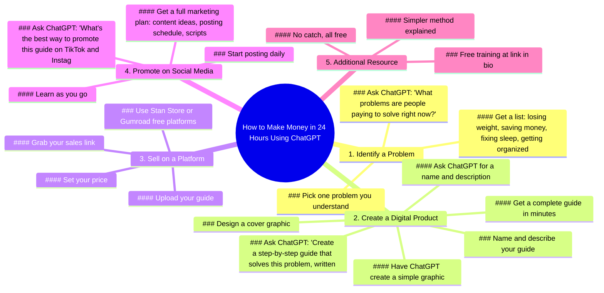

# Make Money in 24 Hours Using ChatGPT

> 🌐 **Read this in:** [English](../../en/2026-07/tiktok-transcript-makemoneyonline-digitalproducts-chatgpt-digitalmarketingforb-b958.md) · **中文**

> **Creator:** [@officialloucameron](https://www.tiktok.com/@officialloucameron) · **Views:** 2.5M · **Posted:** 2026-07-19 · **Niche:** finance
>
> **TL;DR:** Promises quick, easy money with a specific tool, grabbing attention instantly.

[Watch original video →](https://www.tiktok.com/@officialloucameron/video/7660325898129837342)

## Why This Went Viral

## 钩子（前3秒）
- **逐字开场白：** "我要教你如何在接下来的24小时内，仅凭ChatGPT就能赚钱。"
- **钩子模式：** 大胆承诺 + 时间限制 + 工具名称（ChatGPT）
- **为何能让人停下滑动：** 承诺用时髦的AI工具轻松、零成本赚钱，瞬间激发贪婪和好奇心。"24小时"制造紧迫感，"无需库存、无需发货、无需设计技能"在观众想到常见借口前就将其全部消除。

## 情感节奏
- **节拍1 – 贪婪与好奇（0:00–0:15）：** "24小时赚钱" + "零经验即可" → 观众被吸引
- **节拍2 – 逐步赋能（0:15–1:00）：** "打开ChatGPT，输入这个" → 感觉可行，随着产品成型，紧张感逐渐增强
- **节拍3 – 小高潮（1:00–1:15）：** "你有了产品、名称、描述和封面" → 完成的满足感
- **节拍4 – 行动推动（1:15–1:45）：** "上传、定价、获取链接，搞定" → 轻松感，兴奋于"开始做生意"
- **节拍5 – 最终推动与转折（1:45–2:15）：** "这就是零经验的人如何推出真实产品" → 社会证明 + 错失恐惧症
- **节拍6 – 软推销（2:15–结尾）：** "个人简介中的免费培训，无套路" → 建立信任，低风险收尾
- **高潮时刻：** "搞定！你正式开业了" —— 成就感的情绪巅峰

## 关键词密度
| 关键词/短语 | 频率 | 功能 |
|---|---|---|
| "ChatGPT" | 6 | 算法覆盖（热门话题）+ 情感吸引（AI魔力） |
| "逐步" / "指南" | 4 | 情感吸引（清晰、简单） |
| "零经验" / "仅凭" | 3 | 情感吸引（消除恐惧，降低门槛） |
| "免费" | 3 | 算法 + 情感（价值感知） |
| "24小时" / "一天" | 2 | 情感吸引（紧迫感、即时满足） |
| "赚钱" / "挣钱" | 2 | 算法（高搜索意图） |
| "个人简介中的链接" | 1 | 算法（行动号召、互动） |

## 为何能传播
1. **"好得难以置信"的公式引发分享欲。** "仅凭ChatGPT"这句话让观众觉得自己发现了秘密。人们分享秘密是为了显得聪明或乐于助人。*具体台词：* "无需库存、无需发货、无需设计技能。"

2. **所有常见借口在前15秒内被预先消除。** 视频在观众想到问题前就消除了障碍。这营造出"我为什么不试试？"的感觉，推动收藏和分享。*具体台词：* "你自己一个字都没写。"

3. **"免费培训"的行动号召创造低风险循环。** 通过在结尾提供免费资源，视频感觉像礼物而非推销。这增加信任，推动点击个人简介，向算法表明内容有价值。*具体台词：* "完全免费。它把一切都讲清楚了。没有套路。"

4. **逐步格式是"稍后保存"的磁铁。** 观众保存视频以便后续跟随步骤。在短视频平台上，保存是高权重的互动信号。*具体台词：* "首先，打开ChatGPT。然后输入..."

5. **社会证明嵌入中间而非结尾。** "这就是零经验的人如何推出真实数字产品"使结果正常化并制造错失恐惧症。*具体台词：* "这就是零经验的人如何在一天内推出真实数字产品。"

## 你可以借鉴什么
1. **"借口三明治"钩子。** 以大胆承诺开场，立即跟上观众最大的三个借口——并声明它们不适用。示例："我将教你如何用[免费工具]实现[大结果]。无需[借口1]、无需[借口2]、无需[借口3]。"

2. **"工具即角色"结构。** 让工具（ChatGPT）成为主角，而不是你。这使过程感觉机械且可复制。观众会想"我也能做到。"在你的下一个视频中，将工具塑造成英雄："让我展示一下[工具]能在5分钟内为你做什么。"

3. **"免费培训"作为信任锚点。** 不要硬推销，而是提供延伸价值的免费资源。这把一个一次性视频变成漏斗。使用确切短语："没有套路。一切都在你手中。去行动吧。"——这让你定位为教练，而非卖家。

## Mind Map

## Full Transcript (Generated by [TokTranscript 转录工具](https://toktranscript.com/?utm_source=github&utm_medium=breakdown&utm_campaign=tool_attribution))

> 📝 Transcripts on this page are auto-generated and show the first 60%. Want to transcribe any TikTok in 30 seconds and get the full version? [Try TokTranscript free →](https://toktranscript.com/?utm_source=github&utm_medium=breakdown&utm_campaign=transcript_cta)

I'm gonna show you how to make money in the next 24 hours using nothing but chat G P T. No inventory, no shipping, and no design skills. Now let me walk you through exactly how to do it. First, open up chat G P T. And type in what problems are people paying to solve right now? It's gonna give you a list. Losing weight, saving money, fixing sleep, getting organised. A ton more. Pick one problem. One preferably, that you understand a little bit. Next, go back to chat G P T. And give it this prompt. Create a step by step guide that solves this problem, written in simple language. In a few minutes, you'll have a complete digital product. A real guy people would pay for. You didn't write a single word of it yourself. Now ask Chat G P T. For a name for your guide and a description that makes people want it. Then have it create a simple graphic so your product looks professional. Right now you have a product, you have a name, a description and a cover. And you built all of it inside one free tool. Next, go to Stand Store or gumroad. Now, what these are are free platforms that let you sell digital products from a single link. Upload your guide, set

*[Read the full transcript on TokTranscript →](https://toktranscript.com/plaza/tiktok-transcript-makemoneyonline-digitalproducts-chatgpt-digitalmarketingforb-b958?utm_source=github&utm_medium=breakdown&utm_campaign=transcript_full)*

## Browse More

- All [finance](../../by-niche/zh-CN/finance.md) breakdowns
- All [Immediate Value Promise](../../by-pattern/zh-CN/hook-immediate-value-promise.md) examples

## Video Info

| | |
|---|---|
| Creator | [@officialloucameron](https://www.tiktok.com/@officialloucameron) |
| Original video | [https://www.tiktok.com/@officialloucameron/video/7660325898129837342](https://www.tiktok.com/@officialloucameron/video/7660325898129837342) |
| Original title | #makemoneyonline #digitalproducts #chatgpt #digitalmarketingforbeginn... |
| Views | 2.5M (2500000) |
| Posted | 2026-07-19 |
| Duration | 0s |
| Niche | `finance` |
| Hook pattern | `Immediate Value Promise` |
| Original language | `en` (this page translated by AI) |
| Available languages | en, zh-CN |
| Generated | 2026-07-20 by [TokTranscript](https://toktranscript.com/) |

---

*This breakdown is for educational analysis under fair use. Original video © [@officialloucameron](https://www.tiktok.com/@officialloucameron). All transcripts are auto-generated and may contain errors.*

*Want to analyze your own TikToks like this? [TokTranscript 转录工具 →](https://toktranscript.com/viral-breakdown?utm_source=github&utm_medium=breakdown&utm_campaign=footer_cta)*