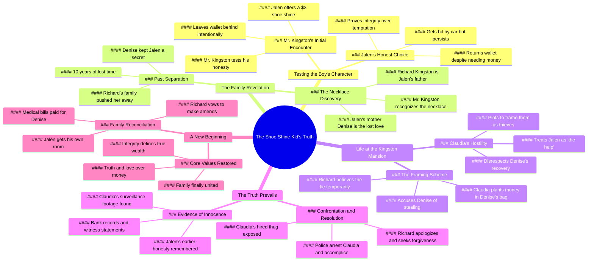

# Millionaire Tests Poor Boy and Finds the Truth

> 🌐 **Read this in:** [English](../../en/2026-07/tiktok-transcript-millionaire-tested-poor-boy-and-find-the-truth-full-story-ai-8db9.md) · **中文**

> **Creator:** [@aistoriess7](https://www.tiktok.com/@aistoriess7) · **Views:** 1.1M · **Posted:** 2026-07-20 · **Niche:** entertainment
>
> **TL;DR:** The hook sets up a class-based prejudice that immediately engages viewers by challenging stereotypes.

[Watch original video →](https://www.tiktok.com/t/ZP8t2Teme/)

## Why This Went Viral

## 钩子（前3秒）
- **逐字开场白：** "今天要擦鞋吗？放着吧。金斯顿家的小子。八成又是来讨钱的。"
- **钩子模式：** 场景 + 对比（穷孩子干活 vs. 富人轻视他）+ 角色引入
- **为何能留住观众：** "放着吧"（轻视）与"我靠自己挣"（尊严）之间的即时张力，制造了一个道德岔路口。观众会锁定屏幕，想看看谁是对的。

## 情感节奏
- **第一拍 – 好奇：** "我靠自己挣"——这孩子是谁？他为什么在这儿？
- **第二拍 – 温暖 → 悬念：** "我妈说，再小的活儿也值得用心做" → "你爸刚把我妈搞到手了"——突如其来的脆弱。
- **第三拍 – 情感高峰：** 钱包落下 → 诚信考验。"我倒要看看，没人要你的时候，你还能多诚实。"
- **第四拍 – 道德抉择：** "不，孩子。你需要的不是钱，而是一颗干净的心。"——妈妈的教诲落地。
- **第五拍 – 转折：** 车祸 → 仍归还钱包 → 项链揭示。
- **第六拍 – 高潮：** "因为他就是你儿子。"——身份揭示，颠覆一切。
- **第七拍 – 释然 → 新紧张：** "他们住这儿。他住我的一间房。"——虚假的安全感。
- **第八拍 – 背叛：** 克劳迪娅陷害丹妮丝。"累的人最容易成为嫌疑人。"
- **第九拍 – 救赎之路：** 父亲意识到错误 → "我会用余生来弥补。"
- **第十拍 – 结局：** "让我们富有的不是钱，而是真相。"

## 关键词密度
| 词语/短语 | 出现频率 | 驱动因素 |
|-----------|----------|----------|
| "妈妈" | 约15次以上 | 情感牵引——母爱 = 核心共鸣 |
| "真相" | 约10次 | 算法触达——道德清晰 = 可分享 |
| "儿子"/"爸爸" | 约12次 | 情感牵引——家庭渴望 = 高留存 |
| "钱包"/"钱" | 约10次 | 情节驱动——制造利害关系和信任考验 |
| "诚实"/"诚信" | 约6次 | 算法触达——美德信号 = 病毒式传播 |
| "干净"（心、工作） | 约5次 | 情感牵引——纯洁隐喻 = 令人难忘 |
| "家"/"房子" | 约6次 | 情感牵引——归属感 = 深层共鸣 |
| "值得" | 约4次 | 算法触达——正义 = 可分享 |
| "冷"/"暖" | 约4次 | 情感牵引——温度 = 情绪速写 |
| "原谅" | 约3次 | 情感牵引——救赎 = 高互动 |

**算法驱动因素：** "真相"、"诚实"、"值得"——这些词触发分享，因为它们传递道德清晰。
**情感牵引：** "妈妈"、"儿子"、"家"——这些词触发眼泪和留存。

## 为何能传播
1. **道德清晰 + 身份揭示** – "因为他就是你儿子"是最具分享性的时刻。它将整个故事从"穷孩子"翻转成"秘密继承人"。观众立刻想@某人：*"这戳中我了。"*

2. **角色考验结构** – 钱包考验（诚信）、医院考验（牺牲）、房子考验（韧性）为观众提供了3个明确的时刻来支持杰伦。每个考验都是一个微型病毒钩子。*"你挣到的远不止这些"*成为人们截图的金句。

3. **有回报的情感过山车** – 故事循环经历希望 → 背叛 → 救赎。观众留下来，因为他们*需要*看到坏人受到惩罚。*"警察马上到。想都别想跑。"*是他们等待的宣泄时刻。

4. **普世的渴望** – "我只是想要我的爸爸"击中了核心人性需求。这不是关于钱，而是关于归属感。这使得视频跨越不同人群（单亲家庭、领养、疏远家庭）都能被分享。

5. **克劳迪娅作为完美反派** – 她不仅刻薄，而且*策略性地残忍*（"累的人最容易成为嫌疑人"）。观众主动讨厌她，这推动了评论和分享。*"真冷血"*成为一个梗。

## 你可以借鉴什么
1. **"诚信考验"开场** – 以一个小道德困境开始你的视频（落下的钱包、多找的零钱、偷听到的秘密）。它迫使观众问*"我会怎么做？"*——即时互动。

2. **三幕情感结构** – 使用模式：**设定**（他们是谁）→ **考验**（他们面对什么）→ **揭示**（他们真正是谁）。每个病毒式故事都遵循这个。杰伦的弧线：擦鞋童 → 被考验 → 秘密儿子。

3. **埋下一条"项链"** – 使用一个承载情感重量的实体物品（项链、信、照片、玩具）。它成为观众在故事中追踪的视觉锚点。当它在高潮时再次出现，比任何对话都更有冲击力。

## Mind Map

## Full Transcript (Generated by [免费 TikTok 文稿生成器](https://toktranscript.com/?utm_source=github&utm_medium=breakdown&utm_campaign=tool_attribution))

> 📝 Transcripts on this page are auto-generated and show the first 60%. Want to transcribe any TikTok in 30 seconds and get the full version? [Try TokTranscript free →](https://toktranscript.com/?utm_source=github&utm_medium=breakdown&utm_campaign=transcript_cta)

Need a shoe shine today? Leave it. Mr Kingston kid. Probably just looking for handouts. Nah, sir. I work for mine. How much? $3, sir. They'll shine like brand new. You do real clean work, young man. My mama says even small jobs deserve big effort. Sounds like somebody taught you that speech. Nah, that's just my mama talking. What you doing out here in this weather? My mama's in the hospital and your daddy just got my mama. Everybody got a sad story these days, sir. This too much money. Take it for your mama. I only earned $3. You earned more than that. Let's see how honest you stay when nobody wants you. You left your wallet behind, sir. I know. So you testing him. I wanna know who he really is. He's a shoe shine kid, that's all. Mr Reid, man, they already gone. This ain't mine. Mama gonna know what to do. Jalen, what's that? That rich man left it behind. You look inside. No, ma'am. Good. Then we'll look together. This could pay for your medicine. Yeah, just one time. No, baby. You need a clean heart more than money. Tomorrow you take it back. What if he think I tried to keep it? Then you tell him the truth. Storm coming tomorrow. Wait till the rain slows down. Then it'll be too late. I gotta bring it back. Oh, man, the wallet. It's still dry. I gotta keep moving. Mr Reed. I'm sorry, son. What happened? Car clipped me on the way here and you still came. I just wanted to return your money. Take the money. No, sir. It belongs to you. You earned it. I only brought back what was yours. Hold up that necklace. Where'd you get it? My mama gave it to me. What's your name, son? Jalen Brooks. Brooks. Where your mama get that necklace from? She said it belonged to somebody she lost a long time ago. Marcus, get the car. We headed to the hospital right now, right away. Boss, did I do something wrong, sir? Nah, son. Then why you keep looking at me like that? Because I gave that necklace to a woman I loved years ago, Denise Brooks. Richard. Denise, Mama, you know him. Stay close to me, baby. Why my necklace around his neck? Because he's your son. My father. I was gonna tell you someday, someday. 10 years done passed. Your family pushed me away before I could tell you. I thought you left me. I left so your name wouldn't hurt my child. Jalen, I never knew you really. My daddy. Yeah. Then why was it always just me and Mama? Because I stayed blind too long. From today on, that's over. You, my son. Her treatment, bills overdue. Pay all of it. Richard, I ain't asked for your money. Nah, that's the problem. You never asked for nothing and I'm ashamed of that. Mama finally gonna get better. Watch your Step Miss Brooks, you and my son coming home with me. A home can be dangerous when heart's cold. Then I'll make sure you'll stay warm. Richard, who are these people? This Denise Brooks and this my son, Jalen Brooks. Your son? Well, ain't that sweet? They stay in here. He get in one of my rooms. Felix, be respectful. He smell like rain and shoe polish. I can sleep anywhere. Good. That'll come in handy in this house. Everybody gotta earn their place. I'm still recovering. Then recover while cleaning. Hey, football boy, bring me some juice. My name Jalen. Not in this house. To us, you just the help. Please don't treat my son like that. Richard's money make him useful, not important. What if Richard find out? He gonna find exactly what I want him to find. And Denise, she gonna look like a thief. Then they gone for good. Exactly. Look at her. She's so tired, mom. That's cold. Nah, tired people make the best suspects. Money missing from my safe. I ain't wanna say nothing, but I saw Denise near your o

*[Read the full transcript on TokTranscript →](https://toktranscript.com/plaza/tiktok-transcript-millionaire-tested-poor-boy-and-find-the-truth-full-story-ai-8db9?utm_source=github&utm_medium=breakdown&utm_campaign=transcript_full)*

## Browse More

- All [entertainment](../../by-niche/zh-CN/entertainment.md) breakdowns
- All [Assumption vs. Reality](../../by-pattern/zh-CN/hook-assumption-vs-reality.md) examples

## Video Info

| | |
|---|---|
| Creator | [@aistoriess7](https://www.tiktok.com/@aistoriess7) |
| Original video | [https://www.tiktok.com/t/ZP8t2Teme/](https://www.tiktok.com/t/ZP8t2Teme/) |
| Original title | Millionaire tested poor boy and find the truth full story #aifruit #a... |
| Views | 1.1M (1100000) |
| Posted | 2026-07-20 |
| Duration | 0s |
| Niche | `entertainment` |
| Hook pattern | `Assumption vs. Reality` |
| Original language | `en` (this page translated by AI) |
| Available languages | en, zh-CN |
| Generated | 2026-07-21 by [TokTranscript](https://toktranscript.com/) |

---

*This breakdown is for educational analysis under fair use. Original video © [@aistoriess7](https://www.tiktok.com/@aistoriess7). All transcripts are auto-generated and may contain errors.*

*Want to analyze your own TikToks like this? [免费 TikTok 文稿生成器 →](https://toktranscript.com/viral-breakdown?utm_source=github&utm_medium=breakdown&utm_campaign=footer_cta)*