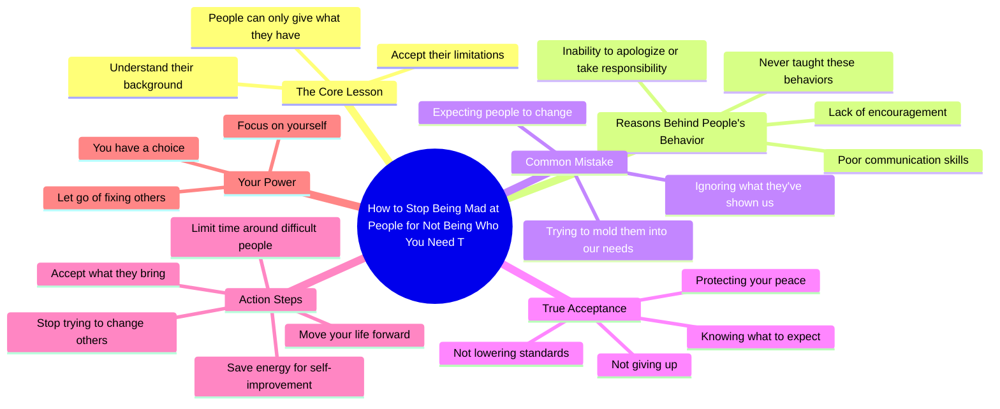

# Stop Being Mad at People for Not Meeting Your Needs

> 🌐 **Read this in:** [English](../../en/2026-07/tiktok-transcript-mindset-success-selfimprovement-relationships-boundaries-a180.md) · **中文**

> **Creator:** [@drtroylee](https://www.tiktok.com/@drtroylee) · **Views:** 994.9K · **Posted:** 2026-07-19 · **Niche:** other
>
> **TL;DR:** Directly addresses a common emotional pain point and offers a solution, immediately engaging viewers seeking relief.

[Watch original video →](https://www.tiktok.com/@drtroylee/video/7662812710014389534?is_from_webapp=1&sender_device=pc&web_id=7664062104052139534)

## Why This Went Viral

## 钩子（前3秒）
- **逐字开场白：**"学会如何不再因为别人无法成为你需要的样子而生气。"
- **钩子模式：** **大胆断言**（为普遍困扰提供解决方案）+ **对比**（生气 vs. 不生气）。
- **为何能让人停止滑动：** 它点出了一种痛苦而难以言说的体验（因他人未能满足期望而产生的怨恨），并承诺能从中解脱。"学会"一词暗示这是可操作的建议，而非单纯的情绪宣泄。

## 情感节奏
- **节拍1 — 认同（0–5秒）：** "人生中最艰难的功课之一"——立刻让观众感到自己的挣扎被理解。
- **节拍2 — 共情（5–15秒）：** "有些人不知道如何鼓励，因为他们从未被鼓励过"——建立理解，而非指责。
- **节拍3 — 张力（15–20秒）：** "我们犯的错误，是期待别人变成我们需要的样子"——点出观众自身的模式，制造片刻不适。
- **节拍4 — 释然（20–30秒）：** "接受不是放弃……而是守护你的平静"——将接受重新定义为力量，而非软弱。
- **节拍5 — 赋能（30–40秒）：** "当你停止试图改变所有人……你的生活才开始向前迈进"——高潮：放手的回报。
- **节拍6 — 收尾（40–45秒）：** "改变不了这些人……你有选择。爱你。"——温柔落地，传递个人情感。

## 关键词密度
| 关键词/短语 | 出现频率（约） | 驱动因素 |
|----------------|-------------------|--------|
| 人们 / 他们 | 10+ | **算法覆盖**（宽泛、可搜索的词汇） |
| 需要 / 被需要 | 4 | **情感牵引**（渴望、缺失） |
| 接受 | 2 | **情感牵引**（核心主题） |
| 改变 / 试图改变 | 3 | **情感牵引**（挫败感、努力） |
| 平静 | 2 | **情感牵引**（向往） |
| 选择 | 1（高潮处） | **情感牵引**（赋能） |
| 生活 / 功课 | 3 | **算法覆盖**（自我成长类目） |

- **算法覆盖：** "人们"、"生活"、"功课"——高流量关键词，有助于视频在自我成长和关系建议类内容中浮现。
- **情感牵引：** "需要"、"接受"、"平静"、"选择"——触发反思和分享欲，因为它们点出了人们渴望的状态。

## 为何能传播
1. **点出普遍痛点，却不带羞辱感。** "我们犯的错误"将所有人包含在内——观众感到被看见，而非被评判。这降低了防御心理，提高了"分享-保存"比例。
2. **将残酷真相重新包装为礼物。** "接受不是放弃……而是守护你的平静"——这一转折将叙事从"你留下是因为软弱"扭转为"你选择平静是因为强大"。这种重新定义极具分享性。
3. **以直接、私人的方式收尾。** "爱你"——打破第四面墙，营造亲密感。观众感到说话者是在*对他们*说话，而非泛泛而谈。这能激发评论互动（"正需要这个"）。
4. **"有些人不知道如何……因为……"的节奏性重复**——营造出催眠般、令人难忘的韵律，使信息更易被记住，也更容易被引用到标题或转发中。
5. **高潮部分给出清晰、可操作的建议。** "你只能限制和他们相处的时间，或者选择接受"——提供两个具体选择，毫无模糊之处。观众可以立即应用，并@一位朋友。

## 你可以借鉴的点
1. **以"问题→解决方案"的句式开场。** 不要用问题或模糊的场景开头。直接告诉观众他们将获得什么："学会如何不再因为别人……而生气"——在诊断之前先承诺解药。
2. **使用"有些人……因为……"的模式来建立共情，而非开脱。** 这种结构（行为→根源）让你听起来睿智，而非说教。这是一个模板："有些人不知道如何[X]，因为他们从未[Y]。"
3. **以一句"许可"加上私人化的收尾结束。** "你有选择。我只是说说。爱你。"——这种组合给观众一个清晰、低门槛的行动（选择），并让他们感到被关怀。用它来提升收藏和评论量。

## Mind Map

## Full Transcript (Generated by [TokTranscript](https://toktranscript.com/?utm_source=github&utm_medium=breakdown&utm_campaign=tool_attribution))

> 📝 Transcripts on this page are auto-generated and show the first 60%. Want to transcribe any TikTok in 30 seconds and get the full version? [Try TokTranscript free →](https://toktranscript.com/?utm_source=github&utm_medium=breakdown&utm_campaign=transcript_cta)

Learn how not to be mad at people for not being who you need them to be. One of the hardest lessons in life is realising that people can only give you what they have and who they are. Some people don't know how to encourage because they've never been encouraged. Some people don't know how to communicate, apologise or accept responsibility for their actions coz they never been taught. That doesn't make it okay, but it does make it understandable. The mistake that we make is expecting people to become who we need them to be rather than what they've shown us that they are. Acceptance isn't giving up and it's not lowering y

*[Read the full transcript on TokTranscript →](https://toktranscript.com/plaza/tiktok-transcript-mindset-success-selfimprovement-relationships-boundaries-a180?utm_source=github&utm_medium=breakdown&utm_campaign=transcript_full)*

## Browse More

- All [other](../../by-niche/zh-CN/other.md) breakdowns
- All [Problem-solution promise](../../by-pattern/zh-CN/hook-problem-solution-promise.md) examples

## Video Info

| | |
|---|---|
| Creator | [@drtroylee](https://www.tiktok.com/@drtroylee) |
| Original video | [https://www.tiktok.com/@drtroylee/video/7662812710014389534?is_from_webapp=1&sender_device=pc&web_id=7664062104052139534](https://www.tiktok.com/@drtroylee/video/7662812710014389534?is_from_webapp=1&sender_device=pc&web_id=7664062104052139534) |
| Original title | #mindset #success #selfimprovement #relationships #boundaries  |
| Views | 994.9K (994900) |
| Posted | 2026-07-19 |
| Duration | 0s |
| Niche | `other` |
| Hook pattern | `Problem-solution promise` |
| Original language | `en` (this page translated by AI) |
| Available languages | en, zh-CN |
| Generated | 2026-07-22 by [TokTranscript](https://toktranscript.com/) |

---

*This breakdown is for educational analysis under fair use. Original video © [@drtroylee](https://www.tiktok.com/@drtroylee). All transcripts are auto-generated and may contain errors.*

*Want to analyze your own TikToks like this? [免费 TikTok 文稿生成器 →](https://toktranscript.com/viral-breakdown?utm_source=github&utm_medium=breakdown&utm_campaign=footer_cta)*