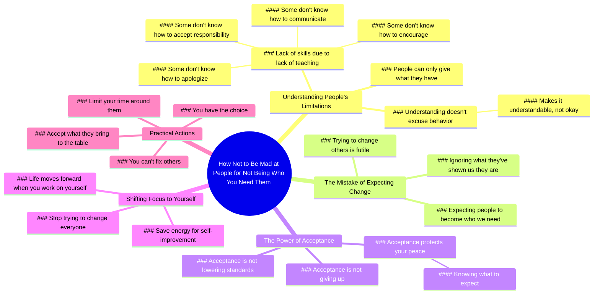

# Stop Expecting People to Be What You Need

> 🌐 **Read this in:** [English](../../en/2026-07/tiktok-transcript-mindset-success-selfimprovement-relationships-boundaries-eee4.md) · **中文**

> **Creator:** [@drtroylee](https://www.tiktok.com/@drtroylee) · **Views:** 1.0M · **Posted:** 2026-07-19 · **Niche:** other
>
> **TL;DR:** Directly addresses a common emotional pain point and promises a solution, instantly engaging viewers.

[Watch original video →](https://www.tiktok.com/@drtroylee/video/7662812710014389534?is_from_webapp=1&sender_device=pc&web_id=7664244124723971598)

## Why This Went Viral

## 钩子（前3秒）
- **逐字开场白：** "学会如何不为他人无法成为你需要的样子而生气。"
- **钩子模式：** **大胆主张 + 解决方案承诺**（直接点出人际关系中令人痛苦的挫折感）。
- **为何能阻止滑动：** 它点出了一个普遍且充满情感的问题（对未满足期望的愤怒），并提供了一条解脱之路——观众感到被理解，并立刻想要答案。

## 情感节奏
1. **好奇 + 认同**（0–5秒）："学会如何不为……而生气"——观众感到被理解。
2. **共情 + 解释**（5–15秒）："有些人不知道如何鼓励，因为他们从未被鼓励过。"——建立同情心，减少责备。
3. **紧张感**（15–20秒）："我们犯的错误是期望别人成为我们需要的样子，而不是他们向我们展示的样子。"——尖锐的洞察创造了一个"顿悟"时刻。
4. **解脱 + 许可**（20–30秒）："接受不是放弃……它只是保护你的平静。"——将接受重新定义为力量，而非软弱。
5. **激励 + 行动号召**（30–35秒）："当你停止试图改变每个人……你的生活开始向前迈进。"——高潮：教训的回报。
6. **温暖收尾**（35–40秒）："无法改变这些人……你有选择。爱你。"——让观众感到被赋能和关怀。

## 关键词密度
- **"人"**（7次）——算法覆盖（高频话题，人际关系内容）。
- **"需要 / 被需要"**（5次）——情感吸引力（对认同的普遍渴望）。
- **"接受 / 接纳"**（4次）——核心概念，驱动情感共鸣。
- **"改变"**（3次）——算法（自我提升领域）+ 情感（释放挫折感）。
- **"平静"**（2次）——情感锚点（期望的结果）。
- **"选择"**（2次）——赋能触发（高分享性）。
- **"可以理解"**（1次）——关键共情词，降低防御性。

**算法驱动因素：** "人"、"改变"、"生活"——广泛、可搜索、高流量话题。  
**情感吸引力：** "需要"、"接受"、"平静"、"选择"——创造共鸣和控制感。

## 为何能传播
1. **立即点出普遍痛点**——"无法成为你需要的样子"适用于伴侣、父母、朋友、老板。观众在几秒内自我认同。
2. **将负面情绪重新定义为智慧**——"生气"→"可以理解"→"保护你的平静"。这将对怨恨的反思转化为自尊，使其作为"人生建议"极具分享性。
3. **允许停止试图修复他人**——"无法改变这些人。你只能限制你的时间。"这验证了观众的疲惫，并提供了一个社会可接受的退出策略。
4. **温暖的情感收尾**——结尾的"爱你"创造了准社会关系，增加了收藏和分享（观众感到被个人化地对话）。
5. **有节奏、可引用的结构**——像"接受不是放弃……它是保护你的平静"这样的句子易于剪辑、加字幕，并作为独立引文转发。

## 你可以借鉴的
1. **以"解决痛苦模式的方案"开场**——不是问题，而是直接指令（"学会如何不为……生气"）。这标志着即时价值，并吸引受挫的观众。
2. **使用"有些人"作为富有同情心的缓冲**——不是责备，而是说"有些人不知道如何X，因为他们从未Y过。"这使观众在听到真相时不会感到被攻击。
3. **以温暖、个人化的签名结尾**——"爱你"或"我只是说说"创造亲密感，并增加收藏、评论和分享的可能性（观众感到收到了一条私人信息）。

## Mind Map

## Full Transcript (Generated by [TokTranscript 转录工具](https://toktranscript.com/?utm_source=github&utm_medium=breakdown&utm_campaign=tool_attribution))

> 📝 Transcripts on this page are auto-generated and show the first 60%. Want to transcribe any TikTok in 30 seconds and get the full version? [Try TokTranscript free →](https://toktranscript.com/?utm_source=github&utm_medium=breakdown&utm_campaign=transcript_cta)

Learn how not to be mad at people for not being who you need them to be. One of the hardest lessons in life is realising that people can only give you what they have and who they are. Some people don't know how to encourage because they've never been encouraged. Some people don't know how to communicate, apologise or accept responsibility for their actions coz they never been taught. That doesn't make it okay, but it does make it understandable. The mistake that we make is expecting people to become who we need them to be rather than what they've shown us that they are. Acceptance isn't giving up and it's not lowering y

*[Read the full transcript on TokTranscript →](https://toktranscript.com/plaza/tiktok-transcript-mindset-success-selfimprovement-relationships-boundaries-eee4?utm_source=github&utm_medium=breakdown&utm_campaign=transcript_full)*

## Browse More

- All [other](../../by-niche/zh-CN/other.md) breakdowns
- All [Problem-Solution Promise](../../by-pattern/zh-CN/hook-problem-solution-promise.md) examples

## Video Info

| | |
|---|---|
| Creator | [@drtroylee](https://www.tiktok.com/@drtroylee) |
| Original video | [https://www.tiktok.com/@drtroylee/video/7662812710014389534?is_from_webapp=1&sender_device=pc&web_id=7664244124723971598](https://www.tiktok.com/@drtroylee/video/7662812710014389534?is_from_webapp=1&sender_device=pc&web_id=7664244124723971598) |
| Original title | #mindset #success #selfimprovement #relationships #boundaries  |
| Views | 1.0M (1000000) |
| Posted | 2026-07-19 |
| Duration | 0s |
| Niche | `other` |
| Hook pattern | `Problem-Solution Promise` |
| Original language | `en` (this page translated by AI) |
| Available languages | en, zh-CN |
| Generated | 2026-07-21 by [TokTranscript](https://toktranscript.com/) |

---

*This breakdown is for educational analysis under fair use. Original video © [@drtroylee](https://www.tiktok.com/@drtroylee). All transcripts are auto-generated and may contain errors.*

*Want to analyze your own TikToks like this? [TokTranscript 转录工具 →](https://toktranscript.com/viral-breakdown?utm_source=github&utm_medium=breakdown&utm_campaign=footer_cta)*