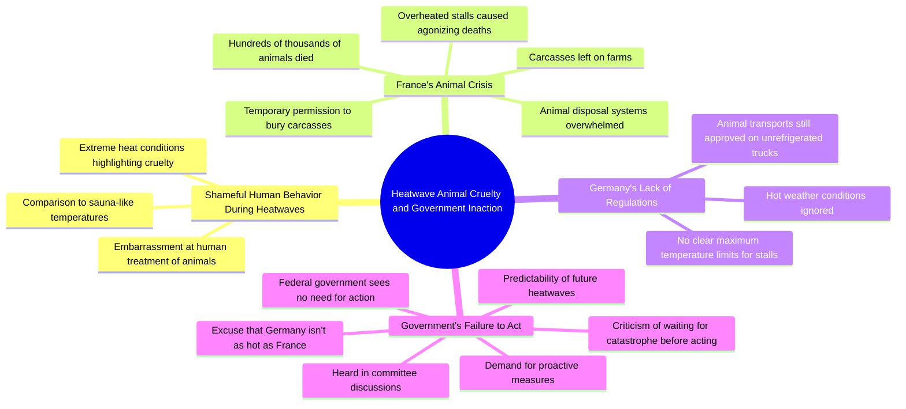

# Heatwave Animal Suffering in French Farms

> 🌐 **Read this in:** [English](../../en/2026-07/tiktok-transcript-muss-es-erst-zur-katastrophe-kommen-tierhaltung-hitzewelle-t-5813.md) · **中文**

> **Creator:** [@zoe.gruene](https://www.tiktok.com/@zoe.gruene) · **Views:** 1.2M · **Posted:** 2026-07-19 · **Niche:** other
>
> **TL;DR:** Opens with a powerful, self-critical emotional statement that instantly grabs attention and signals moral urgency.

[Watch original video →](https://vt.tiktok.com/ZSXxPuh7E/)

## Why This Went Viral

## 钩子（前3秒）
- **逐字开场白：** "有时候我真的为自己是一个人而感到羞耻，尤其是在这炎热的天气里，当我看到我们如何对待动物时"
- **钩子模式：** 情感上的羞耻坦白 + 对比（人类 vs. 动物） + 紧迫感（炎热的天气）
- **为何能阻止滑动：** 演讲者以一种赤裸裸、令人不适的羞耻坦白开场，显得脆弱且具有对抗性。它立即发出信号："这不是一场正常的政治演讲"，并制造了认知失调——观众期待政客为政策辩护，而不是表达个人的厌恶。

## 情感节奏
- **节拍1——羞耻与厌恶（0-5秒）：** "我为自己感到羞耻" + "我们如何对待动物" —— 发自内心、个人化，设定道德高地
- **节拍2——恐怖与规模（5-15秒）：** "数十万只动物痛苦地...死去" —— 形象生动、具体数字、苦难画面
- **节拍3——系统性失败（15-25秒）：** "动物尸体处理设施已经跟不上" + "尸体...被遗弃" —— 官僚体系崩溃，增加具体细节
- **节拍4——恐惧与投射（25-35秒）：** "这种事情在德国不可能发生...但在这里我们也没有明确的最高温度限制" —— 从法国转向德国，制造本地紧张感
- **节拍5——愤怒与沮丧（35-45秒）：** "联邦政府...认为没有必要采取行动" + "这完全是可预见的" —— 直接指责，推向高潮
- **节拍6——高潮与道德愤慨（45-55秒）：** "为什么非要等到灾难发生，这个联邦政府才决定采取行动？" —— 情感冲击的顶峰，反问句
- **节拍7——突然中断（55-60秒）：** "您的发言时间已到" —— 冰冷、程序化的结束，与情感强度形成对比，让观众感到意犹未尽（这推动了分享）

## 关键词密度
| 关键词/短语 | 频率（约） | 功能 |
|---|---|---|
| **动物 / 动物们** | 4 | 情感拉动——道德分量，同理心触发 |
| **温度 / 炎热 / 炎夏** | 4 | 算法覆盖——季节性，热门话题 |
| **法国** | 3 | 算法覆盖——地理对比，新闻钩子 |
| **联邦政府** | 2 | 算法覆盖——政治问责 |
| **灾难** | 2 | 情感拉动——恐惧、紧迫感、戏剧性 |
| **行动 / 行动必要** | 2 | 情感拉动——行动号召，沮丧感 |
| **痛苦地 / 死去** | 2 | 情感拉动——形象生动，可分享的愤怒 |
| **没有明确的最高温度限制** | 1（但核心） | 算法覆盖——政策空白，可搜索议题 |

## 为何能传播
1. **道德愤慨 + 具体、可验证的事实** —— "数十万只动物痛苦地...死去" + "动物尸体处理设施已经跟不上" —— 这不是泛泛的愤怒；这是基于数据的愤怒，感觉可信且紧迫。观众分享是因为他们感到知情且愤慨。
2. **"它也可能发生在这里"的投射** —— "在这里我们也没有明确的最高温度限制" —— 视频在不到10秒内从"看法国的例子"转向"这就是我们的未来"。这制造了本地恐惧，推动了在德国/邻国之间的分享。
3. **高潮问题是一个完美的分享触发点** —— "为什么非要等到灾难发生，这个联邦政府才决定采取行动？" —— 这是一个跨越党派的普遍政治挫败感，使其成为任何人都可以分享的无党派愤慨。
4. **冰冷、程序化的结尾制造了情感上的急转弯** —— 在如此激烈的情绪之后，"您的发言时间已到"让观众感觉被截断，这增加了评论/分享的冲动，以"完成"情感弧线。
5. **个人羞耻与制度失败之间的对比** —— 作为政客，以"我为自己感到羞耻"开场创造了一个罕见的脆弱时刻，使视频感觉真实且未经排练——这是政治内容走红的关键因素。

## 你可以借鉴什么
1. **以个人、令人不适的坦白开场** —— "有时候我为自己感到羞耻..."之所以有效，是因为它出乎意料地来自一位政客。在任何领域，以"我不好意思承认..."或"我不敢相信我竟然这么说..."开场，都能立即引发好奇心和情感投入。
2. **使用"这正在发生 → 它也会发生在你身上"的桥梁** —— 视频花了15秒讲法国，然后转向德国。对于任何趋势/危机，先展示一个真实的例子，然后明确说"这就是我们的未来"，以制造紧迫感。
3. **以一个无法回答的反问句结尾** —— "为什么非要等到灾难发生？"迫使观众在脑海中完成这个想法。这增加了参与度（评论、分享），因为人们想要回答这个问题或发泄赞同。

## Mind Map

## Full Transcript (Generated by [TokTranscript](https://toktranscript.com/?utm_source=github&utm_medium=breakdown&utm_campaign=tool_attribution))

> 📝 Transcripts on this page are auto-generated and show the first 60%. Want to transcribe any TikTok in 30 seconds and get the full version? [Try TokTranscript free →](https://toktranscript.com/?utm_source=github&utm_medium=breakdown&utm_campaign=transcript_cta)

manchmal schäm ich mich wirklich dafür 1 Mensch zu sein und das gilt jetzt besonders bei diesen heißen Temperaturen wenn ich sehe wie wir mit Tieren umgehen in Frankreich sind in den letzten Wochen hunderttausende Tiere qualvoll in den viel zu überhitzten stellen bei wirklich saunaartigen Temperaturen verreckt man kanns nich Anders sagen es waren so viele dass die tierkörperbeseitigungsanlagen nich mehr hinterhergekommen sind die kadava wurden teilweise auf den Höfen zurückgelassen man konnte sie da zeitweise sogar vergraben und jetzt wollen wir uns natürlich alle wünschen dass sowas in Deutschland nicht passieren kann aber auch hier haben wir keine klaren Höchsttemperaturen für Stelle und es werden selbst bei heißesten Temperaturen immer noch tiertransporte auf ungekühlten

*[Read the full transcript on TokTranscript →](https://toktranscript.com/plaza/tiktok-transcript-muss-es-erst-zur-katastrophe-kommen-tierhaltung-hitzewelle-t-5813?utm_source=github&utm_medium=breakdown&utm_campaign=transcript_full)*

## Browse More

- All [other](../../by-niche/zh-CN/other.md) breakdowns
- All [Emotional confession](../../by-pattern/zh-CN/hook-emotional-confession.md) examples

## Video Info

| | |
|---|---|
| Creator | [@zoe.gruene](https://www.tiktok.com/@zoe.gruene) |
| Original video | [https://vt.tiktok.com/ZSXxPuh7E/](https://vt.tiktok.com/ZSXxPuh7E/) |
| Original title | Muss es erst zur Katastrophe kommen? #tierhaltung #hitzewelle #tiersc... |
| Views | 1.2M (1200000) |
| Posted | 2026-07-19 |
| Duration | 0s |
| Niche | `other` |
| Hook pattern | `Emotional confession` |
| Original language | `en` (this page translated by AI) |
| Available languages | en, zh-CN |
| Generated | 2026-07-20 by [TokTranscript](https://toktranscript.com/) |

---

*This breakdown is for educational analysis under fair use. Original video © [@zoe.gruene](https://www.tiktok.com/@zoe.gruene). All transcripts are auto-generated and may contain errors.*

*Want to analyze your own TikToks like this? [TokTranscript →](https://toktranscript.com/viral-breakdown?utm_source=github&utm_medium=breakdown&utm_campaign=footer_cta)*