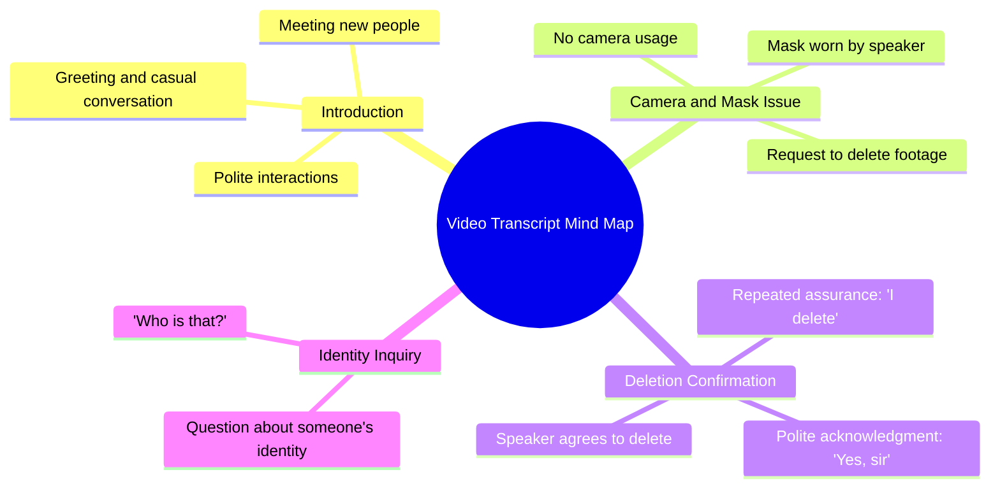

# N3on Accidentally Films a Masked Stranger

> 🌐 **Read this in:** [English](../../en/2026-07/tiktok-transcript-n3on-did-not-realise-who-he-just-put-on-camera-n3on-clips-fy-3311.md) · **中文**

> **Creator:** [@clips_are_good](https://www.tiktok.com/@clips_are_good) · **Views:** 12.2M · **Posted:** 2026-07-30 · **Niche:** other
>
> **TL;DR:** The hook sets up a normal greeting then subverts it with a paranoid request to delete footage.

[Watch original video →](https://vm.tiktok.com/ZN8eufTAY/)

## Why This Went Viral

## 钩子（前3秒）
- **逐字开场：**“你好。你们怎么样？嘿，很高兴认识你。很高兴认识你。不要拍。我戴口罩。”
- **钩子模式：**场景 + 提问（即时社交互动，带转折）
- **为何能让人停下滑动：**礼貌、友好的问候瞬间让人感到温暖和亲切——但迅速转向“不要拍。我戴口罩”制造了一种微妙的紧张感。观众被正常对话与意外请求（戴口罩+删除）之间的反差吸引。这感觉像是一个真实、未经编排的瞬间，从而激发好奇心。

## 情绪节奏
- **节拍1（好奇）：**友好问候——“你好。你们怎么样？”——让人感到安全、正常。
- **节拍2（轻微紧张）：**“不要拍。我戴口罩。”——引入一种古怪、谨慎的行为。
- **节拍3（悬念）：**“你能把这个删掉吗，拜托？”——删除录像的请求显得紧迫，或许带有隐秘性。
- **节拍4（释然+转折）：**“哦，好的，我会删。我删。我删。我删。好的，先生。”——顺从快得几乎反常，制造出新的不安层次。
- **节拍5（高潮）：**“那是谁？”——最后一句将焦点转向画面外的存在，留下一个开放式谜团。
- **高潮时刻：**最后一句——“那是谁？”——因为它打破了既有模式，暗示着还有其他事情正在发生。

## 关键词密度
- **“删除”**（重复4次）——算法触达：触发对隐私、同意或病毒式“已删除录像”话题的搜索。情感吸引力：制造紧迫感和不安。
- **“口罩”**——算法：关联疫情时代或匿名性内容。情感：传达谨慎、恐惧或伪装。
- **“拍摄”**——算法：视频相关内容的高流量关键词。情感：让观众意识到自己正在被观看。
- **“很高兴认识你”**——情感：解除防备，与紧张形成友好对比。
- **“好的，先生”**——情感：顺从的语气，增加权力动态和神秘感。
- **“那是谁”**——情感：悬念式结尾，驱动评论和猜测。

## 为何能传播
- **神秘感+悬念式结尾：**最后一句“那是谁？”迫使观众评论、@朋友或重看以捕捉细节。这推动了互动信号（评论、重播），从而提升算法触达。
- **未解决的紧张感：**删除录像的请求从未得到完整解释。观众不禁猜测此人是否在隐瞒什么、身处危险，或是恶作剧的一部分。这种模糊性助长了分享和猜测。
- **共鸣感+不适感：**礼貌的开场随后是尴尬的请求，映照了现实生活中的社交尴尬。人们分享是因为他们“经历过”或觉得这种互动既尴尬又有趣。
- **简短、可重复的结构：**整个互动不到30秒，易于循环、混剪或拼接。“删删删”的重复具有模因潜力。
- **算法友好的模式：**高关键词密度（“删除”“口罩”“拍摄”）加上清晰的钩子和悬念式结尾，契合平台对高留存、高评论内容的偏好。

## 你可以借鉴什么
1. **使用“礼貌式紧张”钩子：**以温暖、正常的互动开场（问候、微笑），然后转向一个意外的请求或规则。这种反差能迅速抓住注意力。
2. **以未解答的问题结尾：**最后一句（“那是谁？”）是天然的评论诱饵。始终留下一根松散的线头，迫使观众猜测或追问更多。
3. **重复一个关键词来制造节奏：**说四次“删除”创造了一种催眠般的、模因式的韵律。选择一个动作词并短促重复，让片段更易记住、更易被引用。

## Mind Map

## Full Transcript (Generated by [TikTok 转录工具](https://toktranscript.com/?utm_source=github&utm_medium=breakdown&utm_campaign=tool_attribution))

> 📝 Transcripts on this page are auto-generated and show the first 60%. Want to transcribe any TikTok in 30 seconds and get the full version? [Try TokTranscript free →](https://toktranscript.com/?utm_source=github&utm_medium=breakdown&utm_campaign=transcript_cta)

Hello. How you guys doing? Hey, nice to meet you. Nice to meet you. No camera. I use mask. Yeah, yeah. Can you delete this, ple

*[Read the full transcript on TokTranscript →](https://toktranscript.com/plaza/tiktok-transcript-n3on-did-not-realise-who-he-just-put-on-camera-n3on-clips-fy-3311?utm_source=github&utm_medium=breakdown&utm_campaign=transcript_full)*

## Browse More

- All [other](../../by-niche/zh-CN/other.md) breakdowns
- All [Unexpected response](../../by-pattern/zh-CN/hook-unexpected-response.md) examples

## Video Info

| | |
|---|---|
| Creator | [@clips_are_good](https://www.tiktok.com/@clips_are_good) |
| Original video | [https://vm.tiktok.com/ZN8eufTAY/](https://vm.tiktok.com/ZN8eufTAY/) |
| Original title | N3on did NOT realise WHO he just put on camera 😨😳 #n3on #clips #fyp #... |
| Views | 12.2M (12200000) |
| Posted | 2026-07-30 |
| Duration | 0s |
| Niche | `other` |
| Hook pattern | `Unexpected response` |
| Original language | `en` (this page translated by AI) |
| Available languages | en, zh-CN |
| Generated | 2026-07-31 by [TokTranscript](https://toktranscript.com/) |

---

*This breakdown is for educational analysis under fair use. Original video © [@clips_are_good](https://www.tiktok.com/@clips_are_good). All transcripts are auto-generated and may contain errors.*

*Want to analyze your own TikToks like this? [TokTranscript →](https://toktranscript.com/viral-breakdown?utm_source=github&utm_medium=breakdown&utm_campaign=footer_cta)*