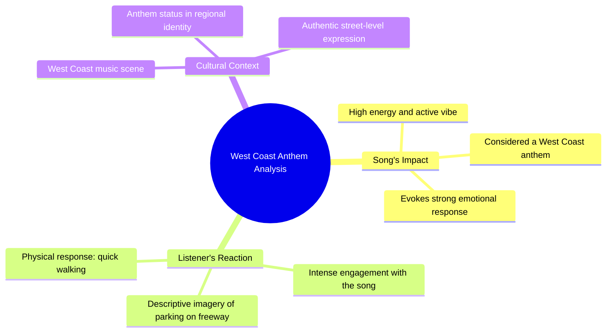

# West Coast Anthem Gets Man Ready to Park on Freeway

> 🌐 **Read this in:** [English](../../en/2026-07/tiktok-transcript-og-trippin-lol-og-unc-anthem-westcoast-cali-5641.md) · **中文**

> **Creator:** [@wenceslas007](https://www.tiktok.com/@wenceslas007) · **Views:** 1.1M · **Posted:** 2026-07-04 · **Niche:** entertainment
>
> **TL;DR:** The hook creates urgency and curiosity by promising a hot take before abruptly leaving.

[Watch original video →](https://www.tiktok.com/@wenceslas007/video/7651309168392965406?_r=1&_t=ZN-97lLQeyAqO6)

## Why This Went Viral

## 钩子（前3秒）
- **逐字开场白：** "我就要说这个，说完立马滚蛋，老兄。"
- **钩子模式：** 大胆声明 + 离开威胁（制造紧迫感和风险）
- **为何能阻止滑动：** 说话者立即暗示高风险（"滚蛋"）和有争议或冒险的观点。咄咄逼人的语气和脏话引人注意，而"我就要说这个"制造了悬念，迫使观众在内容消失前听完这个劲爆观点。

## 情感节奏
- **节拍1（0–2秒）：** 紧张——咄咄逼人、对抗性的开场（"我就要说这个，说完立马滚蛋"）
- **节拍2（2–5秒）：** 好奇——以强烈情感引入主题（"那首歌"），用"太带劲了"表达高度情绪化
- **节拍3（5–8秒）：** 共鸣——文化特定性（"西海岸圣歌"）建立群体内连接
- **节拍4（8–12秒）：** 视觉高潮——夸张、生动的意象（"把车停在高速公路上……下车开始快步走"）营造出令人捧腹的画面
- **节拍5（12–14秒）：** 释放——画面的荒诞性以喜剧效果收尾，让观众感到满足，并可能重看或分享

## 关键词密度
- **"老兄"**（4次）——通过高互动（评论、分享）和情感吸引力（文化真实性、群体内纽带）推动算法覆盖
- **"歌"**（1次，全文隐含）——与音乐内容的算法相关性
- **"带劲"**（1次）——情感吸引力；一个引发好奇心的独特描述词
- **"西海岸"**（1次）——通过地理/区域音乐社区实现算法覆盖
- **"圣歌"**（1次）——情感吸引力；提升歌曲地位
- **"把车停下" / "高速公路" / "快步走"** ——视觉关键词，推动可分享性（易于引用、可制成表情包的意象）

## 为何能传播
1. **高风险框架** ——"我就要说这个，说完立马滚蛋"营造出"禁忌观点"的动态。观众感觉自己获得了独家、未经筛选的内容，从而推动观看时长和分享。
2. **超具体、荒诞的意象** ——"把车停在高速公路上……开始快步走"是一个生动、荒谬的视觉画面，令人过目不忘。这使得视频易于引用和混音或反应，助长了混音文化。
3. **文化群体内信号** ——"西海岸圣歌"和反复使用"老兄"（在特定文化语境中）营造出内部知识的感觉。认同西海岸嘻哈文化的观众感到被认可，更有可能在社区内分享。
4. **情感冲击** ——视频以咄咄逼人开始，然后转向荒诞喜剧。这种对比让观众在整个短视频中保持参与，并增加了重看以捕捉语气转变的可能性。
5. **低投入、高回报格式** ——"劲爆观点 + 走人"的结构易于复制。观众可以想象自己或他人做同样的事，使其成为用户生成内容（UGC）的模板，从而自然传播。

## 你可以借鉴什么
1. **"离开威胁"钩子** ——以暗示即将说些冒险话然后立即离开的台词开场。这制造了紧迫感，让观众觉得自己获得了独家、未经筛选的内容。例如："我马上要说些会让我被拉黑的话，所以快听。"
2. **描绘一个荒谬、具体的心理画面** ——不要说"我喜欢这首歌"，而是描述一个荒谬的行为来证明你的热爱。越具体、越视觉化，越容易分享。例如："我会离开自己的生日派对，去车里听这首歌。"
3. **使用群体内语言建立社区** ——一个恰到好处的文化引用（如"西海岸圣歌"）或共享的方言术语，可以将普通观众转变为忠诚的部落。认同该引用的观众感到被看见，更有可能参与和分享。

## Mind Map

## Full Transcript (Generated by [TokTranscript 转录工具](https://toktranscript.com/?utm_source=github&utm_medium=breakdown&utm_campaign=tool_attribution))

> 📝 Transcripts on this page are auto-generated and show the first 60%. Want to transcribe any TikTok in 30 seconds and get the full version? [Try TokTranscript free →](https://toktranscript.com/?utm_source=github&utm_medium=breakdown&utm_campaign=transcript_cta)

I'm gonna say this and I'm gonna get the fuck out of here, nigga. That song is so damn active, nigga. And such a West Coast anthem, nigga. 

*[Read the full transcript on TokTranscript →](https://toktranscript.com/plaza/tiktok-transcript-og-trippin-lol-og-unc-anthem-westcoast-cali-5641?utm_source=github&utm_medium=breakdown&utm_campaign=transcript_full)*

## Browse More

- All [entertainment](../../by-niche/zh-CN/entertainment.md) breakdowns
- All [Urgent declaration + immediate exit](../../by-pattern/zh-CN/hook-urgent-declaration-immediate-exit.md) examples

## Video Info

| | |
|---|---|
| Creator | [@wenceslas007](https://www.tiktok.com/@wenceslas007) |
| Original video | [https://www.tiktok.com/@wenceslas007/video/7651309168392965406?_r=1&_t=ZN-97lLQeyAqO6](https://www.tiktok.com/@wenceslas007/video/7651309168392965406?_r=1&_t=ZN-97lLQeyAqO6) |
| Original title | Og trippin lol #og #unc #anthem #westcoast #cali |
| Views | 1.1M (1100000) |
| Posted | 2026-07-04 |
| Duration | 0s |
| Niche | `entertainment` |
| Hook pattern | `Urgent declaration + immediate exit` |
| Original language | `en` (this page translated by AI) |
| Available languages | en, zh-CN |
| Generated | 2026-07-07 by [TokTranscript](https://toktranscript.com/) |

---

*This breakdown is for educational analysis under fair use. Original video © [@wenceslas007](https://www.tiktok.com/@wenceslas007). All transcripts are auto-generated and may contain errors.*

*Want to analyze your own TikToks like this? [TokTranscript →](https://toktranscript.com/viral-breakdown?utm_source=github&utm_medium=breakdown&utm_campaign=footer_cta)*