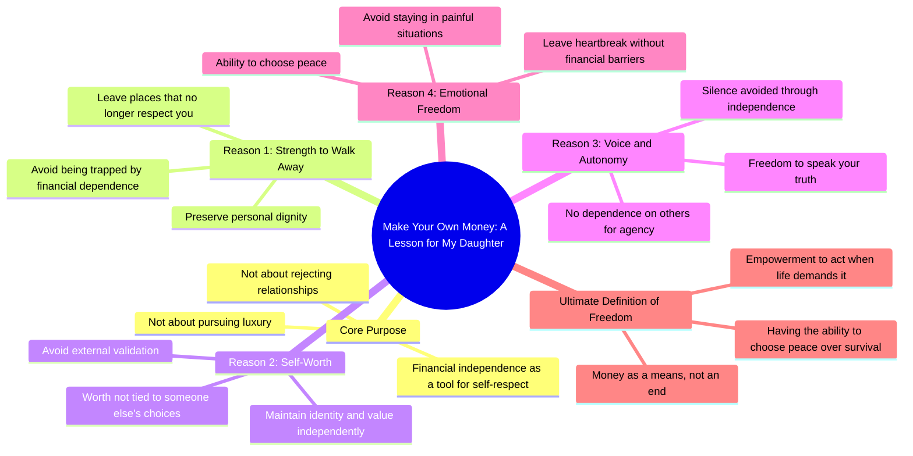

# Teach Your Daughter Financial Independence for Self-Respect

> 🌐 **Read this in:** [English](../../en/2026-07/tiktok-transcript-one-day-i-will-tell-my-daughter-this-make-your-own-money-not-fc83.md) · **中文**

> **Creator:** [@loudthoughtsforyou](https://www.tiktok.com/@loudthoughtsforyou) · **Views:** 1.9M · **Posted:** 2026-07-10 · **Niche:** other
>
> **TL;DR:** Opens with a personal promise and a direct command that immediately challenges conventional wisdom.

[Watch original video →](https://www.tiktok.com/t/ZTSV8MBss/)

## Why This Went Viral

## 钩子（前3秒）
- **逐字开场白：** “有一天我会告诉我的女儿：自己赚钱。”
- **钩子模式：** 大胆断言 + 情感承诺（以女权/自我价值信息包裹的父辈智慧）。
- **为何能阻止滑动：** 它利用了一种普遍的情感触发点——父母之爱——但立刻颠覆了预期的“拜金女”套路。观众以为会听到“这样你就不需要男人”，但下一句却反转成“这样你就能离开一个不再尊重你的地方”。这种反转制造了微小的惊讶冲击 + 情感共鸣。

## 情感节奏
- **节拍1（好奇心 + 信任）：** “有一天我会告诉我的女儿。”——营造了一个脆弱、亲密的框架。观众会凑近观看。
- **节拍2（紧张 + 反抗）：** “自己赚钱。不是因为你不需要一个男人，也不是因为你想要奢侈品。”——颠覆陈词滥调。制造认知失调。
- **节拍3（痛苦 + 认同）：** “而是因为有一天，你可能需要力量，离开一个不再尊重你的地方。”——转折点。普遍的痛点（有毒关系、经济束缚）。
- **节拍4（共鸣 + 宣泄）：** “这样你的价值就永远不会与他人的选择挂钩。这样你的声音就永远不会被依赖所压制。”——“这样”的重复构建了渐强的节奏。观众感到被看见。
- **高潮：** “因为自由不仅仅是拥有金钱。自由是拥有选择平静而非生存的能力。”——论点落地。这是一个掷地有声的时刻，将金钱重新定义为自主的工具，而非贪婪。
- **最终节拍（隐含的行动号召）：** “当生活要求你这样做时。”——在观众心中留下一个萦绕心头、开放式的疑问。

## 关键词密度
- **“金钱”**（3次）——算法覆盖（高搜索量词汇）。同时具有情感性：将财务素养与自我价值联系起来。
- **“自由”**（2次）——情感吸引力。抽象、令人向往。推动分享（人们希望与自由相关联）。
- **“离开”**（1次，但贯穿全文）——动作动词。情感冲击力强。吸引有毒关系幸存者的参与。
- **“尊重”**（1次）——核心价值观。算法 + 情感。低竞争，高共鸣。
- **“力量”**（1次）——情感锚点。暗示克服脆弱。推动收藏（人们想记住这句话）。
- **“平静”**（1次）——与“生存”形成对比。创造了一个易于转发/截图的二元对立。
- **“依赖”**（1次）——负面情感触发器。吸引曾感到被困的人的评论。
- **“选择”**（1次）——自主权词汇。算法（在自助领域参与度高）。

## 为何能传播
1. **“颠覆预期”钩子：** 第一行设置了一个陈词滥调（“自己赚钱，这样你就不需要男人”），但立刻将其转变为基于创伤、女权赋权的信息。这种惊喜触发了多巴胺冲击，并促使观众重看或分享以证明他们“懂了”。
2. **普遍痛点 + 特定受众：** 视频直接针对女性（“我的女儿”），但情感核心——感到被困在一个你无法负担离开的处境中——是普遍的。男性、酷儿群体以及任何处于有毒工作/关系中的人也会感到被看见。这扩大了分享圈，超越了特定群体。
3. **节奏性重复 + “这样”结构：** “这样你的价值……这样你的声音……这样你永远不必留下”的模式具有催眠效果。它模仿了布道或宣言。观众更可能收藏、引用或混剪，因为这些句子是模块化的、可引用的。
4. **“自由 vs. 生存”二元对立：** 高潮将物质需求（金钱）重新定义为精神需求（平静）。这种二元对立在情感上具有粘性。它会被截图、变成表情包、用作标题。这种对比易于记忆和重复。
5. **开放式结尾：** “当生活要求你这样做时。”——这是一个悬念。它邀请观众完成思考，从而推动评论（“如果生活从不要求呢？”“但如果你负担不起离开呢？”）。评论推动算法。

## 你可以借鉴的
1. **使用“颠覆预期”模式：** 以你的观众听过100次的话开头（“自己赚钱”），然后立即用一个更深刻、更脆弱的真相来反驳它。这会迫使他们重新参与。
2. **用“这样”重复来构建脚本：** 写3-4行，每行都以“这样你的……”或“这样你永远不……”开头。这创造了一种节奏性、催眠般的流动，感觉像宣言。这也使视频易于引用和混剪。
3. **以一个萦绕心头、开放式的疑问结尾：** 不要解决紧张感。给观众留下一个未完成的想法（“当生活要求你这样做时”），迫使他们评论、收藏或分享以完成意义。这是最高杠杆的参与策略。

## Mind Map

## Full Transcript (Generated by [TokTranscript](https://toktranscript.com/?utm_source=github&utm_medium=breakdown&utm_campaign=tool_attribution))

> 📝 Transcripts on this page are auto-generated and show the first 60%. Want to transcribe any TikTok in 30 seconds and get the full version? [Try TokTranscript free →](https://toktranscript.com/?utm_source=github&utm_medium=breakdown&utm_campaign=transcript_cta)

I will tell my daughter this one day. Make your own money. Not because you won't need a man, not because you want luxury. But because one day you might need the strength to walk away from a place that no longer respects you. So your worth is never tied to someone else's choices. So your voice is never silenced by dependence. So yo

*[Read the full transcript on TokTranscript →](https://toktranscript.com/plaza/tiktok-transcript-one-day-i-will-tell-my-daughter-this-make-your-own-money-not-fc83?utm_source=github&utm_medium=breakdown&utm_campaign=transcript_full)*

## Browse More

- All [other](../../by-niche/zh-CN/other.md) breakdowns
- All [Promise + Imperative](../../by-pattern/zh-CN/hook-promise-imperative.md) examples

## Video Info

| | |
|---|---|
| Creator | [@loudthoughtsforyou](https://www.tiktok.com/@loudthoughtsforyou) |
| Original video | [https://www.tiktok.com/t/ZTSV8MBss/](https://www.tiktok.com/t/ZTSV8MBss/) |
| Original title | One day, I will tell my daughter this: Make your own money. Not becau... |
| Views | 1.9M (1900000) |
| Posted | 2026-07-10 |
| Duration | 0s |
| Niche | `other` |
| Hook pattern | `Promise + Imperative` |
| Original language | `en` (this page translated by AI) |
| Available languages | en, zh-CN |
| Generated | 2026-07-10 by [TokTranscript](https://toktranscript.com/) |

---

*This breakdown is for educational analysis under fair use. Original video © [@loudthoughtsforyou](https://www.tiktok.com/@loudthoughtsforyou). All transcripts are auto-generated and may contain errors.*

*Want to analyze your own TikToks like this? [TokTranscript →](https://toktranscript.com/viral-breakdown?utm_source=github&utm_medium=breakdown&utm_campaign=footer_cta)*