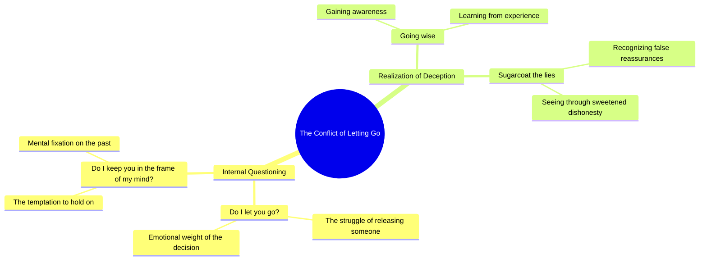

# OOTD: Deciding Whether to Let Go

> 🌐 **Read this in:** [English](../../en/2026-07/tiktok-transcript-ootd-484b.md) · **中文**

> **Creator:** [@zah1de](https://www.tiktok.com/@zah1de) · **Views:** 2.0M · **Posted:** 2026-07-03 · **Niche:** entertainment
>
> **TL;DR:** Opens with a direct, relatable internal conflict that hooks viewers into the emotional narrative.

[Watch original video →](https://vt.tiktok.com/ZSCXXop95/)

## Why This Went Viral

## 钩子（前3秒）
- **逐字开场白：** “所以我问自己，是放手让你走？还是把你留在我的脑海里？”
- **钩子模式：** 疑问 / 内心独白（情感困境）
- **为何能吸引注意力：** 双重疑问瞬间营造情感张力——观众被迫代入这种自我拷问。它显得原始、未解且极具个人色彩，从而引发对冲突的好奇。

## 情感节奏
- **节拍1 — 好奇 + 张力：** 开场疑问将观众拉入一个未解的内心冲突。
- **节拍2 — 悬念 + 期待：** “现在我终于看穿你给谎言裹上的糖衣”——这句台词揭示了对欺骗的察觉，营造出背叛感。
- **节拍3 — 情感高潮：** “给谎言裹上糖衣”是点睛之笔——这是痛苦清醒的时刻，说话者从困惑转向明了。
- **节拍4 — 共鸣 / 余韵：** 不完整的句式留下悬而未决的感觉，让观众在脑海中反复回味这份情感重量。

## 关键词密度
- **“我”**（重复3次）—— 推动个人认同，通过第一人称的共鸣感提升算法互动
- **“你”**（重复2次）—— 形成直接对话，增强情感吸引力并提高评论可能性
- **“放手”** —— 情感共鸣强烈，触发分手/释怀的记忆
- **“我的脑海里”** —— 独特短语，提升记忆点和分享性
- **“糖衣”** —— 生动的隐喻，是算法中关于欺骗/关系内容的关键词
- **“谎言”** —— 高情感触发词，推动互动（评论、收藏）

## 为何能传播
- **通过普遍冲突引发共鸣：** “是放手让你走？”——任何渐行渐远关系的核心困境。观众会立刻投射自己的故事。
- **情感悬念效应：** 文案在思绪中途结束（“现在我终于看穿你给谎言裹上的糖衣”）。这种未完成的结局迫使观众评论、重看或收藏以自行补全思绪。
- **歌词般的节奏 + 脆弱感：** 措辞模仿歌词或诗歌——在TikTok和Instagram Reels等平台上极易分享，因为审美化的痛苦能引发共鸣。
- **直接对话触发互动：** “我问自己……是否把你留下”——第二人称“你”让观众感觉被直接对话，增加评论可能性。
- **寥寥数语中的隐喻密度：** “给谎言裹上糖衣”是一个紧凑、视觉化的隐喻，令人过目不忘——观众会在评论中引用并转发。

## 你可以借鉴的
- **以双重疑问开场，迫使自我反思：** 在前3秒提出两个对立的问题，制造即时情感张力（例如：“我该保持沉默？还是终于开口？”）。
- **以未完成的思绪结尾：** 在结局前截断文案——让观众停留在一个生动的隐喻或未完成的句子上。这会推动收藏和评论。
- **用一个强有力的原创隐喻作为情感锚点：** “给谎言裹上糖衣”是被引用的金句。精心打造一个单一、视觉化、充满情感张力的短语，概括你的全部信息。

## Mind Map

## Full Transcript (Generated by [TokTranscript 转录工具](https://toktranscript.com/?utm_source=github&utm_medium=breakdown&utm_campaign=tool_attribution))

> 📝 Transcripts on this page are auto-generated and show the first 60%. Want to transcribe any TikTok in 30 seconds and get the full version? [Try TokTranscript free →](https://toktranscript.com/?utm_source=github&utm_medium=breakdown&utm_campaign=transcript_cta)

So I ask myself, do I let you go? Do I keep you in the frame of my min

*[Read the full transcript on TokTranscript →](https://toktranscript.com/plaza/tiktok-transcript-ootd-484b?utm_source=github&utm_medium=breakdown&utm_campaign=transcript_full)*

## Browse More

- All [entertainment](../../by-niche/zh-CN/entertainment.md) breakdowns
- All [Rhetorical Question](../../by-pattern/zh-CN/hook-rhetorical-question.md) examples

## Video Info

| | |
|---|---|
| Creator | [@zah1de](https://www.tiktok.com/@zah1de) |
| Original video | [https://vt.tiktok.com/ZSCXXop95/](https://vt.tiktok.com/ZSCXXop95/) |
| Original title | OOTD 🩵 |
| Views | 2.0M (2000000) |
| Posted | 2026-07-03 |
| Duration | 0s |
| Niche | `entertainment` |
| Hook pattern | `Rhetorical Question` |
| Original language | `en` (this page translated by AI) |
| Available languages | en, zh-CN |
| Generated | 2026-07-06 by [TokTranscript](https://toktranscript.com/) |

---

*This breakdown is for educational analysis under fair use. Original video © [@zah1de](https://www.tiktok.com/@zah1de). All transcripts are auto-generated and may contain errors.*

*Want to analyze your own TikToks like this? [TokTranscript →](https://toktranscript.com/viral-breakdown?utm_source=github&utm_medium=breakdown&utm_campaign=footer_cta)*