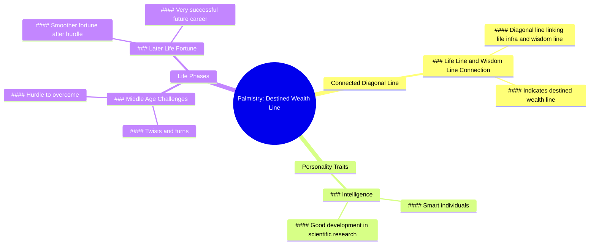

# Connected Diagonal Line Palm Wealth Meaning

> 🌐 **Read this in:** [English](../../en/2026-07/tiktok-transcript-palmistry-palmist-palmistry-palmreading-b574.md) · **中文**

> **Creator:** [@gvdesd](https://www.tiktok.com/@gvdesd) · **Views:** 3.9M · **Posted:** 2026-07-08 · **Niche:** other
>
> **TL;DR:** The hook promises a secret indicator of wealth, instantly grabbing curiosity.

[Watch original video →](https://www.tiktok.com/@gvdesd/video/7215204378762923282)

## Why This Went Viral

## 钩子（前3秒）
- **逐字开场白：** "手掌中生命线与智慧线之间有一条相连的斜线，这就是所谓的命中注定的财运线。"
- **钩子模式：** **大胆断言**（一个具体的、伪科学的掌相事实，以绝对真理的形式呈现）。
- **为何能让人停下滑动：** 它结合了**神秘感**（你身体上隐藏的含义）和**个人相关性**（每个人都有手掌，观众会立刻检查自己的手）。这种具体而自信的语言（"命中注定的财运线"）会触发一种立即自我诊断的冲动。

## 情绪节奏
1. **好奇心**（0-3秒）："这是什么线？我有吗？"——观众检查自己的手掌。
2. **认可/恭维**（3-6秒）："有这种掌纹的人很聪明，在科研方面会有很好的发展。"——自我满足，积极的身份认同强化。
3. **紧张感**（6-9秒）："但是，这样的人在中年时期会经历波折。"——突然的负面转折，制造担忧和叙事悬念。
4. **解脱/奖励**（9-12秒）："只有过了这个坎，运势才会更顺……未来的事业会非常成功。"——情绪宣泄，圆满结局，希望。
- **高潮时刻：** 从"波折"到"运势更顺"的转变——这种情感回报让观众感觉自己得到了一个关于最终成功的预言。

## 关键词密度
| 关键词/短语 | 功能 |
|---|---|
| **命中注定的财运线** | 算法覆盖（"财运线 手掌"搜索量高）+ 情感吸引（对财富的渴望） |
| **聪明** | 情感吸引（自我满足，身份认同） |
| **科研** | 算法覆盖（小众、低竞争关键词）+ 权威提升 |
| **波折** | 情感吸引（戏剧性，奋斗的共鸣） |
| **中年** | 情感吸引（针对特定焦虑人群） |
| **成功** | 情感吸引（励志，希望） |
| **手掌 / 掌相** | 算法覆盖（常青小众领域，高互动率） |

**算法驱动因素：** "财运线"、"掌相"、"手掌"——搜索量高，在短视频中竞争低。
**情感驱动因素：** "聪明"、"成功"、"波折"——触发身份认同和叙事张力。

## 为何能传播
1. **普遍的自我诊断机制** —— "手掌中生命线与智慧线之间有一条相连的斜线，这就是所谓的命中注定的财运线"这句话迫使每位观众检查自己的手掌。这创造了一个即时的互动循环（观看→检查→评论"我有！"或"我没有！"），从而提升评论数和观看时长。
2. **12秒内的叙事弧线** —— 脚本遵循经典的英雄之旅压缩版：*天赋*（聪明，适合做研究）→ *障碍*（中年波折）→ *回报*（运势顺畅，成功）。这种情绪过山车能保持高留存率，让视频比平淡的预测更令人满足。
3. **励志 + 共鸣的张力** —— "中年波折"与大量人群（30-50岁面临职业/家庭压力的人）产生共鸣。视频提供了一种**应对机制**：你的挣扎是*命中注定*的，而成功是*必然*的。这能减轻焦虑，让观众愿意分享给正在挣扎的朋友。
4. **通过具体性建立权威** —— 使用"生命线"、"智慧线"和"科研"等术语营造出一种专业知识的假象。观众比相信泛泛的"你会发财"解读更相信这种说法，从而增加了感知价值和可分享性。
5. **低参与门槛** —— 视频以积极的未来（成功的事业）结束。认同这一预测的观众很可能会评论"我有这条线"或"我现在就是中年，希望这是真的"——这两者都能通过评论数和关键词匹配来推动算法提升。

## 你可以借鉴什么
1. **"自我检查"钩子** —— 以一个迫使观众去检查某样东西（他们的手掌、他们的脸、他们的手机屏幕）的断言开场。例如："如果你的眉毛之间有一个V形皱纹，你就有天生的谈判天赋。"这能立即吸引注意力并创造留下的理由。
2. **压缩版英雄弧线** —— 使用三部分情感结构：**天赋 → 挣扎 → 回报**。即使在10秒内，这种模式（积极→消极→积极）也能保持高留存率，让视频感觉完整。适用于任何领域（健身、理财、人际关系）。
3. **针对特定焦虑** —— 不要泛泛地说"你会面临挑战"，而是点名一个具体的人生阶段（"中年"、"二十多岁后期"、"四十岁以后"）。这能让视频对特定群体感觉更个人化，增加该群体内的分享以及"符合"描述的人的评论。

## Mind Map

## Full Transcript (Generated by [免费 TikTok 文稿生成器](https://toktranscript.com/?utm_source=github&utm_medium=breakdown&utm_campaign=tool_attribution))

> 📝 Transcripts on this page are auto-generated and show the first 60%. Want to transcribe any TikTok in 30 seconds and get the full version? [Try TokTranscript free →](https://toktranscript.com/?utm_source=github&utm_medium=breakdown&utm_campaign=transcript_cta)

There is a connected diagonal line between the life infra and the wisdom line in the palm, indicating the destined wealth line. People with this palmistry are smart and will have good development in scientific research. However, suc

*[Read the full transcript on TokTranscript →](https://toktranscript.com/plaza/tiktok-transcript-palmistry-palmist-palmistry-palmreading-b574?utm_source=github&utm_medium=breakdown&utm_campaign=transcript_full)*

## Browse More

- All [other](../../by-niche/zh-CN/other.md) breakdowns
- All [Reveal a hidden sign](../../by-pattern/zh-CN/hook-reveal-a-hidden-sign.md) examples

## Video Info

| | |
|---|---|
| Creator | [@gvdesd](https://www.tiktok.com/@gvdesd) |
| Original video | [https://www.tiktok.com/@gvdesd/video/7215204378762923282](https://www.tiktok.com/@gvdesd/video/7215204378762923282) |
| Original title | #手相palmistry #palmist #palmistry #palmreading #手相  |
| Views | 3.9M (3900000) |
| Posted | 2026-07-08 |
| Duration | 0s |
| Niche | `other` |
| Hook pattern | `Reveal a hidden sign` |
| Original language | `en` (this page translated by AI) |
| Available languages | en, zh-CN |
| Generated | 2026-07-09 by [TokTranscript](https://toktranscript.com/) |

---

*This breakdown is for educational analysis under fair use. Original video © [@gvdesd](https://www.tiktok.com/@gvdesd). All transcripts are auto-generated and may contain errors.*

*Want to analyze your own TikToks like this? [拆解你自己的 TikTok →](https://toktranscript.com/viral-breakdown?utm_source=github&utm_medium=breakdown&utm_campaign=footer_cta)*