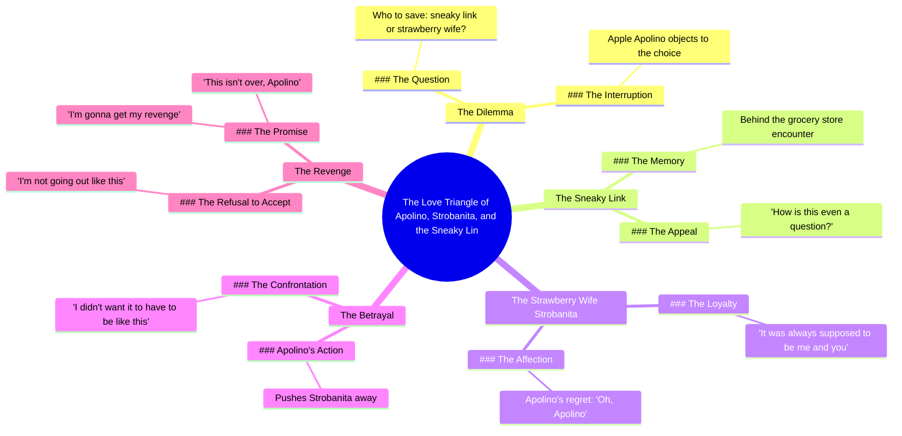

# Loyal Apple Chooses Between Wife and Sneaky Link

> 🌐 **Read this in:** [English](../../en/2026-07/tiktok-transcript-part-1-loyal-apple-fruitstory-aistory-fruitdrama-aifruit-7b19.md) · **中文**

> **Creator:** [@fruit4thoughtai](https://www.tiktok.com/@fruit4thoughtai) · **Views:** 6.3M · **Posted:** 2026-07-13 · **Niche:** entertainment
>
> **TL;DR:** Presents an absurd, relatable conflict that immediately grabs attention.

[Watch original video →](https://www.tiktok.com/t/ZTSnB7jps/)

## Why This Went Viral

## 钩子（前3秒）
- **原文：** "我不知道该救谁。我的秘密情果还是我的草莓妻子。"
- **钩子模式：** 反差 + 荒谬前提（水果角色间的感情戏）
- **为何能让人停下刷屏：** "秘密情果"一词立刻暗示了戏剧冲突，但与"草莓妻子"搭配起来却异常荒诞，让人忍不住再看一眼。观众必须看下去才能理解这个笑话。

## 情绪节奏
1. **好奇**（0:00–0:03）—— "我不知道该救谁" 设置了一个道德困境。
2. **困惑 + 愉悦**（0:03–0:06）—— "苹果，不要！" 揭示角色是水果，制造出荒诞的张力。
3. **怀旧呼应**（0:06–0:09）—— "还记得我们在杂货店后面做了什么吗？" 补充背景故事，加深笑点。
4. **背叛**（0:09–0:12）—— "这还用问吗？" 升级冲突。
5. **高潮**（0:12–0:18）—— "本该只有我和你" 带来情感上的收尾（伪浪漫的解决方式）。
6. **转折 + 悬念**（0:18–0:22）—— "我会报复的" 重新吸引观众，为续集埋下伏笔。

## 关键词密度
- **"苹果" / "阿波利诺"**（5次）—— 推动角色身份，并触发算法对"苹果剧"或"水果肥皂剧"的搜索。
- **"救"**（3次）—— 情感吸引词，暗示利害关系。
- **"秘密情果"**（2次）—— 抖音流行俚语，引发熟悉感 + 幽默。
- **"妻子" / "斯特罗巴尼塔"**（3次）—— 构建关系框架，利用"三角恋"套路。
- **"报复"**（1次）—— 高情感词，承诺故事延续，提升观看时长。

## 为何能传播
1. **荒谬前提 + 熟悉格式** —— "我该救谁？" 是经典的感情套路，但角色是水果。这种错位创造了可分享的惊喜。（台词："我的秘密情果还是我的草莓妻子。"）
2. **情感悬念** —— 结尾的报复威胁迫使观众评论"第二部？"并与朋友分享，提升互动信号。（台词："我会报复的。"）
3. **低门槛改编** —— 剧本足够简单，其他创作者可以用不同物品进行模仿（例如："我的牛油果情妇 vs. 我的香蕉丈夫"），推动趋势复制。
4. **高重看性** —— 快节奏对话和夸张的配音表演让观众愿意多次观看，以捕捉所有荒谬的台词。（台词："还记得我们在杂货店后面做了什么吗？"）

## 你可以借鉴什么
1. **使用"错位格式"钩子** —— 将一个熟悉的情感模板（感情戏、背叛、报复）应用于意想不到的主题（水果、物品、动物）。这能瞬间引发好奇。
2. **以续集预告结尾** —— 始终留下一个未解决的线索（"我会报复的"），以增加要求第二部的评论，并提升整体观看时长。
3. **给角色起荒谬的名字** —— "阿波利诺"和"斯特罗巴尼塔"令人难忘且易于引用。独特的名字让视频在评论和分享中更容易被提及，推动口碑传播。

## Mind Map

## Full Transcript (Generated by [TikTok 转录工具](https://toktranscript.com/?utm_source=github&utm_medium=breakdown&utm_campaign=tool_attribution))

> 📝 Transcripts on this page are auto-generated and show the first 60%. Want to transcribe any TikTok in 30 seconds and get the full version? [Try TokTranscript free →](https://toktranscript.com/?utm_source=github&utm_medium=breakdown&utm_campaign=transcript_cta)

I don't know who to save. My sneaky link or my strawberry wife. Apple, no! You can't do this! Remember what we did behind the grocery store? How is this even a question? Help me up. Appleino, what are you doing? I didn't want it to have to be like this.

*[Read the full transcript on TokTranscript →](https://toktranscript.com/plaza/tiktok-transcript-part-1-loyal-apple-fruitstory-aistory-fruitdrama-aifruit-7b19?utm_source=github&utm_medium=breakdown&utm_campaign=transcript_full)*

## Browse More

- All [entertainment](../../by-niche/zh-CN/entertainment.md) breakdowns
- All [Dilemma Hook](../../by-pattern/zh-CN/hook-dilemma-hook.md) examples

## Video Info

| | |
|---|---|
| Creator | [@fruit4thoughtai](https://www.tiktok.com/@fruit4thoughtai) |
| Original video | [https://www.tiktok.com/t/ZTSnB7jps/](https://www.tiktok.com/t/ZTSnB7jps/) |
| Original title | Part 1 | Loyal Apple #fruitstory #aistory #fruitdrama #aifruit  |
| Views | 6.3M (6300000) |
| Posted | 2026-07-13 |
| Duration | 0s |
| Niche | `entertainment` |
| Hook pattern | `Dilemma Hook` |
| Original language | `en` (this page translated by AI) |
| Available languages | en, zh-CN |
| Generated | 2026-07-14 by [TokTranscript](https://toktranscript.com/) |

---

*This breakdown is for educational analysis under fair use. Original video © [@fruit4thoughtai](https://www.tiktok.com/@fruit4thoughtai). All transcripts are auto-generated and may contain errors.*

*Want to analyze your own TikToks like this? [TokTranscript 转录工具 →](https://toktranscript.com/viral-breakdown?utm_source=github&utm_medium=breakdown&utm_campaign=footer_cta)*